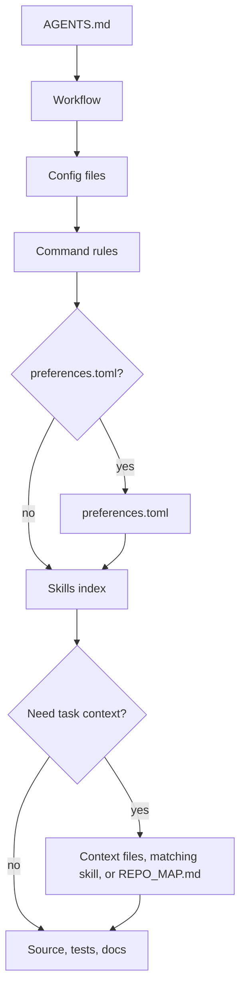

# mustflow

Languages: [English](README.md) · [한국어](docs/i18n/ko/README.md) · [中文](docs/i18n/zh/README.md) · [Español](docs/i18n/es/README.md) · [Français](docs/i18n/fr/README.md) · [हिन्दी](docs/i18n/hi/README.md)

mustflow is a workflow CLI for LLM coding agents. It helps agents enter a
repository, read the right operating context, run only declared commands, and
verify their work without guessing.

The core model is simple: put `AGENTS.md` at the project root, then keep the
detailed workflow under `.mustflow/`. Agents start from `AGENTS.md`, then follow
the command contract, skills, project context, and verification rules in order.

## Agent Read Flow



`read_order` defines the required reading order, while `optional_read_order` and `[context]`
govern how task-specific context is loaded. The `[refresh]` policy determines when agents reread the
same instructions.

The skills index is an active routing step: agents compare the task with `.mustflow/skills/INDEX.md`
and read matching `SKILL.md` files before editing that scope. Skills guide procedure only; command
execution still comes from `.mustflow/config/commands.toml`.

- Documentation site: <https://mustflow.github.io>
- Human-readable project examples: [`examples/`](examples/)
- Repository: <https://github.com/0disoft/mustflow>
- Issues: <https://github.com/0disoft/mustflow/issues>
- Contributing: [CONTRIBUTING.md](https://github.com/0disoft/mustflow/blob/main/CONTRIBUTING.md)
- Security: [SECURITY.md](https://github.com/0disoft/mustflow/blob/main/SECURITY.md)
- Changelog: [CHANGELOG.md](https://github.com/0disoft/mustflow/blob/main/CHANGELOG.md)

## What it does

mustflow installs and validates an agent workflow for user projects.

- Installs `AGENTS.md` and the `.mustflow/**` workflow files.
- Declares runnable command rules in `.mustflow/config/commands.toml`.
- Checks install health and configuration structure with `mf check` and `mf doctor`.
- Runs only allowed one-shot commands within a timeout via `mf run <intent>`.
- Generates a concise repository navigation map, `REPO_MAP.md`, with `mf map`.
- Indexes and searches mustflow docs, skills, and command rules with SQLite via
  `mf index` and `mf search`.
- Tracks agent-created or agent-modified documentation that needs prose review
  with `mf docs review`, including optional multiline review comments and
  cleanup of imported comment files.
- Previews and applies bundled template updates safely with `mf update`.
- Publishes JSON Schemas for automation-facing reports and command contracts in
  `schemas/`.

## What it does not do

mustflow is not an automatic project editor and is not tied to one agent product.

- It does not generate or modify application source code.
- It does not change project files just by being installed. Files are created
  only when `mf init` runs.
- It does not enforce tool-specific filenames such as `CLAUDE.md` or
  `GEMINI.md`.
- It does not replace a build system, test runner, package manager, or CI/CD
  setup.
- It does not add platform-specific files for GitHub, GitLab, or similar tools
  to the default template.
- It does not create a `justfile`, `Makefile`, or `Taskfile.yml` by default.
- `mf dashboard` starts a local browser UI for inspecting mustflow status,
  reviewing verification recommendations from changed files, inspecting
  configured command intents, checking release and version-source status,
  checking template update readiness, inspecting the latest run receipt,
  inspecting skill routes, reviewing and editing safe preferences in
  `.mustflow/config/preferences.toml`, and managing the documentation review
  queue in `.mustflow/review/docs.toml`, then opens it in the default browser.
  The page can switch between English, Korean, Chinese, Spanish, French, and
  Hindi. It includes verification-selection and test authoring preferences.
  When the dashboard saves preferences, it
  refreshes the matching manifest-lock entry as a customized baseline if the lock
  file exists.

## Candidate features

These are parked ideas, not yet officially supported.

- Community skill registry and skill pack installs
- Optional `.mustflow/work-items/`
- `mf orient`, `mf refresh`
- Tool-specific adapters

## Quick start

Node.js 20 or newer is required. mustflow is distributed as an npm package, and
the CLI name is `mf`.

```sh
npm install -D mustflow
npx mf init --dry-run
npx mf init
npx mf check --strict
```

In an interactive terminal, `mf init` asks you to choose the document language,
project profile, and agent report language. Use `mf init --yes` when scripts
should install the English defaults without prompts.

pnpm and Bun can use the same npm package.

```sh
pnpm add -D mustflow
pnpm exec mf init --yes

bun add -d mustflow
bunx mf init --yes
```

Deno `npm:` execution should be treated as experimental until separately
verified.

## Installed files

`mf init` installs only the agent workflow into the current directory.

```text
your-project/
├─ AGENTS.md
├─ .gitignore
└─ .mustflow/
   ├─ config/
   │  ├─ commands.toml
   │  ├─ manifest.lock.toml
   │  ├─ mustflow.toml
   │  └─ preferences.toml
   ├─ context/
   │  ├─ INDEX.md
   │  └─ PROJECT.md
   ├─ docs/
   │  └─ agent-workflow.md
   └─ skills/
      ├─ INDEX.md
      ├─ artifact-integrity-check/
      │  └─ SKILL.md
      ├─ code-review/
      │  └─ SKILL.md
      ├─ contract-sync-check/
      │  └─ SKILL.md
      ├─ date-number-audit/
      │  └─ SKILL.md
      ├─ dependency-reality-check/
      │  └─ SKILL.md
      ├─ diff-risk-review/
      │  └─ SKILL.md
      ├─ docs-prose-review/
      │  └─ SKILL.md
      ├─ docs-update/
      │  └─ SKILL.md
      ├─ external-prompt-injection-defense/
      │  └─ SKILL.md
      ├─ failure-triage/
      │  └─ SKILL.md
      ├─ instruction-conflict-scope-check/
      │  └─ SKILL.md
      ├─ migration-safety-check/
      │  └─ SKILL.md
      ├─ performance-budget-check/
      │  └─ SKILL.md
      ├─ project-context-authoring/
      │  └─ SKILL.md
      ├─ pattern-scout/
      │  └─ SKILL.md
      ├─ repro-first-debug/
      │  └─ SKILL.md
      ├─ security-privacy-review/
      │  └─ SKILL.md
      ├─ source-freshness-check/
      │  └─ SKILL.md
      ├─ security-regression-tests/
      │  └─ SKILL.md
      ├─ skill-authoring/
      │  └─ SKILL.md
      ├─ test-maintenance/
      │  └─ SKILL.md
      ├─ ui-quality-gate/
      │  └─ SKILL.md
      └─ web-asset-optimization/
         └─ SKILL.md
```

The default template does not create project-owned root documents or contract
files such as `README.md`, `PROJECT.md`, `ROADMAP.md`, `DESIGN.md`,
`GOVERNANCE.md`, `TESTING.md`, `API.md`, `project.contract.json`, or
`openapi.yaml`. It also does not create CI configuration, general `docs/`, or
general `skills/`. User projects may already use those names for their own
files.

`mf init` creates `.gitignore` when it is missing. If it already exists,
mustflow updates only its managed block and preserves user rules.

`REPO_MAP.md` is not copied from the template. Generate it when needed with
`mf map --write`. `.mustflow/cache/mustflow.sqlite` is also a regenerable local
index created by `mf index`.
`.mustflow/review/docs.toml` is not copied from the template; `mf docs review`
creates it only when a document is added to the review queue.

If a project already has optional root Markdown files such as `README.md`,
`PROJECT.md`, `ROADMAP.md`, `DESIGN.md`, `GOVERNANCE.md`, `TESTING.md`,
`DEPLOYMENT.md`, `ARCHITECTURE.md`, or `API.md`, the repository map can use them
as navigation anchors. It can also discover purpose-specific machine-readable
contracts such as `project.contract.json`, `project.constants.json`,
`design-tokens.json`, `openapi.yaml`, `asyncapi.yaml`, `schema.graphql`, and
`schema.prisma`. Generic catch-all names such as `SSOT.json` are not default
anchors. `mf init` still does not create or overwrite those project-owned files
by default.

## Basic workflow

```sh
npx mf init --dry-run
npx mf init
npx mf doctor
npx mf check --strict
npx mf map --write
```

Create the optional local search index if search capabilities are needed.

```sh
npx mf index --dry-run --json
npx mf index
npx mf search mustflow_check
```

Preview template updates before applying them.
Files marked as customized in `.mustflow/config/manifest.lock.toml` are kept as
repository-specific baselines while their current content still matches the lock.

```sh
npx mf status
npx mf update --dry-run
npx mf update --apply
```

Agents should prefer the configured update intents so the repository receives a
run receipt.

```sh
mf run mustflow_update_dry_run
mf run mustflow_update_apply
```

## Commands

| Command | Purpose |
| --- | --- |
| `mf init` | Install `AGENTS.md` and `.mustflow/**`. |
| `mf init --dry-run` | Show which files would be created without writing files. |
| `mf init --merge` | Merge the mustflow managed block into an existing `AGENTS.md`. |
| `mf init --force` | Back up conflicting files, then overwrite them. |
| `mf check` | Validate mustflow files, TOML configuration, and skill document shape. |
| `mf check --strict` | Run additional safety checks for document identity, authority/lifecycle metadata, skill index/body alignment, skill metadata, command boundaries, version-source discovery, retention policy, output limits, raw logs, and secret-like context. |
| `mf classify --changed` | Classify changed paths, public surfaces, and validation reasons without modifying files. |
| `mf contract-lint` | Inspect `.mustflow/config/commands.toml` for command-contract errors and warnings without running commands. |
| `mf doctor` | Inspect the current mustflow root without writing files. |
| `mf docs review list` | Show documents still waiting for prose review after agent edits. |
| `mf docs review add <path>` | Add or refresh a document review queue entry. |
| `mf docs review comment <path>` | Add multiline review guidance to an existing queue entry. |
| `mf docs review approve <path>` | Mark review complete and hide the document from the default queue. |
| `mf context --json` | Print read order, command rules, available capabilities, and recent run summary as JSON. |
| `mf map --stdout` | Print the current mustflow root map to stdout. |
| `mf map --write` | Create or update `REPO_MAP.md`. |
| `mf run <intent>` | Run an allowed one-shot command. |
| `mf index` | Build a SQLite index for mustflow docs and command rules. |
| `mf search <query>` | Search docs, skills, and command rules in the SQLite index. |
| `mf status` | Inspect installed state and changed or missing files. |
| `mf update --dry-run` | Calculate a template update plan without writing files. |
| `mf update --apply` | Apply template updates when nothing is blocked. |
| `mf help <topic>` | Show installed mustflow help. |
| `mf dashboard` | Start a local dashboard for status, verification recommendations, release/version-source status, template update readiness, latest run receipt, skill routes, safe preferences, and documentation review. |
| `mf version` | Print the installed mustflow package version. |
| `mf version --check` | Compare the installed package version with the latest npm release and print an update command when a newer version exists. |
| `mf version-sources` | Inspect detected package, template, and declared version sources without modifying files. |
| `mf impact --changed` | Report whether changed paths require a package or template version decision. |
| `mf verify --reason <event>` | Run configured verification intents selected by `required_after` metadata. |
| `mf explain authority [path]` | Explain managed Markdown authority decisions without modifying files. |
| `mf explain skill <skill_id>` | Explain the trigger, scope, risk, checks, and output contract for one skill route. |
| `mf explain skills` | Explain the strict skill index/body alignment summary used by `mf doctor --strict`. |
| `mf explain surface [path]` | Explain how a path maps to public-surface and validation categories. |

Automation and agents should use `--json` output instead of parsing human-facing
text. Published JSON Schemas for stable outputs live in `schemas/`.

## Command execution policy

Runnable work is declared in `.mustflow/config/commands.toml` so agents do not
guess commands.

`mf run` executes only commands that satisfy all of these conditions:

- `status = "configured"`
- `lifecycle = "oneshot"`
- `run_policy = "agent_allowed"`
- `stdin = "closed"`

Development servers, watch modes, browser UIs, interactive commands, and
background processes are not run directly.

Each command run writes the latest run record to
`.mustflow/state/runs/latest.json`. The record includes the intent name, working
directory, timeout, exit code, timeout status, and the tail of stdout and stderr.

## Language and profiles

Installed workflow language, agent response language, and product-facing locale
are separate settings.

```sh
npx mf init --profile product --locale ko --agent-lang ko
npx mf init --product-source-locale en --product-locale ko-KR
npx mf init --set git.auto_commit=true
```

- `--profile`: Project profile. The default is `minimal`.
- `--locale`: Installed mustflow document language. The default template
  currently provides `en`, `ko`, `zh`, `es`, `fr`, and `hi`. The default
  template includes localized documents for all listed locales.
- `--agent-lang`: Default language for final agent reports.
- `--interactive`: Choose init settings from prompts.
- `--yes`: Use the default English init settings without prompts.
- `--set`: Set an allowed preference during installation. Supported keys are
  `git.auto_stage`, `git.auto_commit`, `git.auto_push=false`,
  `git.commit_message.style`, `git.commit_message.language`,
  `git.commit_message.max_suggestions`, `git.commit_message.include_body`,
  `git.commit_message.split_when_multiple_concerns`,
  `reporting.commit_suggestion.enabled`, `language.memory.summary`, and
  boolean `release.versioning.*` fields such as
  `release.versioning.suggest_bump=false`, `verification.selection.*` fields,
  and `testing.authoring.*` fields. Versioning preferences do not assume a
  fixed version file; agents must locate the repository-specific version source
  before suggesting or editing versions. Repositories that need an explicit
  version source can add `.mustflow/config/versioning.toml`; `mf init` does not
  install that optional file by default.
  `git.commit_message.style` accepts `conventional`, `descriptive`, or
  `gitmoji`; `gitmoji` only changes the suggested message format.
  `git.commit_message.language` accepts `preserve_existing`, `agent_response`,
  `docs`, or a locale tag such as `ja`, `de`, or `pt-BR`.
  `testing.authoring.new_test_policy` accepts `evidence_required`,
  `manual_approval`, or `broad`.
- `--product-source-locale`, `--product-locale`: Source and target locales for
  user-facing product strings.
- `--lang`: CLI output language. Current values are `en`, `ko`, `zh`, `es`,
  `fr`, and `hi`.

## Repository structure

The mustflow repository contains the CLI, templates, contract specifications,
documentation site, and repository-level translation docs.

```text
mustflow/
├─ README.md
├─ ROADMAP.md
├─ LICENSE
├─ package.json
├─ schemas/
├─ tsconfig.json
├─ docs/
│  ├─ spec/
│  └─ i18n/
├─ docs-site/
├─ src/
│  └─ cli/
├─ templates/
│  └─ default/
└─ tests/
```

Files copied into user projects come from `templates/default/common/` and
`templates/default/locales/<locale>/`.

Versioned contract specifications live in `docs/spec/`. The documentation site
links them from Design -> Contract specifications.

## Development

Development commands in this repository use Bun. Users do not need Bun to run
`mf` in their own projects.

```sh
bun install
bun run check
bun run docs:check:fast
bun run docs:check
bun run check:install
```

Agents working in this repository should prefer the configured mustflow intents
for routine verification.

```sh
mf run build
mf run test_fast
mf run test_related
mf run test
mf run test_release
mf run docs_validate_fast
mf run docs_validate
mf run mustflow_check
```

The Bun scripts remain available for human maintainers and release packaging.
`test_fast` runs the fast CLI regression baseline, `test_related` selects tests
from changed files and falls back to the fast baseline, and `test_release` keeps
package metadata and packaging checks out of routine local edits. `lint`,
coverage, and test-audit intents remain intentionally unset or manual-only until
this repository has narrower gates for those workflows. `docs_validate_fast`
checks documentation navigation and localized content links without building the
whole static site; `docs_validate` remains the full static documentation build,
search-index, and sitemap gate for release-sensitive changes.

`dist/` is a generated build output and is not committed. `npm pack` and
`npm publish` run `npm run build` through `prepack`, so the npm package contains
the built CLI.

Run the full release check before publishing.

```sh
bun run release:check
```

`release:check` validates the CLI, builds the documentation site, packs the npm
tarball, installs it into a temporary project, and runs the public `mf` workflow.

## Documentation site

The documentation site lives in `docs-site/`.

```sh
bun run docs:dev
bun run docs:build
bun run docs:preview
```

GitHub Pages builds the `docs-site/` source from the `main` branch with GitHub
Actions and deploys `docs-site/dist` as the Pages artifact. Do not commit
`docs-site/dist`.

## Package contents

The npm package includes only:

```text
dist/
templates/
schemas/
README.md
LICENSE
```

`docs/`, `docs-site/`, `tests/`, `src/`, and work notes are not included in the
npm package.

## License

MIT-0
