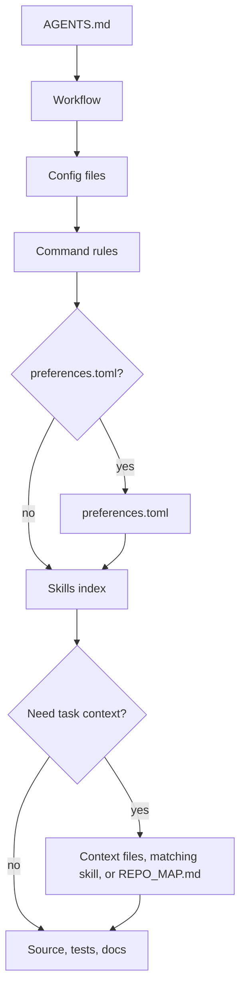

# mustflow

Languages: [English](README.md) · [한국어](docs/i18n/ko/README.md) · [中文](docs/i18n/zh/README.md) · [Español](docs/i18n/es/README.md) · [Français](docs/i18n/fr/README.md) · [हिन्दी](docs/i18n/hi/README.md)

mustflow is a workflow CLI designed for LLM coding agents. It guides agents to enter a repository, understand the correct operating context, run only authorized commands, and verify their work without guessing.

The core concept is straightforward: place `AGENTS.md` at the project root and keep detailed workflows under `.mustflow/`. Agents start from `AGENTS.md` and then follow the command contract, skills, project context, and verification rules in sequence.

- Documentation site: <https://0disoft.github.io/mustflow/>
- Human-readable project examples: [`examples/`](examples/)
- Repository: <https://github.com/0disoft/mustflow>
- Issues: <https://github.com/0disoft/mustflow/issues>
- Contributing: [CONTRIBUTING.md](https://github.com/0disoft/mustflow/blob/main/CONTRIBUTING.md)
- Security: [SECURITY.md](https://github.com/0disoft/mustflow/blob/main/SECURITY.md)
- Changelog: [CHANGELOG.md](https://github.com/0disoft/mustflow/blob/main/CHANGELOG.md)

## No-guessing workflow

The initial mustflow path is deliberately narrow.

```sh
npm install -D mustflow
npx mf init --yes
npx mf check --strict
```

After changes to code, templates, schemas, or documentation, classify the changed paths and review the verification plan before running any commands.

```sh
npx mf classify --changed --json > .mustflow/state/change-plan.json
npx mf verify --from-plan .mustflow/state/change-plan.json --plan-only --json
npx mf verify --from-plan .mustflow/state/change-plan.json --json
```

The plan is based on change classification and the `required_after` metadata in `.mustflow/config/commands.toml`. A command runs only if its declared intent is configured, one-shot, agent-allowed, closed-stdin, bounded by a timeout, and backed by an explicit command source.

Source anchors, maps, and SQLite search results serve as navigation aids only. They do not grant command permission, bypass validation, or override `AGENTS.md` and `.mustflow/config/commands.toml`.

## Agent Read Flow



`read_order` defines the required reading sequence, while `optional_read_order` and `[context]` control how task-specific context loads. The `[refresh]` policy sets when agents reread the same instructions.

The skills index acts as an active routing step: agents compare the task with `.mustflow/skills/INDEX.md` and read matching `SKILL.md` files before editing that scope. This step is required before file edits even when `mf doctor` or `mf check` passes, because health checks do not decide which task procedure applies. When files are created or modified, the final report should include a concise skill-selection note. Skills guide procedure only; command execution still comes from `.mustflow/config/commands.toml`.

## Quick start

Node.js 20 or newer is required. mustflow is distributed as an npm package with the CLI named `mf`.

```sh
npm install -D mustflow
npx mf init --yes
npx mf check --strict
```

In an interactive terminal, `mf init` prompts you to choose the document language, project profile, and agent report language. Use `mf init --yes` to install English defaults without prompts.

Run `mf init --dry-run` to preview the installation plan before writing files.

pnpm and Bun can use the same npm package. Bun is an installer/runtime option here,
not a separate mustflow dependency:

```sh
pnpm add -D mustflow
pnpm exec mf init --yes

bun add -d mustflow
bunx mf init --yes
```

Project-local installs should use `npx mf`, `pnpm exec mf`, or `bunx mf`. To make `mf`
available as a direct shell command, install mustflow globally:

```sh
npm install -g mustflow
mf version --check

bun install -g mustflow
mf version --check
```

If the shell still prints `mf: command not found`, mustflow is not installed globally
for that shell, or the package manager's global binary directory is not on `PATH`.
With Bun, make sure Bun's global binary directory, commonly `~/.bun/bin`, is on `PATH`.

Deno `npm:` execution is experimental until separately verified.

## What it does

mustflow installs and validates an agent workflow for user projects.

- Installs `AGENTS.md` and `.mustflow/**` workflow files.
- Declares runnable command rules in `.mustflow/config/commands.toml`.
- Checks installation health and configuration structure with `mf check` and `mf doctor`.
- Classifies changed files, public surfaces, and validation reasons with `mf classify`.
- Prints execution-free verification plans with `mf verify --plan-only --json`, including read-only local-index lock explanations when available.
- Runs only allowed one-shot commands within a timeout via `mf run <intent>` or `mf verify` when the selected intent is runnable.
- Writes command receipts to `.mustflow/state/runs/latest.json`.
- Generates a concise repository navigation map, `REPO_MAP.md`, with `mf map`.
- Indexes and searches mustflow docs, skills, skill routes, command rules, command-effect locks, file fingerprints, and opt-in source anchor metadata with SQLite via `mf index` and `mf search`. The local SQLite file is a rebuildable lookup cache, not a memory store, audit log, command transcript store, or source-content database.
- Tracks agent-created or agent-modified documentation needing prose review with `mf docs review`.
- Previews and applies bundled template updates safely with `mf update`.
- Publishes JSON Schemas for automation-facing reports and command contracts in `schemas/`.

## What it does not do

mustflow is not an automatic project editor and is not tied to a single agent product.

- It does not generate or modify application source code.
- It does not change project files just by being installed. Files are created only when `mf init` runs.
- It does not enforce tool-specific filenames such as `CLAUDE.md` or `GEMINI.md`.
- It does not replace a build system, test runner, package manager, or CI/CD setup.
- It does not add platform-specific files for GitHub, GitLab, or similar tools to the default template.
- It does not create a `justfile`, `Makefile`, or `Taskfile.yml` by default.
- `mf dashboard` inspects status, verification recommendations, command intents, release/version-source status, template update readiness, latest run receipts, skill routes, safe preferences, and documentation review state. It can copy or explain workflow information but does not run commands, apply fixes, start agents, merge branches, push changes, or update files automatically.

## Installed files

`mf init` installs only the agent workflow into the current directory.

```text
your-project/
├─ AGENTS.md
├─ .gitignore
└─ .mustflow/
   ├─ config/
   │  ├─ commands.toml
   │  ├─ manifest.lock.toml
   │  ├─ mustflow.toml
   │  └─ preferences.toml
   ├─ context/
   │  ├─ INDEX.md
   │  └─ PROJECT.md
   ├─ docs/
   │  └─ agent-workflow.md
   └─ skills/
      ├─ INDEX.md
      ├─ artifact-integrity-check/
      │  └─ SKILL.md
      ├─ behavior-preserving-refactor/
      │  └─ SKILL.md
      ├─ code-review/
      │  └─ SKILL.md
      ├─ codebase-orientation/
      │  └─ SKILL.md
      ├─ contract-sync-check/
      │  └─ SKILL.md
      ├─ date-number-audit/
      │  └─ SKILL.md
      ├─ database-change-safety/
      │  └─ SKILL.md
      ├─ dependency-reality-check/
      │  └─ SKILL.md
      ├─ diff-risk-review/
      │  └─ SKILL.md
      ├─ docs-prose-review/
      │  └─ SKILL.md
      ├─ docs-update/
      │  └─ SKILL.md
      ├─ external-prompt-injection-defense/
      │  └─ SKILL.md
      ├─ failure-triage/
      │  └─ SKILL.md
      ├─ instruction-conflict-scope-check/
      │  └─ SKILL.md
      ├─ migration-safety-check/
      │  └─ SKILL.md
      ├─ multi-agent-work-coordination/
      │  └─ SKILL.md
      ├─ performance-budget-check/
      │  └─ SKILL.md
      ├─ project-context-authoring/
      │  └─ SKILL.md
      ├─ pattern-scout/
      │  └─ SKILL.md
      ├─ repo-improvement-loop/
      │  └─ SKILL.md
      ├─ requirement-regression-guard/
      │  └─ SKILL.md
      ├─ repro-first-debug/
      │  └─ SKILL.md
      ├─ security-privacy-review/
      │  └─ SKILL.md
      ├─ source-freshness-check/
      │  └─ SKILL.md
      ├─ structure-discovery-gate/
      │  └─ SKILL.md
      ├─ security-regression-tests/
      │  └─ SKILL.md
      ├─ skill-authoring/
      │  └─ SKILL.md
      ├─ test-design-guard/
      │  └─ SKILL.md
      ├─ test-maintenance/
      │  └─ SKILL.md
      ├─ ui-quality-gate/
      │  └─ SKILL.md
      ├─ visual-review-artifact/
      │  ├─ SKILL.md
      │  ├─ resources.toml
      │  └─ assets/
      │     └─ review-template.html
      └─ web-asset-optimization/
         └─ SKILL.md
```

The default template does not create project-owned root documents or contract files such as `README.md`, `PROJECT.md`, `ROADMAP.md`, `DESIGN.md`, `GOVERNANCE.md`, `TESTING.md`, `API.md`, `project.contract.json`, or `openapi.yaml`. It also does not create CI configuration, general `docs/`, or general `skills/`. User projects may already use those names for their own files.

`mf init` creates `.gitignore` if it is missing. If `.gitignore` exists, mustflow updates only its managed block and preserves user rules.

`REPO_MAP.md` is not copied from the template. Generate it when needed with `mf map --write`. `.mustflow/cache/mustflow.sqlite` is also a regenerable local index created by `mf index`. `.mustflow/review/docs.toml` is not copied from the template; `mf docs review` creates it only when a document is added to the review queue.

If a project already has optional root Markdown files such as `README.md`, `PROJECT.md`, `ROADMAP.md`, `DESIGN.md`, `GOVERNANCE.md`, `TESTING.md`, `DEPLOYMENT.md`, `ARCHITECTURE.md`, or `API.md`, the repository map can use them as navigation anchors. It can also discover purpose-specific machine-readable contracts such as `project.contract.json`, `project.constants.json`, `design-tokens.json`, `openapi.yaml`, `asyncapi.yaml`, `schema.graphql`, and `schema.prisma`. Generic catch-all names like `SSOT.json` are not default anchors. `mf init` does not create or overwrite those project-owned files by default.

## Basic workflow

```sh
npx mf init --yes
npx mf doctor
npx mf check --strict
npx mf classify --changed --json > .mustflow/state/change-plan.json
npx mf verify --from-plan .mustflow/state/change-plan.json --plan-only --json
npx mf verify --from-plan .mustflow/state/change-plan.json --json
```

Create the optional local search index if search capabilities are needed. Run the normal command
when creating the index for the first time.

```sh
npx mf index --dry-run --json
npx mf index
npx mf search mustflow_check
```

On later runs, use incremental mode when you want to reuse a compatible fresh cache without rewriting
the SQLite file. If the cache is missing, stale, or incompatible, mustflow falls back to a full rebuild.

```sh
npx mf index --incremental --json
```

Preview template updates before applying them. Files marked as customized in `.mustflow/config/manifest.lock.toml` remain as repository-specific baselines while their current content matches the lock.

```sh
npx mf status
npx mf update --dry-run
npx mf update --apply
```

Agents should prefer the configured update intents so the repository receives a run receipt.

```sh
mf run mustflow_update_dry_run
mf run mustflow_update_apply
```

## Commands

| Command | Purpose |
| --- | --- |
| `mf init` | Install `AGENTS.md` and `.mustflow/**`. |
| `mf init --dry-run` | Show which files would be created without writing files. |
| `mf init --merge` | Merge the mustflow managed block into an existing `AGENTS.md`. |
| `mf init --force` | Back up conflicting files, then overwrite them. |
| `mf check` | Validate mustflow files, TOML configuration, and skill document shape. |
| `mf check --strict` | Run additional safety checks for document identity, authority/lifecycle metadata, skill index/body alignment, skill metadata, command boundaries, version-source discovery, retention policy, output limits, raw logs, and secret-like context. |
| `mf classify --changed` | Classify changed paths, public surfaces, and validation reasons without modifying files. |
| `mf contract-lint` | Inspect `.mustflow/config/commands.toml` for command-contract errors and warnings without running commands. |
| `mf doctor` | Inspect the current mustflow root without writing files. |
| `mf docs review list` | Show documents still waiting for prose review after agent edits. |
| `mf docs review add <path>` | Add or refresh a document review queue entry. |
| `mf docs review comment <path>` | Add multiline review guidance to an existing queue entry. |
| `mf docs review approve <path>` | Mark review complete and hide the document from the default queue. |
| `mf context --json` | Print read order, command rules, available capabilities, and recent run summary as JSON. |
| `mf map --stdout` | Print the current mustflow root map to stdout. |
| `mf map --write` | Create or update `REPO_MAP.md`. |
| `mf run <intent>` | Run an allowed one-shot command. |
| `mf index` | Build a SQLite index for mustflow docs, skill routes, command rules, command-effect locks, and file fingerprints. Use `--incremental` to reuse a compatible fresh index without rewriting it. |
| `mf search <query>` | Search docs, skills, skill routes, command rules, and command-effect locks in the SQLite index. |
| `mf status` | Inspect installed state and changed or missing files. |
| `mf update --dry-run` | Calculate a template update plan without writing files. |
| `mf update --apply` | Apply template updates when nothing is blocked. |
| `mf help <topic>` | Show installed mustflow help. |
| `mf dashboard` | Start a local inspection dashboard for status, verification recommendations, release/version-source status, template update readiness, latest run receipt, skill routes, safe preferences, and documentation review. It does not execute commands or apply fixes. |
| `mf version` | Print the installed mustflow package version. |
| `mf version --check` | Compare the installed package version with the latest npm release and print an update command if a newer version exists. |
| `mf version-sources` | Inspect detected package, template, and declared version sources without modifying files. |
| `mf impact --changed` | Report whether changed paths require a package or template version decision. |
| `mf verify --reason <event>` | Run configured verification intents selected by `required_after` metadata. |
| `mf verify --reason <event> --plan-only --json` | Print the required verification plan without running commands. |
| `mf explain authority [path]` | Explain managed Markdown authority decisions without modifying files. |
| `mf explain skill <skill_id>` | Explain the trigger, scope, risk, checks, and output contract for one skill route. |
| `mf explain skills` | Explain the strict skill index/body alignment summary used by `mf doctor --strict`. |
| `mf explain surface [path]` | Explain how a path maps to public-surface and validation categories. |

Automation and agents should use `--json` output instead of parsing human-facing text. Published JSON Schemas for stable outputs live in `schemas/`.

## Command execution policy

Runnable work is declared in `.mustflow/config/commands.toml` so agents do not guess commands.

`mf run` executes only commands that meet all these conditions:

- `status = "configured"`
- `lifecycle = "oneshot"`
- `run_policy = "agent_allowed"`
- `stdin = "closed"`

Development servers, watch modes, browser UIs, interactive commands, and background processes do not run directly.

Use `mf verify --reason <event> --plan-only --json` to inspect matching verification intents and missing runnable coverage without executing commands. When `.mustflow/cache/mustflow.sqlite` is fresh, scheduled entries include read-only `effectGraph` metadata for write locks and lock conflicts.

Each command run writes the latest run record to `.mustflow/state/runs/latest.json`. The record includes the intent name, working directory, timeout, exit code, timeout status, and the tail of stdout and stderr.

## Language and profiles

Installed workflow language, agent response language, and product-facing locale are separate settings.

```sh
npx mf init --profile product --locale ko --agent-lang ko
npx mf init --product-source-locale en --product-locale ko-KR
npx mf init --set git.auto_commit=true
```

- `--profile`: Project profile. The default is `minimal`. Profiles also select the installed skill surface: `minimal` installs core everyday coding skills, while `oss`, `team`, `product`, and `library` add opt-in skill groups without removing optional skill files from the package.
- `--locale`: Installed mustflow document language. The default template currently supports `en`, `ko`, `zh`, `es`, `fr`, and `hi`. The default template includes localized documents for all these locales.
- `--agent-lang`: Default language for final agent reports.
- `--interactive`: Choose init settings via prompts.
- `--yes`: Use default English init settings without prompts.
- `--set`: Set an allowed preference during installation. Supported keys include `git.auto_stage`, `git.auto_commit`, `git.auto_push=false`, `git.commit_message.style`, `git.commit_message.language`, `git.commit_message.max_suggestions`, `git.commit_message.include_body`, `git.commit_message.split_when_multiple_concerns`, `reporting.commit_suggestion.enabled`, `language.memory.summary`, and boolean `release.versioning.*` fields such as `release.versioning.suggest_bump=false`, `verification.selection.*` fields, and `testing.authoring.*` fields. Versioning preferences do not assume a fixed version file; agents must locate the repository-specific version source before suggesting or editing versions. Repositories needing an explicit version source can add `.mustflow/config/versioning.toml`; `mf init` does not install this optional file by default. `git.commit_message.style` accepts `conventional`, `descriptive`, or `gitmoji`; `gitmoji` only changes the suggested message format. `git.commit_message.language` accepts `preserve_existing`, `agent_response`, `docs`, or a locale tag such as `ja`, `de`, or `pt-BR`. `testing.authoring.new_test_policy` accepts `evidence_required`, `manual_approval`, or `broad`.
- `--product-source-locale`, `--product-locale`: Source and target locales for user-facing product strings.
- `--lang`: CLI output language. Current values are `en`, `ko`, `zh`, `es`, `fr`, and `hi`.

## Repository structure

The mustflow repository contains the CLI, templates, contract specifications, documentation site, and repository-level translation docs.

```text
mustflow/
├─ README.md
├─ ROADMAP.md
├─ LICENSE
├─ package.json
├─ schemas/
├─ tsconfig.json
├─ docs/
│  ├─ spec/
│  └─ i18n/
├─ docs-site/
├─ src/
│  └─ cli/
├─ templates/
│  └─ default/
└─ tests/
```

Files copied into user projects come from `templates/default/common/` and `templates/default/locales/<locale>/`.

Versioned contract specifications live in `docs/spec/`. The documentation site links them under Design -> Contract specifications.

## Candidate features

These are ideas not yet officially supported:

- Community skill registry and skill pack installs
- Optional `.mustflow/work-items/`
- `mf orient`, `mf refresh`
- Tool-specific adapters

## Development

Development commands in this repository use Bun. Users do not need Bun to run `mf` in their own projects.

```sh
bun install
bun run check
bun run docs:check:fast
bun run docs:check
bun run check:install
```

Agents working in this repository should prefer the configured mustflow intents for routine verification.

```sh
mf run build
mf run test_fast
mf run test_related
mf run test
mf run test_coverage
mf run test_release
mf run docs_validate_fast
mf run docs_validate
mf run mustflow_check
```

The Bun scripts remain available for human maintainers and release packaging. `test_fast` runs the fast CLI regression baseline, `test_related` selects tests from changed files and falls back to the fast baseline, and both use 8 Node test workers by default. Set `MUSTFLOW_TEST_CONCURRENCY=1`, `2`, or another positive integer to tune those workers on local machines. `test_release` keeps package metadata and packaging checks out of routine local edits. `test_coverage` runs the fast CLI baseline through Node's built-in coverage report with no enforced threshold; set `MUSTFLOW_TEST_COVERAGE_CONCURRENCY=1`, `2`, or another positive integer to adjust its worker count. `lint` and test-audit are configured as narrow repository-local gates. `docs_validate_fast` checks documentation navigation and localized content links without building the entire static site; `docs_validate` performs the full static documentation build, search index, and sitemap gate for release-sensitive changes.

`dist/` is a generated build output and is not committed. `npm pack` and `npm publish` run `npm run build` via `prepack`, so the npm package contains the built CLI.

Run the full release check before publishing:

```sh
bun run release:check
```

`release:check` validates the CLI, builds the documentation site, packs the npm tarball, installs it into a temporary project, and runs the public `mf` workflow. Maintainer npm publishing uses the `Publish npm package` GitHub Actions workflow from a published GitHub Release. The release tag must match the `package.json` version, with an optional leading `v`. npm Trusted Publishing must be configured for the workflow before maintainers publish through it.

## Documentation site

The documentation site lives in `docs-site/`.

```sh
bun run docs:dev
bun run docs:build
bun run docs:preview
```

GitHub Pages builds the `docs-site/` source from the `main` branch using GitHub Actions and deploys `docs-site/dist` as the Pages artifact. Do not commit `docs-site/dist`.

## Package contents

The npm package includes only:

```text
dist/
templates/
schemas/
README.md
LICENSE
```

`docs/`, `docs-site/`, `tests/`, `src/`, and work notes are not included in the npm package.

## License

MIT-0
