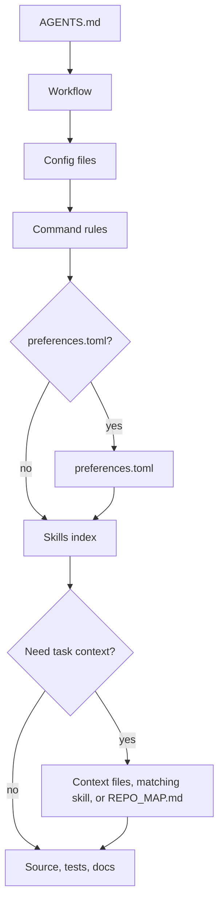

# mustflow

Languages: [English](README.md) · [한국어](docs/i18n/ko/README.md) · [中文](docs/i18n/zh/README.md) · [Español](docs/i18n/es/README.md) · [Français](docs/i18n/fr/README.md) · [हिन्दी](docs/i18n/hi/README.md)

mustflow is a repository-local work contract and verification CLI for LLM coding agents. It keeps agents inside explicit read, command, and verification boundaries without replacing the host agent's sandbox, approval, checkpoint, model, or tool policies.

The core concept is straightforward: place `AGENTS.md` at the project root and keep detailed workflows under `.mustflow/`. Agents start from `AGENTS.md`, then follow the repository command contract, skills, project context, and verification rules in sequence.

- Documentation site: <https://0disoft.github.io/mustflow/>
- Human-readable project examples: [`examples/`](examples/)
- Repository: <https://github.com/0disoft/mustflow>
- Issues: <https://github.com/0disoft/mustflow/issues>
- Contributing: [CONTRIBUTING.md](https://github.com/0disoft/mustflow/blob/main/CONTRIBUTING.md)
- Security: [SECURITY.md](https://github.com/0disoft/mustflow/blob/main/SECURITY.md)
- Changelog: [CHANGELOG.md](https://github.com/0disoft/mustflow/blob/main/CHANGELOG.md)

## Choose your path

- Use mustflow in your repository: start with [Quick start](#quick-start), then review the [no-guessing workflow](#no-guessing-workflow) and [`examples/minimal-js/`](examples/minimal-js/).
- Contribute to mustflow: read [CONTRIBUTING.md](CONTRIBUTING.md), then run only configured command intents from [`.mustflow/config/commands.toml`](.mustflow/config/commands.toml).
- Build an AI coding tool or agent harness: use `AGENTS.md` and `mf context --json` for repository context, then consume JSON output and schemas from `mf api`, `mf classify`, `mf verify`, `mf run`, `mf dashboard`, and [`schemas/`](schemas/).

## No-guessing workflow

The initial mustflow path is deliberately narrow.

Authority stays narrow:

- Current user instructions define the task goal unless they are unsafe.
- Host safety, sandbox, and approval gates still apply.
- Repository work rules come from the nearest `AGENTS.md` and `.mustflow/config/*.toml`.
- Command execution authority comes only from `.mustflow/config/commands.toml`.
- Skills, context files, preferences, generated maps, search results, cache, and state files guide or explain work. They do not grant command permission.

```sh
npm install -D mustflow
npx mf init --yes
npx mf check --strict
```

After changes to code, templates, schemas, or documentation, classify the changed paths and review the verification plan before running any commands.

```sh
npx mf classify --changed --write .mustflow/state/change-classification.json
npx mf verify --from-classification .mustflow/state/change-classification.json --plan-only --json
npx mf verify --from-classification .mustflow/state/change-classification.json --json
```

The plan is based on change classification and the `required_after` metadata in `.mustflow/config/commands.toml`. A command runs only if its declared intent is configured, one-shot, agent-allowed, closed-stdin, bounded by a timeout, and backed by an explicit command source.

Source anchors, maps, and SQLite search results serve as navigation aids only. They do not grant command permission, bypass validation, or override `AGENTS.md` and `.mustflow/config/commands.toml`.

## Agent Read Flow



`read_order` defines the required reading sequence, while `optional_read_order` and `[context]` control how task-specific context loads. The `[refresh]` policy sets when agents reread the same instructions.

The skills index acts as an active routing step: agents compare the task with `.mustflow/skills/INDEX.md` and read matching `SKILL.md` files before editing that scope. This step is required before file edits even when `mf doctor` or `mf check` passes, because health checks do not decide which task procedure applies. When files are created or modified, the final report should include a concise skill-selection note. Skills guide procedure only; command execution still comes from `.mustflow/config/commands.toml`.

## Quick start

Node.js 20 or newer is required. mustflow is distributed as an npm package with the CLI named `mf`.

```sh
npm install -D mustflow
npx mf init --yes
npx mf check --strict
```

In an interactive terminal, `mf init` prompts you to choose the document language, project profile, and agent report language. Use `mf init --yes` to install English defaults without prompts.

Run `mf init --dry-run` to preview the installation plan before writing files.

pnpm and Bun can use the same npm package. Bun is an installer/runtime option here,
not a separate mustflow dependency:

```sh
pnpm add -D mustflow
pnpm exec mf init --yes

bun add -d mustflow
bunx mf init --yes
```

Project-local installs should use `npx mf`, `pnpm exec mf`, or `bunx mf`. To make `mf`
available as a direct shell command, install mustflow globally:

```sh
npm install -g mustflow
mf version --check

bun add -g mustflow@latest
mf version --check
```

If the shell still prints `mf: command not found`, mustflow is not installed globally
for that shell, or the package manager's global binary directory is not on `PATH`.
With Bun, make sure Bun's global binary directory, commonly `~/.bun/bin`, is on `PATH`.

Deno `npm:` execution is experimental until separately verified.

## What it does

mustflow installs and validates an agent workflow for user projects.

- Installs `AGENTS.md` and `.mustflow/**` workflow files.
- Declares runnable command rules in `.mustflow/config/commands.toml`.
- Checks installation health and configuration structure with `mf check` and `mf doctor`.
- Reports host adapter compatibility with `mf adapters status` without generating host-specific files or treating them as command authority.
- Classifies changed files, public surfaces, and validation reasons with `mf classify`.
- Inspects changed files for quality-gaming patterns such as line stuffing, suppressions, test bypass markers, type escapes, and placeholder implementations with `mf quality check`.
- Prints execution-free verification plans with `mf verify --plan-only --json`, including a risk-priced evidence assessment, machine-readable verification decision graph, and read-only local-index lock explanations when available.
- Reports a read-only complexity budget in `mf api diff-risk --changed --json`, `mf verify`
  evidence, and dashboard exports so agents justify new dependencies, helper-style surfaces,
  config/schema churn, and broad structural changes before treating added complexity as free.
- Lists, suggests, and runs bundled read-only utility scripts through `mf script-pack`, including
  `code/outline` for source symbol maps, `code/dependency-graph` for bounded relative import graphs,
  `code/module-boundary` for configured import-boundary guardrails,
  `code/change-impact` for git-diff impact and verification hints, `code/symbol-read` for focused source snippets,
  `code/route-outline` for Hono, Elysia, Axum, and NestJS route maps, `docs/reference-drift` for stale
  documentation references, `repo/config-chain` for nearby config inheritance,
  `repo/env-contract` for environment-variable contract drift,
  `repo/secret-risk-scan` for plausible hardcoded-secret findings without printing values,
  `repo/generated-boundary` for candidate path safety checks, and `core/text-budget`
  for exact file and JSON-field length budgets, so future checks do not sprawl into top-level
  commands.
- Prints context trust metadata in `mf context --json` and prompt-cache bundles so agents can distinguish binding instructions, command contracts, contextual hints, generated evidence, and volatile runtime data before using them.
- Runs only allowed one-shot commands within a timeout via `mf run <intent>` or `mf verify` when the selected intent is runnable.
- Records blockers, contradictions, verification gaps, and remaining risks as a structured conflict ledger in verify, evidence, and dashboard reports.
- Stores bounded failure replay capsules for failed `mf verify` runs so future agents can reproduce the intent, receipt, command fingerprint, and changed-file state without copying raw command output.
- Writes bounded command receipts under `.mustflow/state/runs/run-*`, atomically updates `.mustflow/state/runs/latest.json`, and rebuilds `.mustflow/state/runs/latest.index.json` for recent retained runs.
- Generates a concise repository navigation map, `REPO_MAP.md`, with `mf map`, and a design-flow map, `REPO_FLOW.md`, with `mf flow`.
- Indexes and searches mustflow docs, skills, skill routes, command rules, command-effect locks, file fingerprints, and opt-in source anchor metadata with SQLite via `mf index` and `mf search`. The local SQLite file is a rebuildable lookup cache, not a memory store, audit log, command transcript store, command-authority source, or source-content database.
- Tracks agent-created or agent-modified documentation needing prose review with `mf docs review`.
- Validates restricted work-item or handoff JSON records with `mf handoff validate` without creating backlog files, storing transcripts, or granting command authority.
- Exports bounded static dashboard reports with `mf dashboard --export-json <path>` or `mf dashboard --export <path>` for pull requests and continuous integration artifacts. The export includes a `harness_report` summary for install state, changed surfaces, verification decisions, latest receipt metadata, document-review status, and remaining risks without raw command-output tails or mutation controls.
- Previews and applies bundled template updates safely with `mf update`.
- Publishes JSON Schemas for automation-facing reports and command contracts in `schemas/`.

## What it does not do

mustflow is not an automatic project editor and is not tied to a single agent product.

- It does not generate or modify application source code.
- It does not change project files just by being installed. Files are created only when `mf init` runs.
- It does not enforce tool-specific filenames such as `CLAUDE.md` or `GEMINI.md`.
- It does not replace a build system, test runner, package manager, or CI/CD setup.
- It does not add platform-specific files for GitHub, GitLab, or similar tools to the default template.
- It does not create a `justfile`, `Makefile`, or `Taskfile.yml` by default.
- `mf dashboard` inspects status, verification recommendations, command intents, release/version-source status, template update readiness, latest run receipts, skill routes, safe preferences, and documentation review state. It can copy or explain workflow information but does not run commands, apply fixes, start agents, merge branches, push changes, or update files automatically.

## Installed files

`mf init` installs only the agent workflow into the current directory. The exact skill files depend
on the selected profile; run `mf init --dry-run --profile <profile>` to preview the concrete plan
for a project before writing files.

```text
your-project/
├─ AGENTS.md
├─ .gitignore
└─ .mustflow/
   ├─ config/
   │  ├─ commands.toml
   │  ├─ manifest.lock.toml
   │  ├─ mustflow.toml
   │  └─ preferences.toml
   ├─ context/
   │  ├─ INDEX.md
   │  └─ PROJECT.md
   ├─ docs/
   │  └─ agent-workflow.md
   └─ skills/
      ├─ INDEX.md
      ├─ routes.toml
      └─ <profile-selected-skill>/
         └─ SKILL.md
```

Profiles select the installed skill surface. The package can include optional skill files that are
not copied into every project profile. Non-English workflow documents are localized when available;
skill procedures currently fall back to the canonical English skill files.

The default template does not create project-owned root documents or contract files such as `README.md`, `PROJECT.md`, `ROADMAP.md`, `DESIGN.md`, `GOVERNANCE.md`, `TESTING.md`, `API.md`, `project.contract.json`, or `openapi.yaml`. It also does not create CI configuration, general `docs/`, or general `skills/`. User projects may already use those names for their own files.

`mf init` creates `.gitignore` if it is missing. If `.gitignore` exists, mustflow updates only its managed block and preserves user rules.

`REPO_MAP.md` and `REPO_FLOW.md` are not copied from the template. Generate them when needed with `mf map --write` and `mf flow --write`. `.mustflow/cache/mustflow.sqlite` is also a regenerable local index created by `mf index`. `.mustflow/review/docs.toml` is not copied from the template; `mf docs review` creates it only when a document is added to the review queue.

If a project already has optional root Markdown files such as `README.md`, `PROJECT.md`, `ROADMAP.md`, `DESIGN.md`, `GOVERNANCE.md`, `TESTING.md`, `DEPLOYMENT.md`, `ARCHITECTURE.md`, or `API.md`, the repository map can use them as navigation anchors. It can also discover purpose-specific machine-readable contracts such as `project.contract.json`, `project.constants.json`, `design-tokens.json`, `openapi.yaml`, `asyncapi.yaml`, `schema.graphql`, and `schema.prisma`. Generic catch-all names like `SSOT.json` are not default anchors. `mf init` does not create or overwrite those project-owned files by default.

## Basic workflow

```sh
npx mf init --yes
npx mf doctor
npx mf check --strict
npx mf classify --changed --write .mustflow/state/change-classification.json
npx mf verify --from-classification .mustflow/state/change-classification.json --plan-only --json
npx mf verify --from-classification .mustflow/state/change-classification.json --json
```

Create the optional local search index if search capabilities are needed. Run the normal command
when creating the index for the first time.

```sh
npx mf index --dry-run --json
npx mf index
npx mf search mustflow_check
```

On later runs, use incremental mode when you want to reuse a compatible fresh cache without rewriting
the SQLite file. If the cache is missing, stale, or incompatible, mustflow falls back to a full rebuild.

```sh
npx mf index --incremental --json
```

Preview template updates before applying them. Files marked as customized in `.mustflow/config/manifest.lock.toml` remain as repository-specific baselines while their current content matches the lock.

```sh
npx mf status
npx mf update --dry-run
npx mf update --apply
```

After updating the mustflow package, `mf upgrade` combines the package freshness check with the safe project-file update step. It does not install packages by itself; refresh mustflow with the package manager you used first. When a newer release exists, `mf version --check` and `mf upgrade` print update commands for npm, Bun, pnpm, Yarn, and Deno.

```sh
bun add -g mustflow@latest
mf upgrade --dry-run
mf upgrade
```

Agents should prefer the configured update intents so the repository receives a run receipt.

```sh
mf run mustflow_update_dry_run
mf run mustflow_update_apply
```

## Commands

| Command | Purpose |
| --- | --- |
| `mf init` | Install `AGENTS.md` and `.mustflow/**`. |
| `mf init --dry-run` | Show which files would be created without writing files. |
| `mf init --merge` | Merge the mustflow managed block into an existing `AGENTS.md`. |
| `mf init --force` | Back up conflicting files, then overwrite them. |
| `mf check` | Validate mustflow files, TOML configuration, and skill document shape. |
| `mf check --strict` | Run additional safety checks for document identity, authority/lifecycle metadata, skill index/body alignment, skill metadata, command boundaries, version-source discovery, retention policy, output limits, raw logs, and secret-like context. |
| `mf adapters status` | Inspect existing host-specific instruction and adapter files without generating adapter files or granting command authority. |
| `mf classify --changed` | Classify changed paths, public surfaces, and validation reasons. Add `--write <path>` to save the classification report. |
| `mf contract-lint` | Inspect `.mustflow/config/commands.toml` for command-contract errors and warnings without running commands. Add `--suggest` to print non-runnable candidate snippets from existing command files. |
| `mf onboard commands` | Suggest review-only command-intent snippets from package.json, Makefile, or justfile without writing files or granting command authority. |
| `mf next` | Inspect install state, changed files, verification coverage, and command-contract gaps, then print the next safe mustflow action without running commands. |
| `mf evidence` | Summarize changed-file verification requirements, risk-priced evidence assessment, latest failure replay capsule, conflict ledger, receipts, remaining risks, and gaps without running commands. |
| `mf workspace status` | Inspect configured workspace roots and nested repository contract readiness without granting parent-to-child command authority. |
| `mf workspace command-catalog` | Aggregate per-repository command intent availability with safe `mf run` entrypoints and no raw command strings. |
| `mf workspace verify --changed --plan-only` | Aggregate per-repository changed-file verification plans without running commands or granting parent-to-child command authority. |
| `mf doctor` | Inspect the current mustflow root without writing files. |
| `mf api workspace-summary --json` | Print a stable, read-only JSON summary for coding agents and external harnesses. |
| `mf api command-catalog --json` | Print command intent availability and safe `mf run` entrypoints without exposing raw command strings. |
| `mf api verification-plan --changed --json` | Print a stable, read-only verification plan for changed files without executing commands. |
| `mf api latest-evidence --json` | Print bounded latest run or verify evidence without raw command output. |
| `mf api diff-risk --changed --json` | Print a compact changed-file risk, verification summary, read-only complexity budget, and residual correction signals. |
| `mf api health --json` | Print a compact workspace health report for quick agent gating. |
| `mf api locks --json` | Print active `mf run` locks for multi-session coordination. |
| `mf api serve --stdio` | Serve the same read-only API reports as newline-delimited JSON responses over stdin/stdout. |
| `mf docs review list` | Show documents still waiting for prose review after agent edits. |
| `mf docs review add <path>` | Add or refresh a document review queue entry. |
| `mf docs review comment <path>` | Add multiline review guidance to an existing queue entry. |
| `mf docs review approve <path>` | Mark review complete and hide the document from the default queue. |
| `mf handoff validate <path>` | Validate a restricted work-item or handoff JSON record without writing files. |
| `mf context --json` | Print read order, command rules, context trust metadata, available capabilities, prompt-cache bundles, and recent run summary as JSON. |
| `mf skill route` | Resolve compact skill route candidates from task text, paths, and reasons before reading selected skill documents. |
| `mf map --stdout` | Print the current mustflow root map to stdout. |
| `mf map --write` | Create or update `REPO_MAP.md`. |
| `mf flow --stdout` | Print the current mustflow root design-flow map to stdout. |
| `mf flow --write` | Create or update `REPO_FLOW.md`. |
| `mf flow --check` | Check whether `REPO_FLOW.md` is current. |
| `mf quality check` | Inspect changed files for quality-gaming patterns without writing files. |
| `mf quality check --all` | Inspect every tracked text file for quality-gaming patterns. |
| `mf script-pack list` | List bundled script packs, script refs, routing hints, side-effect flags, input/output labels, and JSON schema files. |
| `mf script-pack suggest --changed --json` | Rank optional read-only helpers for current changed files without running those helpers or granting command authority. |
| `mf script-pack suggest --path <path> --phase before_change` | Rank helpers for an explicit path and workflow phase before deciding which script to run. |
| `mf script-pack run code/outline scan <path...> --json` | Scan supported source files for symbol headers, line ranges, source anchors, return metadata, and content hashes. |
| `mf script-pack run code/dependency-graph scan <path...> --json` | Trace bounded relative import, export, require, and dynamic import edges for TypeScript and JavaScript source files. |
| `mf script-pack run code/module-boundary check <path...> --json` | Check configured module-boundary import rules, import cycles, public entrypoints, feature imports, and shared budgets. |
| `mf script-pack run code/change-impact analyze --base HEAD --json` | Analyze changed files and return bounded impact candidates, script-pack hints, and verification intent hints. |
| `mf script-pack run code/symbol-read read <path> --start-line <line> --json` | Read the focused symbol range or bounded source snippet after `code/outline` identifies the relevant location. |
| `mf script-pack run code/symbol-read read --anchor <id> --json` | Read the conservative target symbol for a structured `mf:anchor` source marker. |
| `mf script-pack run code/route-outline scan <path...> --json` | Scan Hono, Elysia, Axum, and NestJS files for route methods, paths, handlers, lifecycle chains, line ranges, and content hashes. |
| `mf script-pack run code/export-diff compare --base HEAD --json` | Compare exported TypeScript or JavaScript declarations, return metadata, and package surface hints against a git base. |
| `mf script-pack run docs/reference-drift check [path...] --json` | Check documentation references to `mf` commands, script-pack refs, schema files, and repository paths against current local surfaces. |
| `mf script-pack run repo/config-chain inspect <path...> --json` | Inspect nearby package, TypeScript, ESLint, Vite, Tailwind, test, and mustflow config files plus static inheritance edges without executing dynamic config code. |
| `mf script-pack run repo/env-contract scan [path...] --json` | Scan code, CI, docs, config, and env examples for environment-variable contract drift without reading or printing real secret env values. |
| `mf script-pack run repo/secret-risk-scan scan [path...] --json` | Scan code, docs, config, CI, and examples for plausible hardcoded secrets while reporting only redacted fingerprints. |
| `mf script-pack run repo/generated-boundary check <path...> --json` | Check whether candidate paths cross generated, ignored, protected, vendor, or cache boundaries before or after edits. |
| `mf script-pack run repo/related-files map <path...> --json` | Map direct imports, importers, same-basename siblings, and nearby config or package boundaries for source navigation. |
| `mf script-pack run core/text-budget check <path...> --max <count>` | Check exact text length budgets for files using grapheme counts by default. |
| `mf script-pack run core/text-budget check package.json --json-pointer /description --max <count> --json` | Check a JSON string field and print the stable report schema. |
| `mf run <intent>` | Run an allowed one-shot command. |
| `mf run <intent> --wait` | Wait for conflicting active run locks before executing the command. |
| `mf run <intent> --dry-run --json` | Preview whether an intent is runnable and what command metadata would be used, without executing it. |
| `mf index` | Build a SQLite index for mustflow docs, skill routes, command rules, command-effect locks, and file fingerprints. Use `--incremental` to reuse a compatible fresh index without rewriting it. |
| `mf search <query>` | Search docs, skills, skill routes, command rules, and command-effect locks in the SQLite index. |
| `mf status` | Inspect installed state and changed or missing files. |
| `mf update --dry-run` | Calculate a template update plan without writing files. |
| `mf update --apply` | Apply template updates when nothing is blocked. |
| `mf upgrade` | Check package freshness, then apply safe bundled template updates when the package is current. |
| `mf upgrade --dry-run` | Check package freshness and print the safe project update plan without writing files. |
| `mf help <topic>` | Show installed mustflow help. |
| `mf dashboard` | Start a local inspection dashboard for status, verification recommendations, release/version-source status, template update readiness, latest run receipt, skill routes, safe preferences, and documentation review. Use `--export-json <path>` or `--export <path>` for a bounded static report. It does not execute commands or apply fixes. |
| `mf version` | Print the installed mustflow package version. |
| `mf version --check` | Compare the installed package version with the latest npm release and print package-manager update commands if a newer version exists. |
| `mf version-sources` | Inspect detected package, template, and declared version sources without modifying files. |
| `mf impact --changed` | Report whether changed paths require a package or template version decision. |
| `mf verify --reason <event>` | Run configured verification intents selected by `required_after` metadata. |
| `mf verify --reason <event> --plan-only --json` | Print the required verification plan without running commands. |
| `mf explain authority [path]` | Explain managed Markdown authority decisions without modifying files. |
| `mf explain skill <skill_id>` | Explain the trigger, scope, risk, checks, output contract, and selection evidence for one skill route. |
| `mf explain skills` | Explain the strict skill index/body alignment summary used by `mf doctor --strict`. |
| `mf explain surface [path]` | Explain how a path maps to public-surface and validation categories. |

Automation and agents should use `--json` output or `mf api serve --stdio` JSONL responses instead of parsing human-facing text. Published JSON Schemas for stable outputs live in `schemas/`.

For script-pack helper selection, start with `mf script-pack suggest --changed --json` or an
explicit `--path`. The suggestion report is only a ranking aid: it does not run scripts, prove
verification, or bypass `.mustflow/config/commands.toml`. A common source-orientation flow is
`code/outline` first, `code/dependency-graph` for relative import impact, then `code/symbol-read`
for the chosen symbol line or source anchor. After a local diff exists, use `code/change-impact`
to summarize changed surfaces, likely related files, optional helper scripts, and verification hints. After
public-ish TypeScript or JavaScript changes, use `code/export-diff` to review exported signatures
and return metadata against a git base. After docs, schema, CLI, or script-pack surface changes, use
`docs/reference-drift` to catch stale references before treating docs as synchronized. For
config-sensitive source or test work, use `repo/config-chain` before assuming effective inherited
rules. For generated or protected paths, use `repo/generated-boundary` before editing or when
reviewing a changed-file set. See the full
[`mf script-pack` documentation](https://0disoft.github.io/mustflow/commands/script-pack/).

`core/text-budget` counts `line` units by splitting text on line breaks; a trailing line break
therefore contributes an empty final line.

## Command execution policy

Runnable work is declared in `.mustflow/config/commands.toml` so agents do not guess commands.
New projects start with Bun-backed `test`, `test_related`, and `test_fast` intents so agents can run
basic verification immediately after `mf init`. Replace those defaults with narrower project-specific
commands when a repository uses another runner or has a faster related-test entrypoint.

`mf run` executes only commands that meet all these conditions:

- `status = "configured"`
- `lifecycle = "oneshot"`
- `run_policy = "agent_allowed"`
- `stdin = "closed"`

Development servers, watch modes, browser UIs, interactive commands, and background processes do not run directly. `mf run` also rejects obvious long-running `argv` shapes, such as shell-wrapper background payloads, interpreter loops, package-manager development scripts, watchers, and development servers declared as one-shot commands. If a bounded one-shot command has a name that matches a common long-running pattern, the intent can explicitly acknowledge that with `allow_long_running_command_patterns = true`; background shell patterns remain blocked.

Command environments remove the project-local `node_modules/.bin` path from `PATH` by default. If an intent needs a project dependency binary such as `eslint`, `tsc`, or `vitest`, declare it through the package manager, for example `npm exec eslint -- ...`, `pnpm exec tsc -- --noEmit`, `bun x eslint ...`, or `yarn exec eslint ...`. `mf check --strict` warns when an agent-runnable intent uses a bare executable name that appears under the project-local `.bin` directory, except for names listed in `defaults.allow_project_local_bin_bare_executables`. `mf run` may resolve those allowed names directly from the local `.bin` directory without exposing every local binary through `PATH`. The installed template allows `mf` and `mustflow` by default. Intent-level `allow_env_inheritance_risks = true` is available when a command intentionally uses `env_policy = "inherit"`.

Use `mf verify --reason <event> --plan-only --json` to inspect matching verification intents, command eligibility, risk-priced evidence requirements, remaining gaps, and missing runnable coverage without executing commands. Use `mf run <intent> --dry-run --json` to inspect one resolved command intent without spawning a process or writing a run receipt. Plan-only verification includes a `decision_graph` that connects changed surfaces, classification reasons, command candidates, eligibility checks, effects, and gaps. When `.mustflow/cache/mustflow.sqlite` is fresh, scheduled entries also include read-only `effectGraph` metadata for write locks and lock conflicts. These graph rows are marked `explanation_only` and never grant command authority; `.mustflow/config/commands.toml` remains the only runnable command source.

Each executed command run writes a run record under `.mustflow/state/runs/run-*`, atomically updates `.mustflow/state/runs/latest.json`, and rebuilds `.mustflow/state/runs/latest.index.json` from retained `run-*` and `verify-*` directories. The record includes the intent name, working directory, timeout, exit code, timeout status, and the tail of stdout and stderr. `latest.json` is a root-scoped convenience pointer, not session-scoped proof; in multi-agent or multi-terminal workflows, use the per-run `receipt_path`, the retained index, or `mf run <intent> --json` output as the evidence for a specific run.

## Language and profiles

Installed workflow language, agent response language, and product-facing locale are separate settings.

```sh
npx mf init --profile product --locale ko --agent-lang ko
npx mf init --product-source-locale en --product-locale ko-KR
npx mf init --set git.auto_commit=true
```

- `--profile`: Project profile. The default is `minimal`. Profiles also select the installed skill surface: `minimal` installs core everyday coding skills, `patterns` adds architecture-pattern procedures, and `oss`, `team`, `product`, and `library` add opt-in skill groups without removing optional skill files from the package.
- `--locale`: Installed mustflow document language. The default template currently supports `en`, `ko`, `zh`, `es`, `fr`, and `hi`. The default template includes localized documents for all these locales.
- `--agent-lang`: Default language for final agent reports.
- `--interactive`: Choose init settings via prompts.
- `--yes`: Use default English init settings without prompts.
- `--set`: Set an allowed preference during installation. Supported keys include `git.auto_stage`, `git.auto_commit`, `git.auto_push=false`, `git.commit_message.style`, `git.commit_message.language`, `git.commit_message.max_suggestions`, `git.commit_message.include_body`, `git.commit_message.split_when_multiple_concerns`, `reporting.commit_suggestion.enabled`, `language.memory.summary`, and boolean `release.versioning.*` fields such as `release.versioning.suggest_bump=false`, `verification.selection.*` fields, and `testing.authoring.*` fields. Versioning preferences do not assume a fixed version file; agents must locate the repository-specific version source before suggesting or editing versions. Repositories needing an explicit version source can add `.mustflow/config/versioning.toml`; `mf init` does not install this optional file by default. `git.commit_message.style` accepts `conventional`, `descriptive`, or `gitmoji`; `gitmoji` only changes the suggested message format. `git.commit_message.language` accepts `preserve_existing`, `agent_response`, `docs`, or a locale tag such as `ja`, `de`, or `pt-BR`. `testing.authoring.new_test_policy` accepts `evidence_required`, `manual_approval`, or `broad`.
- `--product-source-locale`, `--product-locale`: Source and target locales for user-facing product strings.
- `--lang`: CLI output language. Current values are `en`, `ko`, `zh`, `es`, `fr`, and `hi`.

## Repository structure

The mustflow repository contains the CLI, templates, contract specifications, documentation site, and repository-level translation docs.

```text
mustflow/
├─ README.md
├─ ROADMAP.md
├─ LICENSE
├─ package.json
├─ schemas/
├─ tsconfig.json
├─ docs/
│  ├─ spec/
│  └─ i18n/
├─ docs-site/
├─ src/
│  └─ cli/
├─ templates/
│  └─ default/
└─ tests/
```

Files copied into user projects come from `templates/default/common/` and `templates/default/locales/<locale>/`.

Versioned contract specifications live in `docs/spec/`. The documentation site links them under Design -> Contract specifications.

## Candidate features

These are ideas not yet officially supported:

- Community skill registry and skill pack installs
- Optional `.mustflow/work-items/` writers and lifecycle commands
- `mf orient`, `mf refresh`
- Tool-specific adapters

## Development

Development commands in this repository use Bun. Users do not need Bun to run `mf` in their own projects.
The mustflow source repository dogfoods the installed workflow files at the repository root: agents
should read `AGENTS.md`, `.mustflow/docs/agent-workflow.md`, and `.mustflow/config/commands.toml`
before changing code or running verification.

```sh
bun install
bun run check
bun run docs:check:fast
bun run docs:check
bun run check:install
```

When Bun is not available, maintainers can still run the core CLI and package metadata checks with Node/npm:

```sh
npm run check:core:node
```

Agents working in this repository should prefer the configured mustflow intents for routine verification.

```sh
mf run build
mf run test_fast
mf run test_related
mf run test
mf run test_coverage
mf run test_release
mf run maintainer_check_node
mf run docs_validate_fast
mf run docs_validate
mf run mustflow_check
mf run release_npm_version_available
mf run release_npm_published_verify
```

The Bun scripts remain available for human maintainers and release packaging. `test_fast` runs the fast CLI regression baseline, `test_related` selects tests from changed files and falls back to the fast baseline, and both use 8 Node test workers by default. Set `MUSTFLOW_TEST_CONCURRENCY=1`, `2`, or another positive integer to tune those workers on local machines. `test_release` keeps package metadata and packaging checks out of routine local edits. `test_coverage` runs the fast CLI baseline through Node's built-in coverage report with no enforced threshold; set `MUSTFLOW_TEST_COVERAGE_CONCURRENCY=1`, `2`, or another positive integer to adjust its worker count. `lint` and test-audit are configured as narrow repository-local gates. `docs_validate_fast` checks documentation navigation and localized content links without building the entire static site; `docs_validate` performs the full static documentation build, search index, and sitemap gate for release-sensitive changes.

`dist/` is a generated build output and is not committed. `npm pack` and `npm publish` run `npm run build` via `prepack`, so the npm package contains the built CLI.

Run the full release check before publishing:

```sh
bun run release:check
```

`release:check` validates the CLI, builds the documentation site, packs the npm tarball, installs it into a temporary project, and runs the public `mf` workflow. Maintainer npm publishing uses the `Publish npm package` GitHub Actions workflow from a published GitHub Release. The release tag must match the `package.json` version, with an optional leading `v`. Run `mf run release_npm_version_available` before creating the tag and `mf run release_npm_published_verify` after the publish workflow completes. npm Trusted Publishing must be configured for the workflow before maintainers publish through it.

## Documentation site

The documentation site lives in `docs-site/`.

```sh
bun run docs:dev
bun run docs:build
bun run docs:preview
```

GitHub Pages builds the `docs-site/` source from the `main` branch using GitHub Actions and deploys `docs-site/dist` as the Pages artifact. Do not commit `docs-site/dist`.

## Package contents

The npm package includes only:

```text
dist/
templates/
schemas/
examples/
README.md
LICENSE
```

`docs/`, `docs-site/`, `tests/`, `src/`, and work notes are not included in the npm package.

## License

MIT-0
