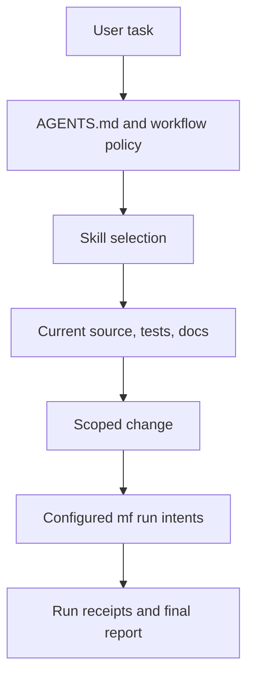
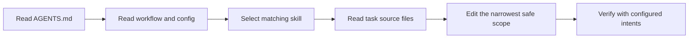
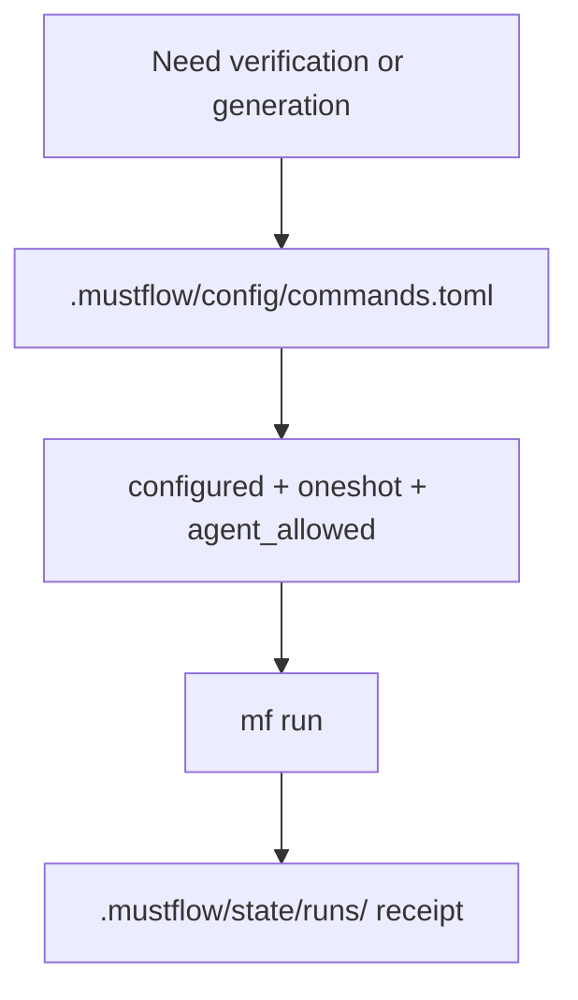
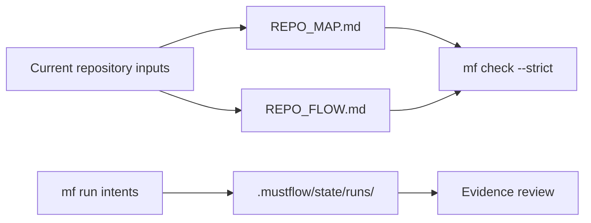

# REPO_FLOW.md

This file is a generated design-flow map for the current mustflow root. It is not command authority, architecture authority, or a replacement for `AGENTS.md`, `.mustflow/config/commands.toml`, or current source files.
Regenerate it with `mf flow --write` instead of editing it by hand.

## How To Use

- Use this file to understand how work moves through the repository before choosing where to read or edit.
- Use `REPO_MAP.md` for file and anchor discovery.
- Use `AGENTS.md` and `.mustflow/config/commands.toml` for binding workflow and command execution rules.
- Use current source, tests, and docs as the source of truth for implementation details.

## One-Screen Mental Model

## Agent Work Flow

### Read Order Inputs

- `AGENTS.md`
- `.mustflow/docs/agent-workflow.md`
- `.mustflow/config/mustflow.toml`
- `.mustflow/config/commands.toml`
- `.mustflow/config/preferences.toml`
- `.mustflow/config/technology.toml`
- `.mustflow/skills/router.toml`

### Optional Navigation Inputs

- `.mustflow/context/INDEX.md`
- `.mustflow/skills/routes.toml`
- `.mustflow/skills/INDEX.md`
- `REPO_MAP.md`

## Command Execution Flow

### Notable Configured Intents

- `mustflow_doctor`
- `mustflow_check`
- `lint`
- `build`
- `test_related`
- `docs_validate_fast`
- `test_release`
- `repo_map`
- `repo_flow`
- `changes_status`
- `changes_diff_summary`

## Generated and Receipt Flow

### Generated Surfaces

- `REPO_MAP.md`
- `REPO_FLOW.md`
- `.mustflow/config/manifest.lock.toml`
- `.mustflow/cache/**`
- `.mustflow/state/**`

## Public Contract Surfaces

- CLI commands and options live in `src/cli/commands/` and `src/cli/lib/command-registry.ts`.
- Human-readable CLI strings live in `src/cli/i18n/`.
- Strict workflow validation lives in `src/cli/lib/validation/`.
- User-facing command docs live in `docs-site/src/content/docs/*/commands/`.
- File-role docs live in `docs-site/src/content/docs/*/files/`.
- Release-sensitive package metadata starts at `package.json`.

## Where To Edit First

- CLI behavior: start at the matching file under `src/cli/commands/`, then sync registry, i18n, tests, and docs.
- Generated Markdown: start at the generator under `src/cli/lib/`, then sync strict validation and file-role docs.
- Command authority: start at `.mustflow/config/commands.toml`, then sync docs and command-contract tests.
- Workflow or skill behavior: start at `.mustflow/skills/router.toml` or the matching `SKILL.md`, then sync route metadata and validation.
- Release metadata: locate version sources before editing version files.

## Present Flow Inputs

- `AGENTS.md`
- `.mustflow/docs/agent-workflow.md`
- `.mustflow/config/mustflow.toml`
- `.mustflow/config/commands.toml`
- `.mustflow/config/preferences.toml`
- `.mustflow/skills/router.toml`
- `.mustflow/skills/routes.toml`
- `.mustflow/skills/INDEX.md`
- `README.md`
- `REPO_MAP.md`
