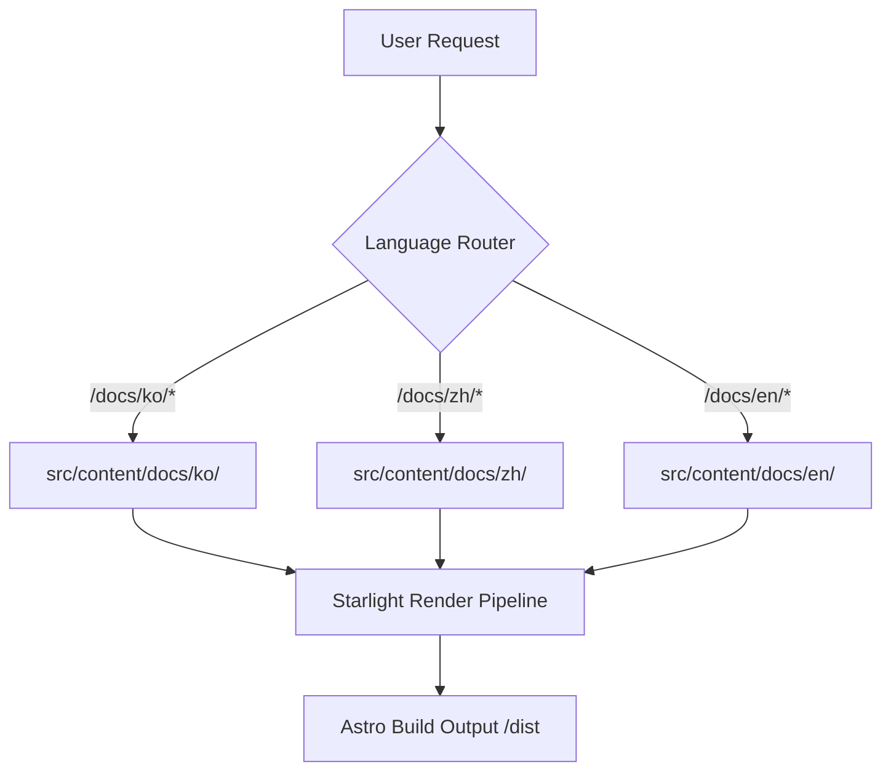

# mustflow docs site

Languages: [English](README.md) · [한국어](docs/i18n/ko/README.md) · [中文](docs/i18n/zh/README.md) · [Español](docs/i18n/es/README.md) · [Français](docs/i18n/fr/README.md) · [हिन्दी](docs/i18n/hi/README.md)

This is the official documentation site deployed to `0disoft.github.io/mustflow`. It provides detailed guidance on the files, configuration scopes, and workflows created by mustflow.

> [!NOTE]
> This documentation site is not installed into user repositories via `mf init`. It serves as a centralized documentation hub for mustflow contributors and users.

---

## Architecture Overview

The site is built using [Astro](https://astro.build/) and [Starlight](https://starlight.astro.build/). Below is a high-level flowchart demonstrating how the static site renders dynamically localized markdown content under the `/docs/` structure:



---

## Directory Map (Topology)

Here is a structured overview of the `docs-site` layout for contributors:

```
docs-site/
├── docs/
│   └── i18n/            # Translations for docs-site internal READMEs (ko, zh, es, fr, hi)
├── src/
│   ├── config/          # Modularized Starlight options (navigation, head, locales, etc.)
│   ├── lib/             # Shared pure functional generation helpers (e.g., machine-readable generator)
│   ├── styles/          # Structured CSS files divided by concern (tokens, interaction, a11y)
│   └── content/docs/    # Multilingual markdown pages for the public documentation site
└── public/              # Static public assets (scripts, images, icons)
```

---

## Commands

### Local Development

Run these commands inside the `docs-site/` folder:

```sh
bun run dev      # Launch the Astro local development server
bun run check    # Run TypeScript and Astro structure checks
bun run build    # Build the production bundle into dist/
bun run preview  # Preview the production build locally
```

### Monorepo Wrapper Commands

Alternatively, you can run these wrapper commands directly from the **repository root**:

```sh
bun run docs:dev      # Launch dev server from root
bun run docs:check    # Run documentation integrity checks
bun run docs:build    # Build docs-site from root
bun run docs:preview  # Preview production build from root
```

### Agent Verification Intent

For LLM agents or continuous integration validation, prefer the configured mustflow intent:

```sh
mf run docs_validate
```

---

## Contributor Maintenance Workflow

When updating documentation or translation files, please strictly follow this 4-step workflow to avoid verification gaps:

1. **Modify English Source first**: Apply your updates to the English source files (e.g., `README.md` or `src/config/README.md`).
2. **Synchronize Locales**: Apply the matching translation edits in `docs/i18n/ko/` or other relevant locale folders.
3. **Synchronize Manifest Hashes**: Calculate the updated file hashes and update `.mustflow/config/manifest.lock.toml`.
4. **Run Verification**: Ensure everything passes by running:
   ```sh
   mf run docs_validate_fast
   mf run mustflow_check
   ```
