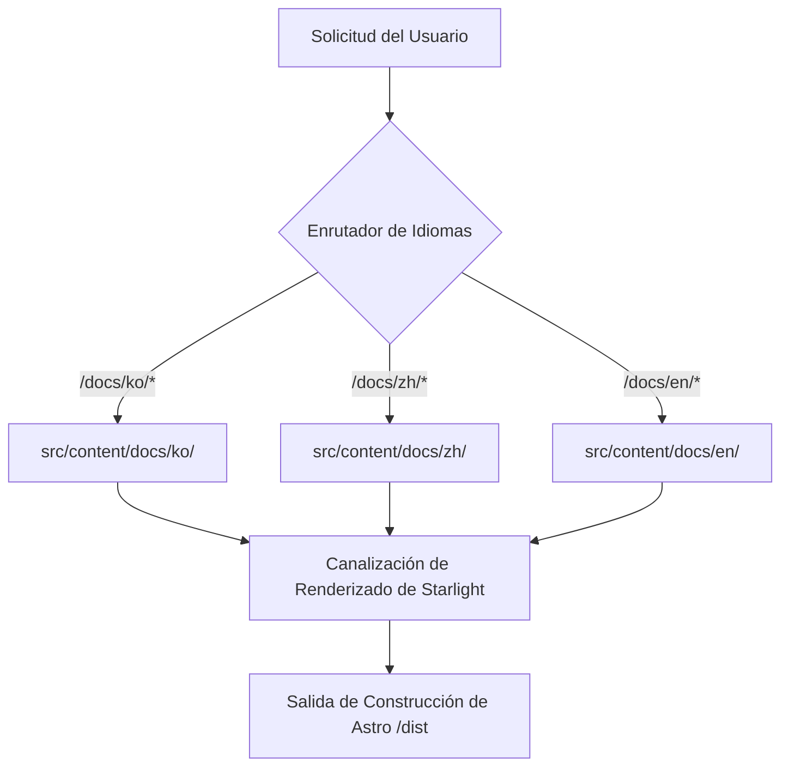

# Sitio de documentación de mustflow

Idiomas: [Inglés](../../../README.md) · [Coreano](../ko/README.md) · [Chino](../zh/README.md) · [Español](README.md) · [Francés](../fr/README.md) · [Hindi](../hi/README.md)

Este es el sitio de documentación oficial desplegado en `0disoft.github.io/mustflow`. Proporciona guías detalladas sobre los archivos, ámbitos de configuración y flujos de trabajo creados por mustflow.

> [!NOTE]
> Este sitio de documentación no se instala en los repositorios de usuario mediante `mf init`. Sirve como un centro de documentación centralizado para los colaboradores y usuarios de mustflow.

---

## Descripción General de la Arquitectura

El sitio está construido utilizando [Astro](https://astro.build/) y [Starlight](https://starlight.astro.build/). A continuación se muestra un diagrama de flujo de alto nivel que demuestra cómo el sitio estático renderiza contenido markdown localizado dinámicamente bajo la estructura `/docs/`:



---

## Mapa de Directorios (Topología)

Aquí hay una descripción estructurada del diseño de `docs-site` para los colaboradores:

```
docs-site/
├── docs/
│   └── i18n/            # Traducciones para los README internos de docs-site (ko, zh, es, fr, hi)
├── src/
│   ├── config/          # Opciones de Starlight modularizadas (navegación, encabezado, locales, etc.)
│   ├── lib/             # Ayudantes de generación funcional pura compartidos (ej. generador legible por máquina)
│   ├── styles/          # Archivos CSS estructurados divididos por funcionalidad (tokens, interacción, a11y)
│   └── content/docs/    # Páginas markdown multilingües para el sitio de documentación pública
└── public/              # Activos públicos estáticos (scripts, imágenes, iconos)
```

---

## Comandos

### Desarrollo Local

Ejecute estos comandos dentro de la carpeta `docs-site/`:

```sh
bun run dev      # Iniciar el servidor de desarrollo local de Astro
bun run check    # Ejecutar comprobaciones de estructura de TypeScript y Astro
bun run build    # Construir el paquete de producción en dist/
bun run preview  # Previsualizar la construcción de producción localmente
```

### Comandos Envolvedores del Monorepo

Alternativamente, puede ejecutar estos comandos envolvedores directamente desde la **raíz del repositorio**:

```sh
bun run docs:dev      # Iniciar el servidor de desarrollo desde la raíz
bun run docs:check    # Ejecutar comprobaciones de integridad de la documentación
bun run docs:build    # Construir docs-site desde la raíz
bun run docs:preview  # Previsualizar la construcción de producción desde la raíz
```

### Intención de Verificación del Agente

Para agentes LLM o validación de integración continua, prefiera el intent configurado de mustflow:

```sh
mf run docs_validate
```

---

## Flujo de Trabajo de Mantenimiento para Colaboradores

Al actualizar la documentación o los archivos de traducción, siga estrictamente este flujo de trabajo de 4 pasos para evitar fallos de verificación:

1. **Modificar primero la Fuente en Inglés**: Aplique sus actualizaciones a los archivos fuente en inglés (ej., `README.md` o `src/config/README.md`).
2. **Sincronizar Idiomas (Locales)**: Aplique las traducciones correspondientes en `docs/i18n/ko/` u otras carpetas de idiomas relevantes.
3. **Sincronizar Hashes del Manifiesto**: Calcule los hashes de los archivos actualizados y actualice `.mustflow/config/manifest.lock.toml`.
4. **Ejecutar Verificación**: Asegúrese de que todo sea correcto ejecutando:
   ```sh
   mf run docs_validate_fast
   mf run mustflow_check
   ```
