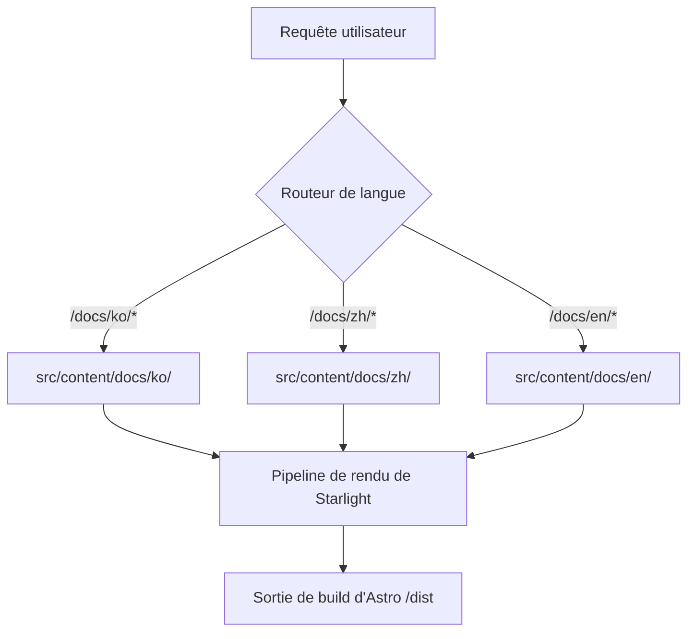

# Site de documentation mustflow

Langues : [Anglais](../../../README.md) · [Coréen](../ko/README.md) · [Chinois](../zh/README.md) · [Espagnol](../es/README.md) · [Français](README.md) · [Hindi](../hi/README.md)

Voici le site de documentation officiel déployé sur `0disoft.github.io/mustflow`. Il fournit des guides détaillés sur les fichiers, les configurations et les flux de travail créés par mustflow.

> [!NOTE]
> Ce site de documentation n'est pas installé dans les dépôts utilisateur via `mf init`. Il sert de hub de documentation centralisé pour les contributeurs et les utilisateurs de mustflow.

---

## Vue d'ensemble de l'architecture

Le site est construit avec [Astro](https://astro.build/) et [Starlight](https://starlight.astro.build/). Ci-dessous, un organigramme de haut niveau démontrant comment le site statique rend le contenu markdown localisé dynamiquement sous la structure `/docs/` :



---

## Carte des répertoires (Topologie)

Voici une vue structurée de l'organisation de `docs-site` pour les contributeurs :

```
docs-site/
├── docs/
│   └── i18n/            # Traductions des README internes de docs-site (ko, zh, es, fr, hi)
├── src/
│   ├── config/          # Options modulaires de Starlight (navigation, en-tête, locales, etc.)
│   ├── lib/             # Utilitaires de génération fonctionnelle pure partagés (ex: générateur lisible par machine)
│   ├── styles/          # Fichiers CSS structurés divisés par domaine d'application (tokens, interaction, a11y)
│   └── content/docs/    # Pages markdown multilingues pour le site de documentation publique
└── public/              # Actifs publics statiques (scripts, images, icônes)
```

---

## Commandes

### Développement local

Exécutez ces commandes dans le dossier `docs-site/` :

```sh
bun run dev      # Lancer le serveur de développement local d'Astro
bun run check    # Exécuter les vérifications de structure de TypeScript et d'Astro
bun run build    # Compiler le bundle de production dans dist/
bun run preview  # Prévisualiser le build de production localement
```

### Commandes enveloppes du monorepo

Alternativement, vous pouvez exécuter ces commandes enveloppes directement depuis la **racine du dépôt** :

```sh
bun run docs:dev      # Lancer le serveur de dev depuis la racine
bun run docs:check    # Exécuter les vérifications d'intégrité de la documentation
bun run docs:build    # Compiler docs-site depuis la racine
bun run docs:preview  # Prévisualiser le build de production depuis la racine
```

### Intention de vérification d'agent

Pour les agents LLM ou la validation d'intégration continue, privilégiez l'intent mustflow configuré :

```sh
mf run docs_validate
```

---

## Flux de travail de maintenance pour les contributeurs

Lors de la mise à jour de la documentation ou des fichiers de traduction, veuillez suivre strictement ce flux de travail en 4 étapes afin d'éviter tout écart de vérification :

1. **Modifier d'abord la source en anglais** : Appliquez vos mises à jour aux fichiers sources en anglais (ex: `README.md` ou `src/config/README.md`).
2. **Synchroniser les langues (locales)** : Appliquez les modifications de traduction correspondantes dans `docs/i18n/ko/` ou d'autres dossiers de langue concernés.
3. **Synchroniser les hashes du manifeste** : Calculez les nouveaux hashes des fichiers et mettez à jour `.mustflow/config/manifest.lock.toml`.
4. **Exécuter la vérification** : Assurez-vous que tout passe en exécutant :
   ```sh
   mf run docs_validate_fast
   mf run mustflow_check
   ```
