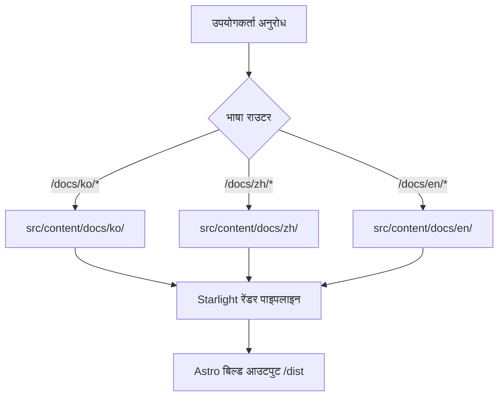

# mustflow दस्तावेज़ साइट

भाषाएँ: [अंग्रेज़ी](../../../README.md) · [कोरियाई](../ko/README.md) · [चीनी](../zh/README.md) · [स्पेनी](../es/README.md) · [फ़्रांसीसी](../fr/README.md) · [हिन्दी](README.md)

यह `0disoft.github.io/mustflow` पर तैनात आधिकारिक दस्तावेज़ साइट है। यह mustflow द्वारा बनाए गए फ़ाइलों, कॉन्फ़िगरेशन क्षेत्रों और कार्यप्रवाहों पर विस्तृत मार्गदर्शन प्रदान करती है।

> [!NOTE]
> यह दस्तावेज़ साइट `mf init` के माध्यम से उपयोगकर्ता रिपॉज़िटरी में इंस्टॉल नहीं होती है। यह mustflow योगदानकर्ताओं और उपयोगकर्ताओं के लिए एक केंद्रीकृत दस्तावेज़ केंद्र के रूप में कार्य करती है।

---

## वास्तुकला अवलोकन (Architecture Overview)

यह साइट [Astro](https://astro.build/) और [Starlight](https://starlight.astro.build/) का उपयोग करके बनाई गई है। नीचे एक उच्च-स्तरीय फ़्लोचार्ट है जो दर्शाता है कि कैसे स्थिर साइट `/docs/` संरचना के तहत गतिशील रूप से स्थानीयकृत मार्कडाउन सामग्री प्रस्तुत (render) करती है:



---

## निर्देशिका मानचित्र (Directory Map - Topology)

यहाँ योगदानकर्ताओं के लिए `docs-site` लेआउट का एक संरचित अवलोकन दिया गया है:

```
docs-site/
├── docs/
│   └── i18n/            # docs-site आंतरिक README के लिए अनुवाद (ko, zh, es, fr, hi)
├── src/
│   ├── config/          # मॉड्यूलराइज्ड Starlight विकल्प (navigation, head, locales, आदि)
│   ├── lib/             # साझा शुद्ध कार्यात्मक जनरेशन सहायक (जैसे, मशीन-पठनीय जनरेटर)
│   ├── styles/          # चिंता के अनुसार विभाजित संरचित CSS फ़ाइलें (tokens, interaction, a11y)
│   └── content/docs/    # सार्वजनिक दस्तावेज़ साइट के लिए बहुभाषी मार्कडाउन पृष्ठ
└── public/              # स्थिर सार्वजनिक संपत्तियाँ (scripts, images, icons)
```

---

## कमांड (Commands)

### स्थानीय विकास (Local Development)

इन कमांडों को `docs-site/` फ़ोल्डर के अंदर चलाएँ:

```sh
bun run dev      # एस्ट्रो स्थानीय विकास सर्वर लॉन्च करें
bun run check    # टाइपस्क्रिप्ट और एस्ट्रो संरचना जाँच चलाएँ
bun run build    # dist/ में उत्पादन बंडल का निर्माण करें
bun run preview  # स्थानीय स्तर पर उत्पादन बिल्ड का पूर्वावलोकन करें
```

### मोनोरिपो रैपर कमांड (Monorepo Wrapper Commands)

वैकल्पिक रूप से, आप इन रैपर कमांडों को सीधे **रिपॉज़िटरी रूट** से चला सकते हैं:

```sh
bun run docs:dev      # रूट से देव सर्वर लॉन्च करें
bun run docs:check    # दस्तावेज़ अखंडता जाँच चलाएँ
bun run docs:build    # रूट से docs-site का निर्माण करें
bun run docs:preview  # रूट से उत्पादन बिल्ड का पूर्वावलोकन करें
```

### एजेंट सत्यापन उद्देश्य (Agent Verification Intent)

LLM एजेंटों या निरंतर एकीकरण (CI) सत्यापन के लिए, कॉन्फ़िगर किए गए mustflow उद्देश्य को प्राथमिकता दें:

```sh
mf run docs_validate
```

---

## योगदानकर्ता रखरखाव कार्यप्रवाह (Contributor Maintenance Workflow)

दस्तावेज़ या अनुवाद फ़ाइलों को अपडेट करते समय, सत्यापन अंतराल से बचने के लिए कृपया इस 4-चरण कार्यप्रवाह का सख्ती से पालन करें:

1. **पहले अंग्रेजी स्रोत को संशोधित करें**: अपने अपडेट अंग्रेजी स्रोत फ़ाइलों (जैसे, `README.md` या `src/config/README.md`) पर लागू करें।
2. **लोकेल सिंक करें**: `docs/i18n/ko/` या अन्य प्रासंगिक लोकेल फ़ोल्डरों में मिलान अनुवाद संपादन लागू करें।
3. **घोषणापत्र हैश (Manifest Hashes) सिंक करें**: अपडेट की गई फ़ाइलों के हैश की गणना करें और `.mustflow/config/manifest.lock.toml` को अपडेट करें।
4. **सत्यापन चलाएँ**: सुनिश्चित करें कि यह सब चलाकर सफल हो:
   ```sh
   mf run docs_validate_fast
   mf run mustflow_check
   ```
