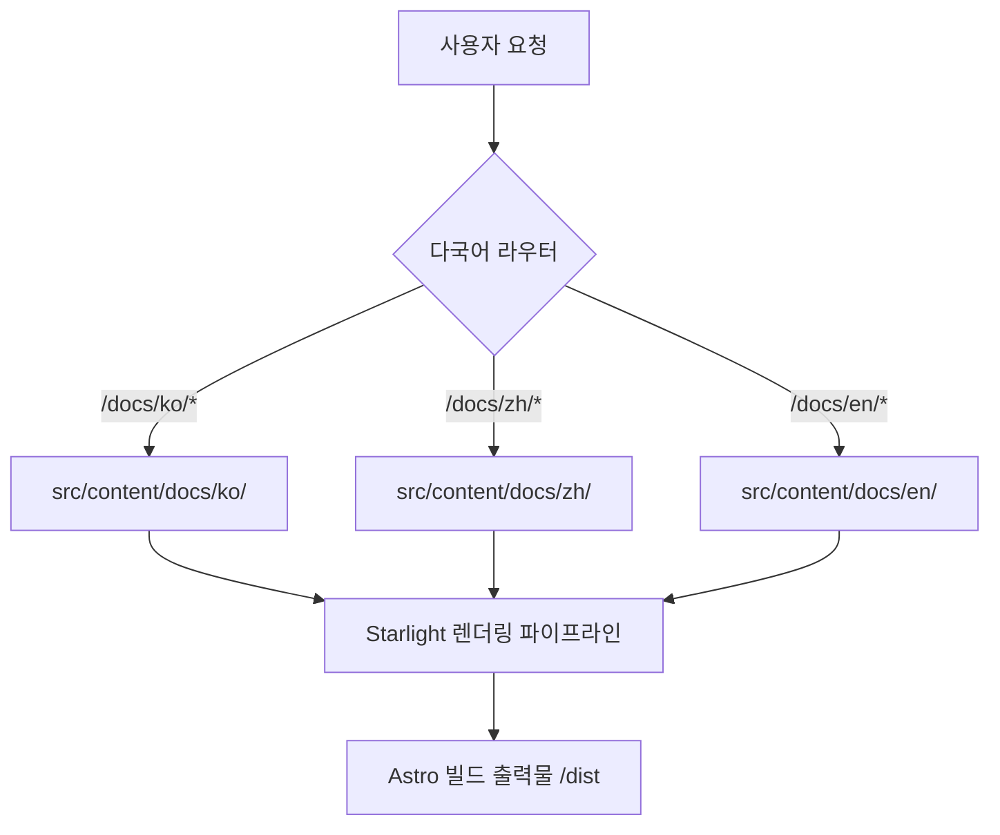

# mustflow 문서 사이트

언어: [영어](../../../README.md) · [한국어](README.md) · [중국어](../zh/README.md) · [스페인어](../es/README.md) · [프랑스어](../fr/README.md) · [힌디어](../hi/README.md)

`0disoft.github.io/mustflow`에 배포되는 공식 문서 사이트입니다. mustflow가 생성하는 파일 구조, 설정 영역 및 프로젝트 워크플로에 대한 상세한 가이드를 제공합니다.

> [!NOTE]
> 이 문서 사이트는 `mf init`을 통해 사용자 저장소에 직접 설치되는 문서가 아닙니다. mustflow 기여자 및 사용자를 위한 중앙화된 글로벌 문서 허브 역할을 수행합니다.

---

## 아키텍처 개요

이 사이트는 [Astro](https://astro.build/) 및 [Starlight](https://starlight.astro.build/)를 기반으로 설계되었습니다. 아래의 아키텍처 흐름도는 정적 사이트가 `/docs/` 하위에서 어떻게 다국어 마크다운 콘텐츠를 동적으로 라우팅하고 렌더링하는지 설명합니다.



---

## 디렉토리 맵 (구조 토폴로지)

기여자를 위해 정리한 `docs-site` 프로젝트의 핵심 폴더 구조입니다.

```
docs-site/
├── docs/
│   └── i18n/            # docs-site 내부 README의 언어별 번역본 (ko, zh, es, fr, hi)
├── src/
│   ├── config/          # Starlight 전용 분할 설정 파일 (네비게이션, 헤드, 로케일 등)
│   ├── lib/             # 공용 유틸 및 메타데이터 자동 생성용 순수 함수형 헬퍼
│   ├── styles/          # 관심사별로 분리된 스타일시트 (디자인 토큰, 접근성, 인터랙션)
│   └── content/docs/    # 공개 문서 사이트에 게시될 다국어 마크다운 원본 페이지
└── public/              # 정적 에셋 (스크립트, 이미지, 아이콘)
```

---

## 명령어

### 로컬 개발 시

`docs-site/` 폴더 내부에서 다음 명령어를 실행할 수 있습니다.

```sh
bun run dev      # Astro 로컬 개발 서버 시작
bun run check    # TypeScript 및 Astro 파일 구조 정합성 검사
bun run build    # 배포용 정적 빌드 파일 생성 (/dist)
bun run preview  # 빌드된 정적 결과물을 로컬에서 미리보기
```

### 모노레포 루트 명령어

저장소 **루트(Root) 경로**에서 직접 실행할 수 있는 편리한 래퍼 명령어입니다.

```sh
bun run docs:dev      # 루트에서 개발 서버 즉시 구동
bun run docs:check    # 문서 상태 및 정합성 검사
bun run docs:build    # docs-site 프로젝트 빌드
bun run docs:preview  # 빌드된 배포판 미리보기 구동
```

### 에이전트 검증 명령어 (Intent)

LLM 에이전트 또는 CI 검증 파이프라인에서 문서 검증을 수행할 때는 설정된 mustflow 전용 명령어를 우선 사용합니다.

```sh
mf run docs_validate
```

---

## 기여자 문서 유지보수 워크플로

문서 또는 번역본을 갱신할 때는 무결성 검증 오류를 예방하기 위해 다음 **4단계 프로세스**를 엄격히 준수해 주세요.

1. **영어 원본 우선 수정**: 원본 파일(예: `README.md` 또는 `src/config/README.md`)을 수정합니다.
2. **다국어 동기화**: 수정 내용에 맞추어 `docs/i18n/ko/` 등의 다국어 번역본을 수정 및 동기화합니다.
3. **매니페스트 해시 동기화**: 변경된 파일들의 SHA-256 해시를 구하고 `.mustflow/config/manifest.lock.toml`에 반영합니다.
4. **검증 실행**: 다음 명령어를 구동하여 오류가 없는지 최종 확인합니다.
   ```sh
   mf run docs_validate_fast
   mf run mustflow_check
   ```
