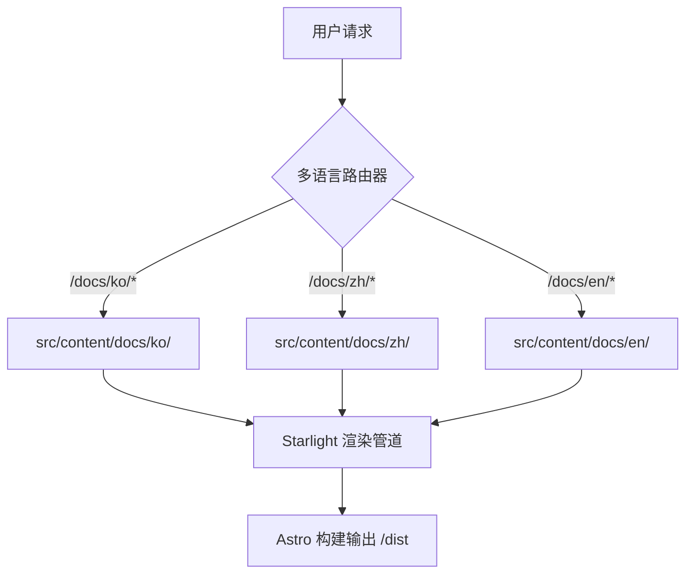

# mustflow 文档站点

语言：[英文](../../../README.md) · [韩文](../ko/README.md) · [中文](README.md) · [西班牙文](../es/README.md) · [法文](../fr/README.md) · [印地文](../hi/README.md)

这是部署到 `0disoft.github.io/mustflow` 的官方文档站点。它提供了关于 mustflow 创建的文件结构、配置范围以及工作流的详细指南。

> [!NOTE]
> 该文档站点不会通过 `mf init` 安装到用户仓库中。它作为 mustflow 贡献者和用户的集中式全球文档中心。

---

## 架构概述

该站点使用 [Astro](https://astro.build/) 和 [Starlight](https://starlight.astro.build/) 构建。以下高级流程图展示了静态站点如何动态渲染并路由 `/docs/` 结构下的多语言 Markdown 内容：



---

## 目录映射 (拓扑结构)

以下是供贡献者参考的 `docs-site` 项目核心目录拓扑图：

```
docs-site/
├── docs/
│   └── i18n/            # docs-site 内部 README 的多语言翻译 (ko, zh, es, fr, hi)
├── src/
│   ├── config/          # Starlight 专用的模块化配置文件 (导航、头部、区域语言等)
│   ├── lib/             # 多个路由共享的纯函数生成辅助工具 (如机器可读元数据生成器)
│   ├── styles/          # 按关注点分离的结构化样式表 (设计变量、交互、无障碍支持)
│   └── content/docs/    # 用于在公共文档站点上发布的多语言 Markdown 源码页面
└── public/              # 静态公共资源 (脚本、图像、图标)
```

---

## 命令

### 本地开发

在 `docs-site/` 文件夹内运行以下命令：

```sh
bun run dev      # 启动 Astro 本地开发服务器
bun run check    # 运行 TypeScript 和 Astro 结构完整性检查
bun run build    # 将生产包构建到 dist/ 目录中
bun run preview  # 在本地预览生产环境构建结果
```

### 单体仓库根目录包装命令

或者，您也可以直接在**仓库根目录**下运行以下包装命令：

```sh
bun run docs:dev      # 从根目录启动开发服务器
bun run docs:check    # 运行文档完整性检查
bun run docs:build    # 从根目录构建 docs-site
bun run docs:preview  # 从根目录预览生产环境构建结果
```

### 代理验证命令 (Intent)

对于 LLM 代理或持续集成验证，优先使用配置的 mustflow 意图：

```sh
mf run docs_validate
```

---

## 贡献者维护工作流

更新文档或翻译文件时，请严格遵守以下 **4 步工作流**，以防止验证完整性出错：

1. **优先修改英文源文件**：先将您的更改应用到英文源文件 (例如 `README.md` 或 `src/config/README.md`)。
2. **同步翻译**：在 `docs/i18n/zh/` 或其他相关的语言文件夹中应用对应的翻译修改。
3. **同步清单哈希值**：重新计算修改后文件的 SHA-256 哈希值，并更新 `.mustflow/config/manifest.lock.toml`。
4. **运行验证**：运行以下命令确保所有检查均已通过：
   ```sh
   mf run docs_validate_fast
   mf run mustflow_check
   ```
