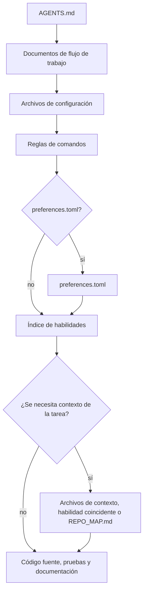

# mustflow

Idiomas: [Inglés](../../../README.md) · [Coreano](../ko/README.md) · [Chino](../zh/README.md) · [Español](README.md) · [Francés](../fr/README.md) · [Hindi](../hi/README.md)

mustflow es una CLI de flujo de trabajo para agentes de codificación basados en
LLM. Ayuda a los agentes a entrar en un repositorio, leer el contexto operativo
correcto, ejecutar solo comandos declarados y verificar su trabajo sin adivinar.

El modelo central es simple: coloca `AGENTS.md` en la raíz del proyecto y guarda
el flujo de trabajo detallado bajo `.mustflow/`. Los agentes empiezan en
`AGENTS.md` y luego siguen, en orden, el contrato de comandos, las habilidades,
el contexto del proyecto y las reglas de verificación.

## Flujo de lectura del agente



`read_order` define el orden de lectura obligatorio, mientras que
`optional_read_order` y `[context]` gobiernan cómo se carga el contexto
específico de cada tarea. La política `[refresh]` determina cuándo los agentes
vuelven a leer las mismas instrucciones.

El índice de skills es un paso activo de enrutamiento: los agentes comparan la tarea con
`.mustflow/skills/INDEX.md` y leen los `SKILL.md` coincidentes antes de editar ese alcance.
Las skills solo guían el procedimiento; la ejecución de comandos sigue viniendo de
`.mustflow/config/commands.toml`.

- Sitio de documentación: <https://mustflow.github.io>
- Repositorio: <https://github.com/0disoft/mustflow>
- Incidencias: <https://github.com/0disoft/mustflow/issues>

## Qué hace

mustflow instala y valida un flujo de trabajo para agentes en proyectos de
usuario.

- Instala `AGENTS.md` y los archivos de flujo de trabajo `.mustflow/**`.
- Declara reglas de comandos ejecutables en
  `.mustflow/config/commands.toml`.
- Comprueba el estado de instalación y la estructura de configuración con
  `mf check` y `mf doctor`.
- Ejecuta solo comandos puntuales permitidos, dentro de un tiempo límite, con
  `mf run <intent>`.
- Genera un mapa conciso de navegación del repositorio, `REPO_MAP.md`, con
  `mf map`.
- Indexa y busca documentación, habilidades y reglas de comandos de mustflow con
  SQLite mediante `mf index` y `mf search`.
- Previsualiza y aplica de forma segura las actualizaciones de plantillas
  incluidas con `mf update`.
- Publica JSON Schemas para informes orientados a automatizacion y contratos de
  comandos en `schemas/`.

## Qué no hace

mustflow no es un editor automático de proyectos y no está ligado a un producto
de agente concreto.

- No genera ni modifica código fuente de aplicaciones.
- No cambia archivos del proyecto solo por estar instalado. Los archivos se
  crean únicamente cuando se ejecuta `mf init`.
- No impone nombres de archivo específicos de herramientas, como `CLAUDE.md` o
  `GEMINI.md`.
- No sustituye un sistema de compilación, ejecutor de pruebas, gestor de
  paquetes ni configuración de integración o despliegue continuo.
- No añade archivos específicos de plataformas como GitHub, GitLab o similares
  a la plantilla predeterminada.
- No crea `justfile`, `Makefile` ni `Taskfile.yml` de forma predeterminada.
- `mf dashboard` inicia una interfaz local de navegador para revisar y editar
  preferencias seguras en `.mustflow/config/preferences.toml`, y la abre en el
  navegador predeterminado. La página permite cambiar entre inglés, coreano,
  chino, español, francés e hindi. También incluye selección de verificación y
  preferencias de escritura de tests. Al guardar preferencias, actualiza la
  entrada del archivo de bloqueo como línea base personalizada si ese archivo existe.

## Funciones candidatas

Estas son ideas aparcadas; todavía no son funciones admitidas oficialmente.

- Registro comunitario de habilidades e instalación de paquetes de habilidades
- `.mustflow/work-items/` opcional
- `mf orient`, `mf refresh`
- Adaptadores específicos de herramientas

## Inicio rápido

Se requiere Node.js 20 o posterior. mustflow se distribuye como paquete npm, y
el nombre de la CLI es `mf`.

```sh
npm install -D mustflow
npx mf init --dry-run
npx mf init
npx mf check --strict
```

En una terminal interactiva, `mf init` permite elegir el idioma de los
documentos, el perfil del proyecto y el idioma de los informes del agente. Usa
`mf init --yes` cuando un script deba instalar los valores predeterminados en
inglés sin preguntas.

pnpm y Bun pueden usar el mismo paquete npm.

```sh
pnpm add -D mustflow
pnpm exec mf init --yes

bun add -d mustflow
bunx mf init --yes
```

La ejecución de Deno con `npm:` debe considerarse experimental hasta que se
verifique por separado.

## Archivos instalados

`mf init` instala únicamente el flujo de trabajo para agentes en el directorio
actual.

```text
your-project/
├─ AGENTS.md
├─ .gitignore
└─ .mustflow/
   ├─ config/
   │  ├─ commands.toml
   │  ├─ manifest.lock.toml
   │  ├─ mustflow.toml
   │  └─ preferences.toml
   ├─ context/
   │  ├─ INDEX.md
   │  └─ PROJECT.md
   ├─ docs/
   │  └─ agent-workflow.md
   └─ skills/
      ├─ INDEX.md
      ├─ code-review/
      │  └─ SKILL.md
      ├─ codebase-orientation/
      │  └─ SKILL.md
      ├─ docs-update/
      │  └─ SKILL.md
      ├─ failure-triage/
      │  └─ SKILL.md
      ├─ project-context-authoring/
      │  └─ SKILL.md
      ├─ skill-authoring/
      │  └─ SKILL.md
      ├─ test-maintenance/
      │  └─ SKILL.md
      ├─ visual-review-artifact/
      │  └─ SKILL.md
      └─ web-asset-optimization/
         └─ SKILL.md
```

La plantilla predeterminada no crea documentos raíz ni contratos propiedad del
proyecto como `README.md`, `PROJECT.md`, `ROADMAP.md`, `DESIGN.md`,
`GOVERNANCE.md`, `TESTING.md`, `API.md`, `project.contract.json` u
`openapi.yaml`. Tampoco crea configuración de CI, `docs/` general ni `skills/`
general. Los proyectos de usuario ya pueden usar esos nombres para sus propios
archivos.

`mf init` crea `.gitignore` si falta. Si ya existe, mustflow actualiza solo su
bloque administrado y conserva las reglas del usuario.

`REPO_MAP.md` no se copia desde la plantilla. Genéralo cuando sea necesario con
`mf map --write`. `.mustflow/cache/mustflow.sqlite` también es un índice local
regenerable creado por `mf index`.

Si un proyecto ya tiene archivos Markdown raíz opcionales como `README.md`,
`PROJECT.md`, `ROADMAP.md`, `DESIGN.md`, `GOVERNANCE.md`, `TESTING.md`,
`DEPLOYMENT.md`, `ARCHITECTURE.md` o `API.md`, el mapa del repositorio puede
usarlos como anclas de navegación. También puede descubrir contratos legibles
por máquina con propósito claro como `project.contract.json`,
`project.constants.json`, `design-tokens.json`, `openapi.yaml`, `asyncapi.yaml`,
`schema.graphql` y `schema.prisma`. Nombres genéricos como `SSOT.json` no son
anclas predeterminadas. `mf init` sigue sin crear ni sobrescribir esos archivos
propiedad del proyecto por defecto.

## Flujo básico

```sh
npx mf init --dry-run
npx mf init
npx mf doctor
npx mf check --strict
npx mf map --write
```

Crea el índice local de búsqueda opcional si se necesitan capacidades de
búsqueda.

```sh
npx mf index --dry-run --json
npx mf index
npx mf search mustflow_check
```

Previsualiza las actualizaciones de plantilla antes de aplicarlas.

```sh
npx mf status
npx mf update --dry-run
npx mf update --apply
```

Los agentes deben preferir las intenciones de actualización configuradas para
que el repositorio conserve un recibo de ejecución.

```sh
mf run mustflow_update_dry_run
mf run mustflow_update_apply
```

## Comandos

| Comando | Propósito |
| --- | --- |
| `mf init` | Instala `AGENTS.md` y `.mustflow/**`. |
| `mf init --dry-run` | Muestra qué archivos se crearían sin escribir archivos. |
| `mf init --merge` | Fusiona el bloque gestionado por mustflow en un `AGENTS.md` existente. |
| `mf init --force` | Hace copia de seguridad de los archivos en conflicto y luego los sobrescribe. |
| `mf check` | Valida los archivos de mustflow, la configuración TOML y la forma de los documentos de habilidades. |
| `mf check --strict` | Ejecuta comprobaciones de seguridad adicionales para identidad documental, metadatos de skills, límites de comando, política de retención, límites de salida, registros sin procesar y contexto con apariencia de secreto. |
| `mf doctor` | Inspecciona la raíz mustflow actual sin escribir archivos. |
| `mf context --json` | Imprime como JSON el orden de lectura, las reglas de comandos, las capacidades disponibles y el resumen de la ejecución reciente. |
| `mf map --stdout` | Imprime el mapa de la raíz mustflow actual en la salida estándar. |
| `mf map --write` | Crea o actualiza `REPO_MAP.md`. |
| `mf run <intent>` | Ejecuta un comando puntual permitido. |
| `mf index` | Crea un índice SQLite para la documentación y las reglas de comandos de mustflow. |
| `mf search <query>` | Busca documentación, habilidades y reglas de comandos en el índice SQLite. |
| `mf status` | Inspecciona el estado instalado y los archivos cambiados o ausentes. |
| `mf update --dry-run` | Calcula un plan de actualización de plantilla sin escribir archivos. |
| `mf update --apply` | Aplica actualizaciones de plantilla cuando no hay nada bloqueado. |
| `mf help <topic>` | Muestra la ayuda instalada de mustflow. |
| `mf dashboard` | Inicia un panel local para preferencias seguras de mustflow y lo abre en el navegador predeterminado. Al guardar, actualiza la línea base personalizada si existe el archivo de bloqueo. |
| `mf version-sources` | Inspecciona fuentes de versión detectadas, de plantilla y declaradas sin modificar archivos. |
| `mf explain authority [path]` | Explica decisiones de autoridad de Markdown administrado sin modificar archivos. |

Las automatizaciones y los agentes deben usar la salida `--json` en lugar de
analizar texto orientado a personas. Los JSON Schemas para salidas estables
viven en `schemas/`.

## Política de ejecución de comandos

El trabajo ejecutable se declara en `.mustflow/config/commands.toml` para que
los agentes no adivinen comandos.

`mf run` ejecuta solo comandos que cumplen todas estas condiciones:

- `status = "configured"`
- `lifecycle = "oneshot"`
- `run_policy = "agent_allowed"`
- `stdin = "closed"`

Los servidores de desarrollo, modos de observación, interfaces de navegador,
comandos interactivos y procesos en segundo plano no se ejecutan directamente.

Cada ejecución de comando escribe el registro de ejecución más reciente en
`.mustflow/state/runs/latest.json`. El registro incluye el nombre de la
intención, el directorio de trabajo, el tiempo límite, el código de salida, el
estado de tiempo agotado y el final de stdout y stderr.

## Idiomas y perfiles

El idioma del flujo de trabajo instalado, el idioma de respuesta del agente y la
configuración regional orientada al producto son ajustes separados.

```sh
npx mf init --profile product --locale ko --agent-lang ko
npx mf init --product-source-locale en --product-locale ko-KR
npx mf init --set git.auto_commit=true
```

- `--profile`: Perfil del proyecto. El valor predeterminado es `minimal`.
- `--locale`: Idioma de los documentos mustflow instalados. La plantilla
  predeterminada actualmente proporciona `en`, `ko`, `zh`, `es`, `fr` y `hi`.
  La plantilla predeterminada incluye documentos localizados para todos los
  idiomas enumerados.
- `--agent-lang`: Idioma predeterminado para los informes finales del agente.
- `--interactive`: Permite elegir los ajustes iniciales mediante preguntas.
- `--yes`: Usa los ajustes iniciales predeterminados en inglés sin preguntas.
- `--set`: Define una preferencia permitida durante la instalación. Las claves
  admitidas son `git.auto_stage`, `git.auto_commit`, `git.auto_push=false`,
  `git.commit_message.*`, `reporting.commit_suggestion.enabled`,
  `language.memory.summary`, `release.versioning.*`, `verification.selection.*`
  y `testing.authoring.*`.
  `git.commit_message.style` acepta `conventional`, `descriptive` o
  `gitmoji`; `gitmoji` solo cambia el formato del mensaje sugerido.
  `git.commit_message.language` acepta `preserve_existing`, `agent_response`,
  `docs` o una etiqueta de idioma como `ja`, `de` o `pt-BR`.
  `testing.authoring.new_test_policy` acepta `evidence_required`,
  `manual_approval` o `broad`.
- `--product-source-locale`, `--product-locale`: Configuraciones regionales de
  origen y destino para cadenas de producto orientadas al usuario.
- `--lang`: Idioma de salida de la CLI. Los valores actuales son `en`, `ko`,
  `zh`, `es`, `fr` y `hi`.

## Estructura del repositorio

El repositorio mustflow contiene la CLI, las plantillas, las especificaciones de
contrato, el sitio de documentación y la documentación de traducción a nivel de
repositorio.

```text
mustflow/
├─ README.md
├─ ROADMAP.md
├─ LICENSE
├─ package.json
├─ schemas/
├─ tsconfig.json
├─ docs/
│  ├─ spec/
│  └─ i18n/
├─ docs-site/
├─ src/
│  └─ cli/
├─ templates/
│  └─ default/
└─ tests/
```

Los archivos copiados en proyectos de usuario provienen de
`templates/default/common/` y `templates/default/locales/<locale>/`.

Las especificaciones de contrato versionadas viven en `docs/spec/`. El sitio de
documentación las enlaza desde Design -> Contract specifications.

## Desarrollo

Los comandos de desarrollo en este repositorio usan Bun. Los usuarios no
necesitan Bun para ejecutar `mf` en sus propios proyectos.

```sh
bun install
bun run check
bun run docs:check
bun run check:install
```

Los agentes que trabajan en este repositorio deben preferir los intents
configurados de mustflow para la verificacion habitual.

```sh
mf run build
mf run test
mf run docs_validate
mf run mustflow_check
```

Los scripts de Bun siguen disponibles para mantenedores humanos y para el flujo
de empaquetado de releases. Los intents `test_related`, `lint`, coverage y
test-audit no se declaran hasta que el repositorio tenga comprobaciones mas
especificas para esos flujos.

`dist/` es una salida de compilación generada y no se confirma en el
repositorio. `npm pack` y `npm publish` ejecutan `npm run build` mediante
`prepack`, por lo que el paquete npm contiene la CLI compilada.

Ejecuta la comprobación completa de publicación antes de publicar.

```sh
bun run release:check
```

`release:check` valida la CLI, compila el sitio de documentación, empaqueta el
tarball npm, lo instala en un proyecto temporal y ejecuta el flujo público de
`mf`.

## Sitio de documentación

El sitio de documentación vive en `docs-site/`.

```sh
bun run docs:dev
bun run docs:build
bun run docs:preview
```

GitHub Pages compila el código fuente de `docs-site/` desde la rama `main` con
GitHub Actions y despliega `docs-site/dist` como artefacto de Pages. No confirmes
`docs-site/dist` en el repositorio.

## Contenido del paquete

El paquete npm incluye solo:

```text
dist/
templates/
schemas/
README.md
LICENSE
```

`docs/`, `docs-site/`, `tests/`, `src/` y las notas de trabajo no se incluyen en
el paquete npm.

## Licencia

MIT-0
