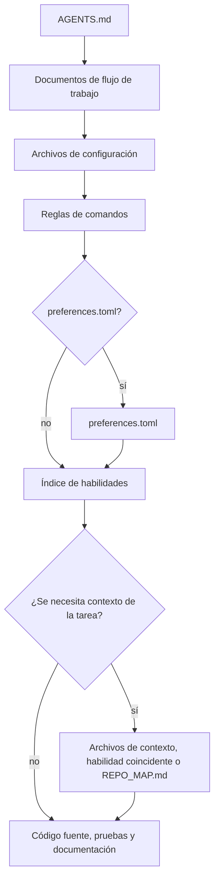

# mustflow

Idiomas: [Inglés](../../../README.md) · [Coreano](../ko/README.md) · [Chino](../zh/README.md) · [Español](README.md) · [Francés](../fr/README.md) · [Hindi](../hi/README.md)

mustflow es una CLI de contrato de trabajo y verificación local del repositorio para agentes de codificación basados en LLM. No reemplaza la zona aislada, las aprobaciones, los puntos de control, el modelo ni las políticas de herramientas del agente anfitrión; ayuda a que los agentes respeten los límites explícitos de lectura, comandos y verificación del repositorio.

El modelo central es sencillo: se coloca `AGENTS.md` en la raíz del proyecto y se guarda el flujo de trabajo detallado bajo `.mustflow/`. Los agentes comienzan en `AGENTS.md` y luego siguen, en orden, el contrato de comandos del repositorio, las habilidades, el contexto del proyecto y las reglas de verificación.

## Flujo de lectura del agente



`read_order` define el orden obligatorio de lectura, mientras que `optional_read_order` y `[context]` regulan cómo se carga el contexto específico de cada tarea. La política `[refresh]` determina cuándo los agentes vuelven a leer las mismas instrucciones.

El índice de skills es un paso activo de enrutamiento: los agentes comparan la tarea con `.mustflow/skills/INDEX.md` y leen los `SKILL.md` coincidentes antes de editar ese ámbito. Las skills solo guían el procedimiento; la ejecución de comandos sigue dependiendo de `.mustflow/config/commands.toml`.

- Sitio de documentación: <https://0disoft.github.io/mustflow/>
- Repositorio: <https://github.com/0disoft/mustflow>
- Incidencias: <https://github.com/0disoft/mustflow/issues>

## Qué hace

mustflow instala y valida un flujo de trabajo para agentes en proyectos de usuario.

- Instala `AGENTS.md` y los archivos de flujo de trabajo `.mustflow/**`.
- Declara reglas para comandos ejecutables en `.mustflow/config/commands.toml`.
- Verifica el estado de instalación y la estructura de configuración con `mf check` y `mf doctor`.
- Ejecuta solo comandos puntuales permitidos, dentro de un límite de tiempo, con `mf run <intent>`.
- Genera un mapa conciso de navegación del repositorio, `REPO_MAP.md`, con `mf map`.
- Indexa y busca documentación, habilidades y reglas de comandos de mustflow mediante SQLite con `mf index` y `mf search`.
- Previsualiza y aplica de forma segura actualizaciones de plantillas con `mf update`.
- Publica JSON Schemas para informes orientados a automatización y contratos de comandos en `schemas/`.

## Qué no hace

mustflow no es un editor automático de proyectos ni está ligado a un agente concreto.

- No genera ni modifica código fuente de aplicaciones.
- No cambia archivos del proyecto solo por estar instalado. Los archivos se crean únicamente al ejecutar `mf init`.
- No impone nombres de archivo específicos de herramientas, como `CLAUDE.md` o `GEMINI.md`.
- No sustituye sistemas de compilación, ejecutores de pruebas, gestores de paquetes ni configuraciones de integración o despliegue continuo.
- No añade archivos específicos de plataformas como GitHub, GitLab o similares a la plantilla predeterminada.
- No crea `justfile`, `Makefile` ni `Taskfile.yml` por defecto.
- `mf dashboard` inicia una interfaz local en el navegador para revisar y editar preferencias seguras en `.mustflow/config/preferences.toml`, abriéndola en el navegador predeterminado. La página permite cambiar entre inglés, coreano, chino, español, francés e hindi. También incluye selección de verificación y preferencias para la escritura de tests. Al guardar preferencias, actualiza la entrada del archivo de bloqueo como línea base personalizada si dicho archivo existe.

## Funciones candidatas

Estas son ideas aparcadas; aún no son funciones oficialmente soportadas.

- Registro comunitario de habilidades e instalación de paquetes de habilidades.
- `.mustflow/work-items/` opcional.
- Comandos `mf orient`, `mf refresh`.
- Adaptadores específicos de herramientas.

## Inicio rápido

Se requiere Node.js 20 o superior. mustflow se distribuye como paquete npm, y la CLI se llama `mf`.

```sh
npm install -D mustflow
npx mf init --dry-run
npx mf init
npx mf check --strict
```

En una terminal interactiva, `mf init` permite elegir el idioma de los documentos, el perfil del proyecto y el idioma de los informes del agente. Usa `mf init --yes` para instalar valores predeterminados en inglés sin preguntas, ideal para scripts.

pnpm y Bun pueden usar el mismo paquete npm. Aquí, Bun es una opción de instalación/ejecución, no una dependencia adicional de mustflow.

```sh
pnpm add -D mustflow
pnpm exec mf init --yes

bun add -d mustflow
bunx mf init --yes
```

Las instalaciones locales del proyecto deben usar `npx mf`, `pnpm exec mf` o `bunx mf`. Para ejecutar `mf` directamente desde la shell, instala mustflow de forma global.

```sh
npm install -g mustflow
mf version --check

bun install -g mustflow
mf version --check
```

Si la shell sigue mostrando `mf: command not found`, mustflow no está instalado globalmente para esa shell o el directorio global de ejecutables del gestor de paquetes no está en `PATH`. Con Bun, confirma que el directorio global de ejecutables de Bun, normalmente `~/.bun/bin`, esté en `PATH`.

La ejecución con Deno usando `npm:` debe considerarse experimental hasta que se verifique por separado.

## Archivos instalados

`mf init` instala únicamente el flujo de trabajo para agentes en el directorio actual.

```text
your-project/
├─ AGENTS.md
├─ .gitignore
└─ .mustflow/
   ├─ config/
   │  ├─ commands.toml
   │  ├─ manifest.lock.toml
   │  ├─ mustflow.toml
   │  └─ preferences.toml
   ├─ context/
   │  ├─ INDEX.md
   │  └─ PROJECT.md
   ├─ docs/
   │  └─ agent-workflow.md
   └─ skills/
      ├─ INDEX.md
      ├─ code-review/
      │  └─ SKILL.md
      ├─ codebase-orientation/
      │  └─ SKILL.md
      ├─ docs-update/
      │  └─ SKILL.md
      ├─ failure-triage/
      │  └─ SKILL.md
      ├─ project-context-authoring/
      │  └─ SKILL.md
      ├─ skill-authoring/
      │  └─ SKILL.md
      ├─ test-design-guard/
      │  └─ SKILL.md
      ├─ test-maintenance/
      │  └─ SKILL.md
      ├─ visual-review-artifact/
      │  └─ SKILL.md
      └─ web-asset-optimization/
         └─ SKILL.md
```

La plantilla predeterminada no crea documentos raíz ni contratos propiedad del proyecto como `README.md`, `PROJECT.md`, `ROADMAP.md`, `DESIGN.md`, `GOVERNANCE.md`, `TESTING.md`, `API.md`, `project.contract.json` u `openapi.yaml`. Tampoco crea configuración de CI, ni carpetas generales `docs/` o `skills/`. Los proyectos de usuario pueden usar esos nombres para sus propios archivos.

`mf init` crea `.gitignore` si no existe. Si ya está presente, mustflow solo actualiza su bloque gestionado y conserva las reglas del usuario.

`REPO_MAP.md` no se copia desde la plantilla. Généralo cuando sea necesario con `mf map --write`. `.mustflow/cache/mustflow.sqlite` también es un índice local regenerable creado por `mf index`.

Si un proyecto ya tiene archivos Markdown raíz opcionales como `README.md`, `PROJECT.md`, `ROADMAP.md`, `DESIGN.md`, `GOVERNANCE.md`, `TESTING.md`, `DEPLOYMENT.md`, `ARCHITECTURE.md` o `API.md`, el mapa del repositorio puede usarlos como anclas de navegación. También puede detectar contratos legibles por máquina con propósito claro, como `project.contract.json`, `project.constants.json`, `design-tokens.json`, `openapi.yaml`, `asyncapi.yaml`, `schema.graphql` y `schema.prisma`. Nombres genéricos como `SSOT.json` no son anclas predeterminadas. `mf init` no crea ni sobrescribe esos archivos propiedad del proyecto por defecto.

## Flujo básico

```sh
npx mf init --dry-run
npx mf init
npx mf doctor
npx mf check --strict
npx mf map --write
```

Crea el índice local de búsqueda opcional si se requieren capacidades de búsqueda.

```sh
npx mf index --dry-run --json
npx mf index
npx mf search mustflow_check
```

Previsualiza las actualizaciones de plantilla antes de aplicarlas.

```sh
npx mf status
npx mf update --dry-run
npx mf update --apply
```

Los agentes deben preferir las intenciones de actualización configuradas para que el repositorio conserve un recibo de ejecución.

```sh
mf run mustflow_update_dry_run
mf run mustflow_update_apply
```

## Comandos

| Comando                     | Propósito                                                                                     |
|-----------------------------|-----------------------------------------------------------------------------------------------|
| `mf init`                   | Instala `AGENTS.md` y `.mustflow/**`.                                                        |
| `mf init --dry-run`         | Muestra qué archivos se crearían sin escribirlos.                                            |
| `mf init --merge`           | Fusiona el bloque gestionado por mustflow en un `AGENTS.md` existente.                        |
| `mf init --force`           | Realiza una copia de seguridad de los archivos en conflicto y luego los sobrescribe.         |
| `mf check`                  | Valida archivos mustflow, configuración TOML y la estructura de documentos de habilidades.   |
| `mf check --strict`         | Realiza comprobaciones adicionales de seguridad para identidad documental, metadatos, límites, política y contexto. |
| `mf doctor`                 | Inspecciona la raíz mustflow actual sin modificar archivos.                                  |
| `mf context --json`         | Imprime en JSON el orden de lectura, reglas de comandos, capacidades disponibles y resumen de ejecución reciente. |
| `mf map --stdout`           | Imprime el mapa de la raíz mustflow actual en la salida estándar.                            |
| `mf map --write`            | Crea o actualiza `REPO_MAP.md`.                                                             |
| `mf run <intent>`           | Ejecuta un comando puntual permitido.                                                       |
| `mf index`                  | Crea un índice SQLite para documentación y reglas de comandos de mustflow.                   |
| `mf search <query>`         | Busca documentación, habilidades y reglas de comandos en el índice SQLite.                   |
| `mf status`                 | Inspecciona el estado instalado y archivos modificados o ausentes.                          |
| `mf update --dry-run`       | Calcula un plan de actualización de plantilla sin escribir archivos.                        |
| `mf update --apply`         | Aplica actualizaciones de plantilla cuando no hay bloqueos.                                |
| `mf help <topic>`           | Muestra la ayuda instalada de mustflow.                                                    |
| `mf dashboard`              | Inicia un panel local para preferencias seguras y lo abre en el navegador predeterminado. Al guardar, actualiza la línea base personalizada si existe el archivo de bloqueo. |
| `mf version`                | Imprime la versión instalada del paquete mustflow.                                         |
| `mf version --check`        | Compara la versión instalada con la última versión publicada en npm e imprime un comando de actualización. |
| `mf version-sources`        | Inspecciona fuentes de versión detectadas, de plantilla y declaradas sin modificar archivos. |
| `mf explain authority [path]` | Explica decisiones de autoridad de Markdown gestionado sin modificar archivos.            |

Las automatizaciones y agentes deben usar la salida `--json` en lugar de analizar texto orientado a humanos. Los JSON Schemas para salidas estables se encuentran en `schemas/`.

## Política de ejecución de comandos

El trabajo ejecutable se declara en `.mustflow/config/commands.toml` para evitar que los agentes adivinen comandos.

`mf run` ejecuta solo comandos que cumplen todas estas condiciones:

- `status = "configured"`
- `lifecycle = "oneshot"`
- `run_policy = "agent_allowed"`
- `stdin = "closed"`

No se ejecutan directamente servidores de desarrollo, modos de observación, interfaces web, comandos interactivos ni procesos en segundo plano.

Cada ejecución de comando escribe el registro más reciente en `.mustflow/state/runs/latest.json`. Este registro incluye el nombre de la intención, directorio de trabajo, límite de tiempo, código de salida, estado de tiempo agotado y salida final de stdout y stderr.

## Idiomas y perfiles

El idioma del flujo de trabajo instalado, el idioma de respuesta del agente y la configuración regional orientada al producto son ajustes independientes.

```sh
npx mf init --profile product --locale ko --agent-lang ko
npx mf init --product-source-locale en --product-locale ko-KR
npx mf init --set git.auto_commit=true
```

- `--profile`: Perfil del proyecto. Por defecto es `minimal`.
- `--locale`: Idioma de los documentos mustflow instalados. La plantilla predeterminada incluye `en`, `ko`, `zh`, `es`, `fr` y `hi`.
- `--agent-lang`: Idioma predeterminado para los informes finales del agente.
- `--interactive`: Permite elegir ajustes iniciales mediante preguntas.
- `--yes`: Usa ajustes predeterminados en inglés sin preguntas.
- `--set`: Define una preferencia permitida durante la instalación. Las claves admitidas incluyen `git.auto_stage`, `git.auto_commit`, `git.auto_push=false`, `git.commit_message.*`, `reporting.commit_suggestion.enabled`, `language.memory.summary`, `release.versioning.*`, `verification.selection.*` y `testing.authoring.*`.
  - `git.commit_message.style` acepta `conventional`, `descriptive` o `gitmoji`; `gitmoji` solo cambia el formato del mensaje sugerido.
  - `git.commit_message.language` acepta `preserve_existing`, `agent_response`, `docs` o etiquetas de idioma como `ja`, `de` o `pt-BR`.
  - `testing.authoring.new_test_policy` acepta `evidence_required`, `manual_approval` o `broad`.
- `--product-source-locale`, `--product-locale`: Configuraciones regionales de origen y destino para cadenas de producto orientadas al usuario.
- `--lang`: Idioma de salida de la CLI. Valores actuales: `en`, `ko`, `zh`, `es`, `fr` y `hi`.

## Estructura del repositorio

El repositorio mustflow contiene la CLI, plantillas, especificaciones de contrato, sitio de documentación y documentación de traducción a nivel de repositorio.

```text
mustflow/
├─ README.md
├─ ROADMAP.md
├─ LICENSE
├─ package.json
├─ schemas/
├─ tsconfig.json
├─ docs/
│  ├─ spec/
│  └─ i18n/
├─ docs-site/
├─ src/
│  └─ cli/
├─ templates/
│  └─ default/
└─ tests/
```

Los archivos copiados en proyectos de usuario provienen de `templates/default/common/` y `templates/default/locales/<locale>/`.

Las especificaciones de contrato versionadas están en `docs/spec/`. El sitio de documentación las enlaza desde Design -> Contract specifications.

## Desarrollo

Los comandos de desarrollo en este repositorio usan Bun. Los usuarios no necesitan Bun para ejecutar `mf` en sus propios proyectos.

```sh
bun install
bun run check
bun run docs:check
bun run check:install
```

Los agentes que trabajan en este repositorio deben preferir los intents configurados de mustflow para la verificación habitual.

```sh
mf run build
mf run test
mf run docs_validate
mf run mustflow_check
```

Los scripts de Bun siguen disponibles para mantenedores humanos y para el flujo de empaquetado de releases. Los intents `test_related`, `lint`, coverage y test-audit no se declaran hasta que el repositorio tenga comprobaciones más específicas para esos flujos.

`dist/` es una salida de compilación generada y no se confirma en el repositorio. `npm pack` y `npm publish` ejecutan `npm run build` mediante `prepack`, por lo que el paquete npm contiene la CLI compilada.

Ejecuta la comprobación completa de publicación antes de publicar.

```sh
bun run release:check
```

`release:check` valida la CLI, compila el sitio de documentación, empaqueta el tarball npm, lo instala en un proyecto temporal y ejecuta el flujo público de `mf`.

## Sitio de documentación

El sitio de documentación está en `docs-site/`.

```sh
bun run docs:dev
bun run docs:build
bun run docs:preview
```

GitHub Pages compila el código fuente de `docs-site/` desde la rama `main` con GitHub Actions y despliega `docs-site/dist` como artefacto de Pages. No confirmes `docs-site/dist` en el repositorio.

## Contenido del paquete

El paquete npm incluye solo:

```text
dist/
templates/
schemas/
README.md
LICENSE
```

`docs/`, `docs-site/`, `tests/`, `src/` y las notas de trabajo no se incluyen en el paquete npm.

## Licencia

MIT-0
