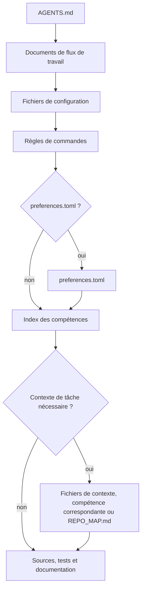

# mustflow

Langues : [Anglais](../../../README.md) · [Coréen](../ko/README.md) · [Chinois](../zh/README.md) · [Espagnol](../es/README.md) · [Français](README.md) · [Hindi](../hi/README.md)

mustflow est une CLI de flux de travail pour les agents de codage basés sur les
LLM. Elle aide les agents à entrer dans un dépôt, lire le bon contexte
opérationnel, exécuter uniquement les commandes déclarées et vérifier leur
travail sans deviner.

Le modèle central est simple : placez `AGENTS.md` à la racine du projet, puis
gardez le flux de travail détaillé sous `.mustflow/`. Les agents commencent par
`AGENTS.md`, puis suivent dans l'ordre le contrat de commandes, les compétences,
le contexte du projet et les règles de vérification.

## Flux de lecture de l'agent



`read_order` définit l'ordre de lecture obligatoire, tandis que
`optional_read_order` et `[context]` régissent le chargement du contexte propre à
chaque tâche. La politique `[refresh]` détermine quand les agents relisent les
mêmes instructions.

L’index des skills est une étape de routage active : les agents comparent la tâche avec
`.mustflow/skills/INDEX.md` et lisent les `SKILL.md` correspondants avant de modifier cette portée.
Les skills guident seulement la procédure ; l’exécution des commandes vient toujours de
`.mustflow/config/commands.toml`.

- Site de documentation : <https://mustflow.github.io>
- Dépôt : <https://github.com/0disoft/mustflow>
- Issues : <https://github.com/0disoft/mustflow/issues>

## Ce que fait mustflow

mustflow installe et valide un flux de travail d'agent pour les projets
utilisateur.

- Installe `AGENTS.md` et les fichiers de flux de travail `.mustflow/**`.
- Déclare les règles de commandes exécutables dans
  `.mustflow/config/commands.toml`.
- Vérifie l'état de l'installation et la structure de configuration avec
  `mf check` et `mf doctor`.
- Exécute uniquement les commandes ponctuelles autorisées, avec délai
  d'expiration, via `mf run <intent>`.
- Génère une carte concise de navigation du dépôt, `REPO_MAP.md`, avec
  `mf map`.
- Indexe et recherche les documents, compétences et règles de commandes
  mustflow avec SQLite via `mf index` et `mf search`.
- Prévisualise et applique en sécurité les mises à jour de modèles inclus avec
  `mf update`.
- Publie des schémas JSON pour les rapports destinés aux automatisations et les
  contrats de commande dans `schemas/`.

## Ce que mustflow ne fait pas

mustflow n'est pas un éditeur automatique de projet et n'est pas lié à un
produit d'agent particulier.

- Il ne génère ni ne modifie le code source de l'application.
- Il ne change pas les fichiers du projet du seul fait de son installation. Les
  fichiers sont créés uniquement lorsque `mf init` s'exécute.
- Il n'impose pas de noms de fichiers propres à des outils, comme `CLAUDE.md` ou
  `GEMINI.md`.
- Il ne remplace pas un système de build, un lanceur de tests, un gestionnaire
  de paquets ni une configuration CI/CD.
- Il n'ajoute pas à la plantilla par défaut des fichiers propres à GitHub,
  GitLab ou d'autres plateformes similaires.
- Il ne crée pas `justfile`, `Makefile` ni `Taskfile.yml` par défaut.
- `mf dashboard` démarre une interface locale dans le navigateur pour consulter
  et modifier les préférences sûres de `.mustflow/config/preferences.toml`, puis
  l'ouvre dans le navigateur par défaut. La page permet de basculer entre
  l'anglais, le coréen, le chinois, l'espagnol, le français et l'hindi. Elle
  inclut aussi la sélection de vérification et les préférences d'écriture des tests.
  Lors de l'enregistrement des préférences, l'entrée du fichier de verrouillage
  devient une ligne de base personnalisée si ce fichier existe.

## Fonctionnalités candidates

Ces éléments sont des idées mises de côté, pas encore officiellement prises en
charge.

- Registre communautaire de compétences et installation de packs de compétences
- `.mustflow/work-items/` optionnel
- `mf orient`, `mf refresh`
- Adaptateurs propres à certains outils

## Démarrage rapide

Node.js 20 ou plus récent est requis. mustflow est distribué comme paquet npm,
et le nom de la CLI est `mf`.

```sh
npm install -D mustflow
npx mf init --dry-run
npx mf init
npx mf check --strict
```

Dans un terminal interactif, `mf init` permet de choisir la langue des
documents, le profil du projet et la langue des rapports de l'agent. Utilisez
`mf init --yes` lorsqu'un script doit installer les valeurs par défaut en
anglais sans poser de questions.

pnpm et Bun peuvent utiliser le même paquet npm.

```sh
pnpm add -D mustflow
pnpm exec mf init --yes

bun add -d mustflow
bunx mf init --yes
```

L'exécution Deno via `npm:` doit être considérée comme expérimentale tant
qu'elle n'a pas été vérifiée séparément.

## Fichiers installés

`mf init` installe uniquement le flux de travail d'agent dans le répertoire
courant.

```text
your-project/
├─ AGENTS.md
├─ .gitignore
└─ .mustflow/
   ├─ config/
   │  ├─ commands.toml
   │  ├─ manifest.lock.toml
   │  ├─ mustflow.toml
   │  └─ preferences.toml
   ├─ context/
   │  ├─ INDEX.md
   │  └─ PROJECT.md
   ├─ docs/
   │  └─ agent-workflow.md
   └─ skills/
      ├─ INDEX.md
      ├─ code-review/
      │  └─ SKILL.md
      ├─ codebase-orientation/
      │  └─ SKILL.md
      ├─ docs-update/
      │  └─ SKILL.md
      ├─ failure-triage/
      │  └─ SKILL.md
      ├─ project-context-authoring/
      │  └─ SKILL.md
      ├─ skill-authoring/
      │  └─ SKILL.md
      ├─ test-maintenance/
      │  └─ SKILL.md
      ├─ visual-review-artifact/
      │  └─ SKILL.md
      └─ web-asset-optimization/
         └─ SKILL.md
```

Le modèle par défaut ne crée pas de documents racine ni de contrats appartenant
au projet comme `README.md`, `PROJECT.md`, `ROADMAP.md`, `DESIGN.md`,
`GOVERNANCE.md`, `TESTING.md`, `API.md`, `project.contract.json` ou
`openapi.yaml`. Il ne crée pas non plus de configuration CI, de dossier `docs/`
général ni de dossier `skills/` général. Les projets utilisateur peuvent déjà
utiliser ces noms pour leurs propres fichiers.

`mf init` crée `.gitignore` s'il manque. S'il existe déjà, mustflow met à jour
uniquement son bloc géré et conserve les règles utilisateur.

`REPO_MAP.md` n'est pas copié depuis le modèle. Générez-le au besoin avec
`mf map --write`. `.mustflow/cache/mustflow.sqlite` est également un index local
régénérable créé par `mf index`.

Si un projet possède déjà des fichiers Markdown racine optionnels comme
`README.md`, `PROJECT.md`, `ROADMAP.md`, `DESIGN.md`, `GOVERNANCE.md`,
`TESTING.md`, `DEPLOYMENT.md`, `ARCHITECTURE.md` ou `API.md`, la carte du dépôt
peut les utiliser comme ancres de navigation. Elle peut aussi découvrir des
contrats lisibles par machine avec un nom précis, comme `project.contract.json`,
`project.constants.json`, `design-tokens.json`, `openapi.yaml`, `asyncapi.yaml`,
`schema.graphql` et `schema.prisma`. Les noms génériques comme `SSOT.json` ne
sont pas des ancres par défaut. `mf init` ne crée ni n'écrase ces fichiers
appartenant au projet par défaut.

## Flux de base

```sh
npx mf init --dry-run
npx mf init
npx mf doctor
npx mf check --strict
npx mf map --write
```

Créez l'index de recherche local optionnel si des capacités de recherche sont
nécessaires.

```sh
npx mf index --dry-run --json
npx mf index
npx mf search mustflow_check
```

Prévisualisez les mises à jour de modèle avant de les appliquer.

```sh
npx mf status
npx mf update --dry-run
npx mf update --apply
```

Les agents doivent privilégier les intentions de mise à jour configurées afin
que le dépôt conserve un reçu d'exécution.

```sh
mf run mustflow_update_dry_run
mf run mustflow_update_apply
```

## Commandes

| Commande | Rôle |
| --- | --- |
| `mf init` | Installe `AGENTS.md` et `.mustflow/**`. |
| `mf init --dry-run` | Montre les fichiers qui seraient créés sans écrire de fichiers. |
| `mf init --merge` | Fusionne le bloc géré par mustflow dans un `AGENTS.md` existant. |
| `mf init --force` | Sauvegarde les fichiers en conflit, puis les écrase. |
| `mf check` | Valide les fichiers mustflow, la configuration TOML et la forme des documents de compétences. |
| `mf check --strict` | Exécute des contrôles de sécurité supplémentaires pour l'identité des documents, les métadonnées de skills, les limites de commande, la politique de rétention, les limites de sortie, les journaux bruts et les traces ressemblant à des secrets. |
| `mf doctor` | Inspecte la racine mustflow courante sans écrire de fichiers. |
| `mf context --json` | Imprime en JSON l'ordre de lecture, les règles de commandes, les capacités disponibles et le résumé de l'exécution récente. |
| `mf map --stdout` | Imprime la carte de la racine mustflow courante sur la sortie standard. |
| `mf map --write` | Crée ou met à jour `REPO_MAP.md`. |
| `mf run <intent>` | Exécute une commande ponctuelle autorisée. |
| `mf index` | Construit un index SQLite pour les documents et règles de commandes mustflow. |
| `mf search <query>` | Recherche des documents, compétences et règles de commandes dans l'index SQLite. |
| `mf status` | Inspecte l'état installé et les fichiers modifiés ou manquants. |
| `mf update --dry-run` | Calcule un plan de mise à jour de modèle sans écrire de fichiers. |
| `mf update --apply` | Applique les mises à jour de modèle lorsque rien n'est bloqué. |
| `mf help <topic>` | Affiche l'aide mustflow installée. |
| `mf dashboard` | Démarre un tableau de bord local pour les préférences mustflow sûres et l'ouvre dans le navigateur par défaut. À l'enregistrement, il actualise la ligne de base personnalisée si le fichier de verrouillage existe. |
| `mf version-sources` | Inspecte les sources de version détectées, de modèle et déclarées sans modifier de fichiers. |
| `mf explain authority [path]` | Explique les décisions d'autorité des documents Markdown gérés sans modifier de fichiers. |

Les automatisations et les agents doivent utiliser la sortie `--json` plutôt
que d'analyser du texte destiné aux humains. Les schémas JSON des sorties
stables se trouvent dans `schemas/`.

## Politique d'exécution des commandes

Le travail exécutable est déclaré dans `.mustflow/config/commands.toml` afin que
les agents ne devinent pas les commandes.

`mf run` exécute uniquement les commandes qui satisfont toutes ces conditions :

- `status = "configured"`
- `lifecycle = "oneshot"`
- `run_policy = "agent_allowed"`
- `stdin = "closed"`

Les serveurs de développement, modes de surveillance, interfaces navigateur,
commandes interactives et processus d'arrière-plan ne sont pas exécutés
directement.

Chaque exécution de commande écrit le dernier enregistrement d'exécution dans
`.mustflow/state/runs/latest.json`. L'enregistrement inclut le nom de
l'intention, le répertoire de travail, le délai d'expiration, le code de sortie,
l'état de délai dépassé et la fin de stdout et stderr.

## Langues et profils

La langue du flux de travail installé, la langue de réponse de l'agent et la
locale destinée au produit sont des réglages séparés.

```sh
npx mf init --profile product --locale ko --agent-lang ko
npx mf init --product-source-locale en --product-locale ko-KR
npx mf init --set git.auto_commit=true
```

- `--profile` : profil du projet. La valeur par défaut est `minimal`.
- `--locale` : langue des documents mustflow installés. Le modèle par défaut
  fournit actuellement `en`, `ko`, `zh`, `es`, `fr` et `hi`. Le modèle par
  défaut inclut des documents localisés pour toutes les langues listées.
- `--agent-lang` : langue par défaut des rapports finaux de l'agent.
- `--interactive` : choisit les paramètres initiaux via des questions.
- `--yes` : utilise les paramètres initiaux anglais par défaut sans questions.
- `--set` : définit une préférence autorisée pendant l'installation. Les clés
  prises en charge sont `git.auto_stage`, `git.auto_commit`, `git.auto_push=false`,
  `git.commit_message.*`, `reporting.commit_suggestion.enabled`,
  `language.memory.summary`, `release.versioning.*`, `verification.selection.*`
  et `testing.authoring.*`.
  `git.commit_message.style` accepte `conventional`, `descriptive` ou
  `gitmoji`; `gitmoji` change seulement le format du message suggéré.
  `git.commit_message.language` accepte `preserve_existing`, `agent_response`,
  `docs` ou une étiquette de langue comme `ja`, `de` ou `pt-BR`.
  `testing.authoring.new_test_policy` accepte `evidence_required`,
  `manual_approval` ou `broad`.
- `--product-source-locale`, `--product-locale` : locales source et cible pour
  les chaînes de produit destinées aux utilisateurs.
- `--lang` : langue de sortie de la CLI. Les valeurs actuelles sont `en`, `ko`,
  `zh`, `es`, `fr` et `hi`.

## Structure du dépôt

Le dépôt mustflow contient la CLI, les modèles, les spécifications de contrat,
le site de documentation et les documents de traduction au niveau du dépôt.

```text
mustflow/
├─ README.md
├─ ROADMAP.md
├─ LICENSE
├─ package.json
├─ schemas/
├─ tsconfig.json
├─ docs/
│  ├─ spec/
│  └─ i18n/
├─ docs-site/
├─ src/
│  └─ cli/
├─ templates/
│  └─ default/
└─ tests/
```

Les fichiers copiés dans les projets utilisateur viennent de
`templates/default/common/` et de `templates/default/locales/<locale>/`.

Les spécifications de contrat versionnées se trouvent dans `docs/spec/`. Le site
de documentation les référence depuis Design -> Contract specifications.

## Développement

Les commandes de développement de ce dépôt utilisent Bun. Les utilisateurs
n'ont pas besoin de Bun pour exécuter `mf` dans leurs propres projets.

```sh
bun install
bun run check
bun run docs:check
bun run check:install
```

Les agents qui travaillent dans ce dépôt doivent privilégier les intents
mustflow configurés pour la vérification courante.

```sh
mf run build
mf run test
mf run docs_validate
mf run mustflow_check
```

Les scripts Bun restent disponibles pour les mainteneurs humains et le flux
d'empaquetage des releases. Les intents `test_related`, `lint`, coverage et
test-audit ne sont pas déclarés tant que le dépôt n'a pas de contrôles plus
ciblés pour ces flux.

`dist/` est une sortie de build générée et n'est pas commitée. `npm pack` et
`npm publish` exécutent `npm run build` via `prepack`, afin que le paquet npm
contienne la CLI compilée.

Exécutez le contrôle complet de publication avant de publier.

```sh
bun run release:check
```

`release:check` valide la CLI, construit le site de documentation, emballe le
tarball npm, l'installe dans un projet temporaire et exécute le flux public
`mf`.

## Site de documentation

Le site de documentation se trouve dans `docs-site/`.

```sh
bun run docs:dev
bun run docs:build
bun run docs:preview
```

GitHub Pages construit la source `docs-site/` depuis la branche `main` avec
GitHub Actions et déploie `docs-site/dist` comme artefact Pages. Ne commitez pas
`docs-site/dist`.

## Contenu du paquet

Le paquet npm inclut uniquement :

```text
dist/
templates/
schemas/
README.md
LICENSE
```

`docs/`, `docs-site/`, `tests/`, `src/` et les notes de travail ne sont pas
inclus dans le paquet npm.

## Licence

MIT-0
