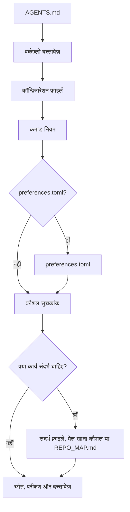

# mustflow

भाषाएँ: [अंग्रेज़ी](../../../README.md) · [कोरियाई](../ko/README.md) · [चीनी](../zh/README.md) · [स्पेनी](../es/README.md) · [फ़्रांसीसी](../fr/README.md) · [हिन्दी](README.md)

mustflow LLM-आधारित कोडिंग एजेंटों के लिए एक वर्कफ़्लो CLI है। यह एजेंटों को
किसी रिपॉज़िटरी में प्रवेश करने, सही संचालन संदर्भ पढ़ने, केवल घोषित कमांड
चलाने और बिना अनुमान लगाए अपना काम सत्यापित करने में मदद करता है।

मुख्य मॉडल सरल है: प्रोजेक्ट रूट में `AGENTS.md` रखें और विस्तृत वर्कफ़्लो को
`.mustflow/` के नीचे रखें। एजेंट `AGENTS.md` से शुरू करते हैं, फिर क्रम से
कमांड अनुबंध, कौशल, प्रोजेक्ट संदर्भ और सत्यापन नियमों का पालन करते हैं।

## एजेंट पढ़ने का प्रवाह



`read_order` आवश्यक पढ़ने का क्रम परिभाषित करता है, जबकि
`optional_read_order` और `[context]` यह नियंत्रित करते हैं कि कार्य-विशेष
संदर्भ कैसे लोड होगा। `[refresh]` नीति तय करती है कि एजेंट वही निर्देश फिर कब
पढ़ेंगे।

- दस्तावेज़ साइट: <https://mustflow.github.io>
- रिपॉज़िटरी: <https://github.com/0disoft/mustflow>
- इश्यू: <https://github.com/0disoft/mustflow/issues>

## यह क्या करता है

mustflow उपयोगकर्ता प्रोजेक्टों के लिए एजेंट वर्कफ़्लो इंस्टॉल और सत्यापित करता
है।

- `AGENTS.md` और `.mustflow/**` वर्कफ़्लो फ़ाइलें इंस्टॉल करता है।
- `.mustflow/config/commands.toml` में चलाए जा सकने वाले कमांड नियम घोषित करता
  है।
- `mf check` और `mf doctor` से इंस्टॉल स्वास्थ्य और कॉन्फ़िगरेशन संरचना जाँचता
  है।
- `mf run <intent>` के माध्यम से समय सीमा के भीतर केवल अनुमत एक-बार चलने वाले
  कमांड चलाता है।
- `mf map` से संक्षिप्त रिपॉज़िटरी नेविगेशन मानचित्र, `REPO_MAP.md`, बनाता है।
- `mf index` और `mf search` के माध्यम से SQLite के साथ mustflow दस्तावेज़,
  कौशल और कमांड नियमों को इंडेक्स और खोजता है।
- `mf update` से शामिल टेम्पलेट अपडेट को सुरक्षित रूप से पहले दिखाता और लागू
  करता है।
- ऑटोमेशन रिपोर्ट और कमांड अनुबंधों के लिए JSON Schemas को `schemas/` में
  प्रकाशित करता है।

## यह क्या नहीं करता

mustflow स्वचालित प्रोजेक्ट संपादक नहीं है और किसी एक एजेंट उत्पाद से बंधा नहीं
है।

- यह एप्लिकेशन स्रोत कोड जनरेट या संशोधित नहीं करता।
- यह केवल इंस्टॉल होने से प्रोजेक्ट फ़ाइलों को नहीं बदलता। फ़ाइलें केवल तब
  बनती हैं जब `mf init` चलता है।
- यह `CLAUDE.md` या `GEMINI.md` जैसे टूल-विशेष फ़ाइल नामों को अनिवार्य नहीं
  करता।
- यह बिल्ड सिस्टम, टेस्ट रनर, पैकेज मैनेजर या CI/CD सेटअप का विकल्प नहीं है।
- यह GitHub, GitLab या समान टूलों की प्लेटफ़ॉर्म-विशेष फ़ाइलों को डिफ़ॉल्ट
  टेम्पलेट में नहीं जोड़ता।
- यह डिफ़ॉल्ट रूप से `justfile`, `Makefile` या `Taskfile.yml` नहीं बनाता।
- डैशबोर्ड अभी लागू नहीं है। `mf dashboard` एक आरक्षित कमांड है।

## प्रस्तावित सुविधाएँ

ये रोकी हुई अवधारणाएँ हैं, अभी आधिकारिक रूप से समर्थित नहीं हैं।

- `mf dashboard`
- समुदाय कौशल रजिस्ट्री और कौशल पैक इंस्टॉल
- वैकल्पिक `.mustflow/work-items/`
- `mf orient`, `mf refresh`
- टूल-विशेष अडैप्टर

## त्वरित शुरुआत

Node.js 20 या नया संस्करण आवश्यक है। mustflow npm पैकेज के रूप में वितरित होता
है, और CLI का नाम `mf` है।

```sh
npm install -D mustflow
npx mf init --dry-run
npx mf init
npx mf check --strict
```

interactive terminal में `mf init` दस्तावेज़ भाषा, project profile और agent
report language चुनने देता है। scripts में बिना प्रश्नों के English defaults
install करने के लिए `mf init --yes` का उपयोग करें।

pnpm और Bun भी उसी npm पैकेज का उपयोग कर सकते हैं।

```sh
pnpm add -D mustflow
pnpm exec mf init --yes

bun add -d mustflow
bunx mf init --yes
```

Deno के `npm:` निष्पादन को अलग से सत्यापित होने तक प्रयोगात्मक माना जाना
चाहिए।

## इंस्टॉल की गई फ़ाइलें

`mf init` वर्तमान डायरेक्टरी में केवल एजेंट वर्कफ़्लो इंस्टॉल करता है।

```text
your-project/
├─ AGENTS.md
├─ .gitignore
└─ .mustflow/
   ├─ config/
   │  ├─ commands.toml
   │  ├─ manifest.lock.toml
   │  ├─ mustflow.toml
   │  └─ preferences.toml
   ├─ context/
   │  ├─ INDEX.md
   │  └─ PROJECT.md
   ├─ docs/
   │  └─ agent-workflow.md
   └─ skills/
      ├─ INDEX.md
      ├─ code-review/
      │  └─ SKILL.md
      ├─ docs-update/
      │  └─ SKILL.md
      ├─ failure-triage/
      │  └─ SKILL.md
      └─ test-maintenance/
         └─ SKILL.md
```

डिफ़ॉल्ट टेम्पलेट `README.md`, `PROJECT.md`, `ROADMAP.md`, `DESIGN.md`,
`GOVERNANCE.md`, `TESTING.md`, `API.md`, `project.contract.json`, या
`openapi.yaml` जैसे project-owned root documents या contract files नहीं बनाता।
यह CI configuration, सामान्य `docs/` या सामान्य `skills/` भी नहीं बनाता।
उपयोगकर्ता प्रोजेक्ट पहले से इन नामों को अपनी फ़ाइलों के लिए उपयोग कर सकते हैं।

यदि `.gitignore` मौजूद नहीं है, तो `mf init` उसे बनाता है। यदि वह पहले से
मौजूद है, तो mustflow केवल अपना managed block अपडेट करता है और user rules
सुरक्षित रखता है।

`REPO_MAP.md` टेम्पलेट से कॉपी नहीं होता। आवश्यकता होने पर इसे
`mf map --write` से जनरेट करें। `.mustflow/cache/mustflow.sqlite` भी
`mf index` द्वारा बनाया गया फिर से बनाया जा सकने वाला स्थानीय सूचकांक है।

यदि किसी प्रोजेक्ट में पहले से `README.md`, `PROJECT.md`, `ROADMAP.md`,
`DESIGN.md`, `GOVERNANCE.md`, `TESTING.md`, `DEPLOYMENT.md`, `ARCHITECTURE.md`,
या `API.md` जैसे optional root Markdown files हैं, तो repository map उन्हें
navigation anchors के रूप में उपयोग कर सकता है। यह `project.contract.json`,
`project.constants.json`, `design-tokens.json`, `openapi.yaml`, `asyncapi.yaml`,
`schema.graphql`, और `schema.prisma` जैसे clear-purpose machine-readable
contract files भी खोज सकता है। `SSOT.json` जैसे generic catch-all names default
anchors नहीं हैं। `mf init` फिर भी इन project-owned files को डिफ़ॉल्ट रूप से
बनाता या overwrite नहीं करता।

## मूल वर्कफ़्लो

```sh
npx mf init --dry-run
npx mf init
npx mf doctor
npx mf check --strict
npx mf map --write
```

यदि खोज क्षमताएँ चाहिए, तो वैकल्पिक स्थानीय खोज सूचकांक बनाएँ।

```sh
npx mf index --dry-run --json
npx mf index
npx mf search mustflow_check
```

टेम्पलेट अपडेट लागू करने से पहले उनका पूर्वावलोकन करें।

```sh
npx mf status
npx mf update --dry-run
npx mf update --apply
```

## कमांड

| कमांड | उद्देश्य |
| --- | --- |
| `mf init` | `AGENTS.md` और `.mustflow/**` इंस्टॉल करता है। |
| `mf init --dry-run` | बिना फ़ाइल लिखे दिखाता है कि कौन-सी फ़ाइलें बनेंगी। |
| `mf init --merge` | मौजूदा `AGENTS.md` में mustflow-प्रबंधित ब्लॉक मिलाता है। |
| `mf init --force` | टकराती फ़ाइलों का बैकअप लेकर उन्हें ओवरराइट करता है। |
| `mf check` | mustflow फ़ाइलों, TOML कॉन्फ़िगरेशन और कौशल दस्तावेज़ संरचना को सत्यापित करता है। |
| `mf check --strict` | रिटेंशन नीति, आउटपुट सीमा, कच्चे लॉग और रहस्य-जैसे संदर्भ के लिए अतिरिक्त सुरक्षा जाँच चलाता है। |
| `mf doctor` | फ़ाइल लिखे बिना वर्तमान mustflow रूट का निरीक्षण करता है। |
| `mf context --json` | पढ़ने का क्रम, कमांड नियम, उपलब्ध क्षमताएँ और हाल की रन सारांश JSON के रूप में प्रिंट करता है। |
| `mf map --stdout` | वर्तमान mustflow रूट मानचित्र को मानक आउटपुट पर प्रिंट करता है। |
| `mf map --write` | `REPO_MAP.md` बनाता या अपडेट करता है। |
| `mf run <intent>` | अनुमत एक-बार चलने वाला कमांड चलाता है। |
| `mf index` | mustflow दस्तावेज़ों और कमांड नियमों के लिए SQLite सूचकांक बनाता है। |
| `mf search <query>` | SQLite सूचकांक में दस्तावेज़, कौशल और कमांड नियम खोजता है। |
| `mf status` | इंस्टॉल स्थिति और बदली या अनुपस्थित फ़ाइलों का निरीक्षण करता है। |
| `mf update --dry-run` | बिना फ़ाइल लिखे टेम्पलेट अपडेट योजना की गणना करता है। |
| `mf update --apply` | जब कुछ भी अवरुद्ध न हो, तब टेम्पलेट अपडेट लागू करता है। |
| `mf help <topic>` | इंस्टॉल की गई mustflow सहायता दिखाता है। |
| `mf dashboard` | आरक्षित। अभी लागू नहीं है। |

ऑटोमेशन और एजेंटों को मनुष्यों के लिए बने पाठ को पार्स करने के बजाय `--json`
आउटपुट का उपयोग करना चाहिए। स्थिर आउटपुट के JSON Schemas `schemas/` में हैं।

## कमांड निष्पादन नीति

चलाए जा सकने वाला काम `.mustflow/config/commands.toml` में घोषित होता है ताकि
एजेंट कमांड का अनुमान न लगाएँ।

`mf run` केवल उन कमांडों को चलाता है जो ये सभी शर्तें पूरी करते हैं:

- `status = "configured"`
- `lifecycle = "oneshot"`
- `run_policy = "agent_allowed"`
- `stdin = "closed"`

विकास सर्वर, वॉच मोड, ब्राउज़र UI, इंटरैक्टिव कमांड और पृष्ठभूमि प्रक्रियाएँ
सीधे नहीं चलाई जातीं।

हर कमांड रन नवीनतम रन रिकॉर्ड को `.mustflow/state/runs/latest.json` में लिखता
है। रिकॉर्ड में इरादे का नाम, कार्य डायरेक्टरी, समय सीमा, निकास कोड, टाइमआउट
स्थिति और stdout तथा stderr का अंतिम भाग शामिल होता है।

## भाषाएँ और प्रोफ़ाइल

इंस्टॉल किए गए वर्कफ़्लो की भाषा, एजेंट प्रतिक्रिया भाषा और उत्पाद-सामना करने
वाली लोकेल अलग-अलग सेटिंग हैं।

```sh
npx mf init --profile product --locale ko --agent-lang ko
npx mf init --product-source-locale en --product-locale ko-KR
npx mf init --set git.auto_commit=true
```

- `--profile`: प्रोजेक्ट प्रोफ़ाइल। डिफ़ॉल्ट `minimal` है।
- `--locale`: इंस्टॉल किए गए mustflow दस्तावेज़ों की भाषा। डिफ़ॉल्ट टेम्पलेट
  अभी `en`, `ko`, `zh`, `es`, `fr` और `hi` प्रदान करता है। डिफ़ॉल्ट टेम्पलेट
  सूचीबद्ध सभी भाषाओं के लिए स्थानीयकृत दस्तावेज़ शामिल करता है।
- `--agent-lang`: एजेंट की अंतिम रिपोर्टों की डिफ़ॉल्ट भाषा।
- `--interactive`: prompts के माध्यम से init settings चुनता है।
- `--yes`: prompts के बिना default English init settings उपयोग करता है।
- `--set`: installation के दौरान allowed preference set करता है। supported
  keys हैं `git.auto_stage`, `git.auto_commit`, `git.commit_message.language`,
  `reporting.commit_suggestion.enabled` और `language.memory.summary`।
- `--product-source-locale`, `--product-locale`: उपयोगकर्ता-सामना करने वाली
  उत्पाद स्ट्रिंग के लिए स्रोत और लक्ष्य लोकेल।
- `--lang`: CLI आउटपुट भाषा। वर्तमान मान `en`, `ko`, `zh`, `es`, `fr` और
  `hi` हैं।

## रिपॉज़िटरी संरचना

mustflow रिपॉज़िटरी में CLI, टेम्पलेट, अनुबंध विनिर्देश, दस्तावेज़ साइट और
रिपॉज़िटरी-स्तरीय अनुवाद दस्तावेज़ शामिल हैं।

```text
mustflow/
├─ README.md
├─ ROADMAP.md
├─ LICENSE
├─ package.json
├─ schemas/
├─ tsconfig.json
├─ docs/
│  ├─ spec/
│  └─ i18n/
├─ docs-site/
├─ src/
│  └─ cli/
├─ templates/
│  └─ default/
└─ tests/
```

उपयोगकर्ता प्रोजेक्टों में कॉपी की गई फ़ाइलें `templates/default/common/` और
`templates/default/locales/<locale>/` से आती हैं।

संस्करणित अनुबंध विनिर्देश `docs/spec/` में हैं। दस्तावेज़ साइट उन्हें
Design -> Contract specifications से लिंक करती है।

## विकास

इस रिपॉज़िटरी के विकास कमांड Bun का उपयोग करते हैं। उपयोगकर्ताओं को अपने
प्रोजेक्टों में `mf` चलाने के लिए Bun की आवश्यकता नहीं है।

```sh
bun install
bun run check
bun run docs:check
bun run check:install
```

इस रिपॉज़िटरी में काम करने वाले एजेंटों को सामान्य सत्यापन के लिए कॉन्फ़िगर
किए गए mustflow intents को प्राथमिकता देनी चाहिए।

```sh
mf run build
mf run test
mf run docs_validate
mf run mustflow_check
```

Bun scripts मानव maintainers और release packaging flow के लिए उपलब्ध रहते हैं।
`test_related`, `lint`, coverage, और test-audit intents तब तक घोषित नहीं किए गए
हैं जब तक इस रिपॉज़िटरी में उन flows के लिए अधिक संकीर्ण gates न हों।

`dist/` जनरेट किया गया बिल्ड आउटपुट है और इसे कमिट नहीं किया जाता। `npm pack`
और `npm publish`, `prepack` के माध्यम से `npm run build` चलाते हैं, इसलिए npm
पैकेज में बनी हुई CLI शामिल होती है।

प्रकाशित करने से पहले पूरी रिलीज़ जाँच चलाएँ।

```sh
bun run release:check
```

`release:check` CLI को सत्यापित करता है, दस्तावेज़ साइट बनाता है, npm tarball
पैक करता है, उसे अस्थायी प्रोजेक्ट में इंस्टॉल करता है और सार्वजनिक `mf`
वर्कफ़्लो चलाता है।

## दस्तावेज़ साइट

दस्तावेज़ साइट `docs-site/` में है।

```sh
bun run docs:dev
bun run docs:build
bun run docs:preview
```

GitHub Pages, GitHub Actions के साथ `main` ब्रांच से `docs-site/` स्रोत बनाता
है और `docs-site/dist` को Pages आर्टिफ़ैक्ट के रूप में परिनियोजित करता है।
`docs-site/dist` कमिट न करें।

## पैकेज सामग्री

npm पैकेज में केवल ये शामिल हैं:

```text
dist/
templates/
schemas/
README.md
LICENSE
```

`docs/`, `docs-site/`, `tests/`, `src/` और कार्य नोट्स npm पैकेज में शामिल
नहीं हैं।

## लाइसेंस

MIT-0
