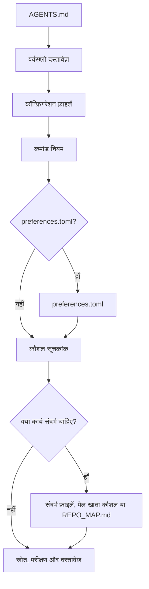

# mustflow

भाषाएँ: [अंग्रेज़ी](../../../README.md) · [कोरियाई](../ko/README.md) · [चीनी](../zh/README.md) · [स्पेनी](../es/README.md) · [फ़्रांसीसी](../fr/README.md) · [हिन्दी](README.md)

mustflow LLM-आधारित कोडिंग एजेंटों के लिए रिपॉज़िटरी-स्थानीय कार्य अनुबंध और
सत्यापन CLI है। यह होस्ट एजेंट के सैंडबॉक्स, अनुमति प्रक्रिया, चेकपॉइंट, मॉडल या
टूल नीतियों को नहीं बदलता; यह एजेंटों को रिपॉज़िटरी की स्पष्ट पढ़ने, कमांड और
सत्यापन सीमाओं के भीतर काम करने में मदद करता है।

मुख्य मॉडल सरल है: प्रोजेक्ट रूट में `AGENTS.md` रखें और विस्तृत वर्कफ़्लो को
`.mustflow/` के अंतर्गत संग्रहित करें। एजेंट `AGENTS.md` से शुरू करते हैं, फिर क्रमवार
रिपॉज़िटरी कमांड अनुबंध, कौशल, प्रोजेक्ट संदर्भ और सत्यापन नियमों का पालन करते हैं।

## एजेंट पढ़ने का प्रवाह



`read_order` आवश्यक पढ़ने का क्रम निर्धारित करता है, जबकि  
`optional_read_order` और `[context]` यह नियंत्रित करते हैं कि कार्य-विशेष  
संदर्भ कैसे लोड होगा। `[refresh]` नीति तय करती है कि एजेंट कब और कैसे वही निर्देश फिर से पढ़ेंगे।

skills index एक सक्रिय routing step है: एजेंट कार्य को `.mustflow/skills/INDEX.md` से  
तुलना करते हैं और उस स्कोप को संपादित करने से पहले मेल खाने वाला `SKILL.md` पढ़ते हैं।  
Skills केवल प्रक्रिया मार्गदर्शन करती हैं; कमांड निष्पादन अब भी  
`.mustflow/config/commands.toml` से होता है।

- दस्तावेज़ साइट: <https://0disoft.github.io/mustflow/>
- रिपॉज़िटरी: <https://github.com/0disoft/mustflow>
- इश्यू: <https://github.com/0disoft/mustflow/issues>

## यह क्या करता है

mustflow उपयोगकर्ता प्रोजेक्टों के लिए एजेंट वर्कफ़्लो इंस्टॉल और सत्यापित करता है।

- `AGENTS.md` और `.mustflow/**` वर्कफ़्लो फ़ाइलें इंस्टॉल करता है।  
- `.mustflow/config/commands.toml` में चलाए जा सकने वाले कमांड नियम घोषित करता है।  
- `mf check` और `mf doctor` के माध्यम से इंस्टॉल की स्थिति और कॉन्फ़िगरेशन संरचना जाँचता है।  
- `mf run <intent>` के जरिए समय सीमा के भीतर केवल अनुमत एक-बार चलने वाले कमांड चलाता है।  
- `mf map` से संक्षिप्त रिपॉज़िटरी नेविगेशन मानचित्र, `REPO_MAP.md`, बनाता है।  
- `mf index` और `mf search` के माध्यम से SQLite के साथ mustflow दस्तावेज़, कौशल और कमांड नियमों को इंडेक्स और खोजता है।  
- `mf update` से शामिल टेम्पलेट अपडेट को सुरक्षित रूप से पहले दिखाता और लागू करता है।  
- ऑटोमेशन रिपोर्ट और कमांड अनुबंधों के लिए JSON Schemas को `schemas/` में प्रकाशित करता है।

## यह क्या नहीं करता

mustflow स्वचालित प्रोजेक्ट संपादक नहीं है और किसी एक एजेंट उत्पाद से बंधा नहीं है।

- यह एप्लिकेशन स्रोत कोड जनरेट या संशोधित नहीं करता।  
- यह केवल इंस्टॉल होने से प्रोजेक्ट फ़ाइलों को नहीं बदलता। फ़ाइलें केवल तब बनती हैं जब `mf init` चलाया जाता है।  
- यह `CLAUDE.md` या `GEMINI.md` जैसे टूल-विशेष फ़ाइल नामों को अनिवार्य नहीं करता।  
- यह बिल्ड सिस्टम, टेस्ट रनर, पैकेज मैनेजर या CI/CD सेटअप का विकल्प नहीं है।  
- यह GitHub, GitLab या समान टूलों की प्लेटफ़ॉर्म-विशेष फ़ाइलों को डिफ़ॉल्ट टेम्पलेट में शामिल नहीं करता।  
- यह डिफ़ॉल्ट रूप से `justfile`, `Makefile` या `Taskfile.yml` नहीं बनाता।  
- `mf dashboard` `.mustflow/config/preferences.toml` में सुरक्षित preferences देखने और बदलने के लिए स्थानीय ब्राउज़र UI शुरू करता है, फिर उसे डिफ़ॉल्ट ब्राउज़र में खोलता है। पृष्ठ भाषा English, Korean, Chinese, Spanish, French और Hindi में बदली जा सकती है। इसमें verification selection और test authoring preferences भी शामिल हैं। Preferences save करने पर यदि lock file मौजूद हो तो मेल खाने वाला entry customized baseline के रूप में refresh हो जाता है।

## प्रस्तावित सुविधाएँ

ये रोक दी गई अवधारणाएँ हैं, अभी आधिकारिक रूप से समर्थित नहीं हैं।

- समुदाय कौशल रजिस्ट्री और कौशल पैक इंस्टॉल  
- वैकल्पिक `.mustflow/work-items/`  
- `mf orient`, `mf refresh`  
- टूल-विशेष अडैप्टर  

## त्वरित शुरुआत

Node.js 20 या नया संस्करण आवश्यक है। mustflow npm पैकेज के रूप में वितरित होता है, और CLI का नाम `mf` है।

```sh
npm install -D mustflow
npx mf init --dry-run
npx mf init
npx mf check --strict
```

इंटरैक्टिव टर्मिनल में `mf init` दस्तावेज़ भाषा, प्रोजेक्ट प्रोफ़ाइल और एजेंट रिपोर्ट भाषा चुनने देता है। बिना प्रश्नों के English डिफ़ॉल्ट इंस्टॉल करने के लिए `mf init --yes` का उपयोग करें।

pnpm और Bun भी उसी npm पैकेज का उपयोग कर सकते हैं। यहाँ Bun install/run विकल्प है, mustflow की अलग dependency नहीं।

```sh
pnpm add -D mustflow
pnpm exec mf init --yes

bun add -d mustflow
bunx mf init --yes
```

Project-local install में `npx mf`, `pnpm exec mf`, या `bunx mf` का उपयोग करें। Shell में `mf` सीधे चलाने के लिए mustflow को global install करें।

```sh
npm install -g mustflow
mf version --check

bun install -g mustflow
mf version --check
```

अगर shell फिर भी `mf: command not found` दिखाती है, तो mustflow उस shell के लिए global install नहीं है, या package manager का global executable directory `PATH` में नहीं है। Bun के साथ, Bun का global executable directory, आम तौर पर `~/.bun/bin`, `PATH` में है या नहीं यह जाँचें।

Deno के `npm:` निष्पादन को सत्यापित होने तक प्रयोगात्मक माना जाना चाहिए।

## इंस्टॉल की गई फ़ाइलें

`mf init` वर्तमान डायरेक्टरी में केवल एजेंट वर्कफ़्लो इंस्टॉल करता है।

```text
your-project/
├─ AGENTS.md
├─ .gitignore
└─ .mustflow/
   ├─ config/
   │  ├─ commands.toml
   │  ├─ manifest.lock.toml
   │  ├─ mustflow.toml
   │  └─ preferences.toml
   ├─ context/
   │  ├─ INDEX.md
   │  └─ PROJECT.md
   ├─ docs/
   │  └─ agent-workflow.md
   └─ skills/
      ├─ INDEX.md
      ├─ code-review/
      │  └─ SKILL.md
      ├─ codebase-orientation/
      │  └─ SKILL.md
      ├─ docs-update/
      │  └─ SKILL.md
      ├─ failure-triage/
      │  └─ SKILL.md
      ├─ project-context-authoring/
      │  └─ SKILL.md
      ├─ skill-authoring/
      │  └─ SKILL.md
      ├─ test-design-guard/
      │  └─ SKILL.md
      ├─ test-maintenance/
      │  └─ SKILL.md
      ├─ visual-review-artifact/
      │  └─ SKILL.md
      └─ web-asset-optimization/
         └─ SKILL.md
```

डिफ़ॉल्ट टेम्पलेट `README.md`, `PROJECT.md`, `ROADMAP.md`, `DESIGN.md`,  
`GOVERNANCE.md`, `TESTING.md`, `API.md`, `project.contract.json`, या  
`openapi.yaml` जैसे प्रोजेक्ट-स्वामित्व वाले रूट दस्तावेज़ या अनुबंध फाइलें नहीं बनाता।  
यह CI कॉन्फ़िगरेशन, सामान्य `docs/` या सामान्य `skills/` भी नहीं बनाता।  
उपयोगकर्ता प्रोजेक्ट पहले से इन नामों को अपनी फ़ाइलों के लिए उपयोग कर सकते हैं।

यदि `.gitignore` मौजूद नहीं है, तो `mf init` उसे बनाता है। यदि वह पहले से मौजूद है, तो mustflow केवल अपना प्रबंधित ब्लॉक अपडेट करता है और उपयोगकर्ता नियम सुरक्षित रखता है।

`REPO_MAP.md` टेम्पलेट से कॉपी नहीं होता। आवश्यकता होने पर इसे  
`mf map --write` से जनरेट करें। `.mustflow/cache/mustflow.sqlite` भी  
`mf index` द्वारा बनाया गया फिर से बनाया जा सकने वाला स्थानीय सूचकांक है।

यदि किसी प्रोजेक्ट में पहले से `README.md`, `PROJECT.md`, `ROADMAP.md`,  
`DESIGN.md`, `GOVERNANCE.md`, `TESTING.md`, `DEPLOYMENT.md`, `ARCHITECTURE.md`,  
या `API.md` जैसे वैकल्पिक रूट Markdown फाइलें हैं, तो रिपॉज़िटरी मैप उन्हें  
नेविगेशन एंकर के रूप में उपयोग कर सकता है। यह `project.contract.json`,  
`project.constants.json`, `design-tokens.json`, `openapi.yaml`, `asyncapi.yaml`,  
`schema.graphql`, और `schema.prisma` जैसे स्पष्ट उद्देश्य वाली मशीन-पठनीय  
अनुबंध फाइलें भी खोज सकता है। `SSOT.json` जैसे सामान्य नाम डिफ़ॉल्ट एंकर नहीं हैं।  
`mf init` फिर भी इन प्रोजेक्ट-स्वामित्व वाली फाइलों को डिफ़ॉल्ट रूप से  
बनाता या ओवरराइट नहीं करता।

## मूल वर्कफ़्लो

```sh
npx mf init --dry-run
npx mf init
npx mf doctor
npx mf check --strict
npx mf map --write
```

यदि खोज क्षमताएँ चाहिए, तो वैकल्पिक स्थानीय खोज सूचकांक बनाएँ।

```sh
npx mf index --dry-run --json
npx mf index
npx mf search mustflow_check
```

टेम्पलेट अपडेट लागू करने से पहले उनका पूर्वावलोकन करें।

```sh
npx mf status
npx mf update --dry-run
npx mf update --apply
```

एजेंट्स को configured update intents प्राथमिकता से उपयोग करनी चाहिए, ताकि रिपॉज़िटरी में run receipt दर्ज हो।

```sh
mf run mustflow_update_dry_run
mf run mustflow_update_apply
```

## कमांड

| कमांड                     | उद्देश्य                                                                                   |
|---------------------------|--------------------------------------------------------------------------------------------|
| `mf init`                 | `AGENTS.md` और `.mustflow/**` फ़ाइलें इंस्टॉल करता है।                                   |
| `mf init --dry-run`       | बिना कोई फ़ाइल लिखे दिखाता है कि कौन-सी फ़ाइलें बनाई जाएंगी।                             |
| `mf init --merge`         | मौजूदा `AGENTS.md` में mustflow-प्रबंधित ब्लॉक्स को मर्ज करता है।                       |
| `mf init --force`         | टकराती फ़ाइलों का बैकअप लेकर उन्हें ओवरराइट करता है।                                    |
| `mf check`                | mustflow फ़ाइलों, TOML कॉन्फ़िगरेशन और कौशल दस्तावेज़ संरचना की जांच करता है।          |
| `mf check --strict`       | दस्तावेज़ पहचान, कौशल मेटाडेटा, कमांड सीमाएँ, रिटेंशन नीति, आउटपुट सीमाएँ, कच्चे लॉग, और secret-like संदर्भों के लिए अतिरिक्त सुरक्षा जांच करता है। |
| `mf doctor`               | फ़ाइल लिखे बिना वर्तमान mustflow रूट का निरीक्षण करता है।                               |
| `mf api workspace-summary --json` | coding agents और external harnesses के लिए stable, read-only JSON summary दिखाता है। |
| `mf api command-catalog --json` | raw command strings दिखाए बिना command intent availability और safe `mf run` entrypoints दिखाता है। |
| `mf api serve --stdio` | वही read-only API reports stdin/stdout पर line-delimited JSON responses के रूप में serve करता है। |
| `mf api verification-plan --changed --json` | commands चलाए बिना बदली गई files के लिए stable, read-only verification plan दिखाता है। |
| `mf api latest-evidence --json` | raw command output के बिना bounded latest run या verify evidence दिखाता है। |
| `mf api diff-risk --changed --json` | बदली गई files के लिए compact risk, verification summary, और read-only residual correction signals दिखाता है। |
| `mf api health --json` | quick agent gate के लिए compact workspace health report दिखाता है। |
| `mf evidence --changed` | commands चलाए बिना changed-file verification requirements, latest evidence, receipts और remaining gaps summarize करता है। |
| `mf workspace status` | configured workspace roots और nested repository contract readiness inspect करता है, parent-to-child command authority दिए बिना। |
| `mf workspace command-catalog` | raw command strings के बिना per-repository command intent availability और safe `mf run` entrypoints दिखाता है। |
| `mf workspace verify --changed --plan-only` | commands चलाए बिना per-repository changed-file verification plans दिखाता है। |
| `mf api locks --json` | multi-session coordination के लिए active `mf run` locks दिखाता है। |
| `mf context --json`       | पढ़ने के क्रम, कमांड नियम, उपलब्ध क्षमताएँ और हाल की रन सारांश JSON के रूप में प्रदर्शित करता है। |
| `mf map --stdout`         | वर्तमान mustflow रूट मैप को मानक आउटपुट पर प्रिंट करता है।                              |
| `mf map --write`          | `REPO_MAP.md` फ़ाइल बनाता या अपडेट करता है।                                            |
| `mf run <intent>`         | अनुमत एक-बार चलने वाले कमांड को चलाता है।                                               |
| `mf run <intent> --wait`  | command चलाने से पहले conflicting active run locks के लिए wait करता है।                 |
| `mf index`                | mustflow दस्तावेज़ों और कमांड नियमों के लिए SQLite सूचकांक बनाता है।                    |
| `mf search <query>`       | SQLite सूचकांक में दस्तावेज़, कौशल और कमांड नियम खोजता है।                            |
| `mf status`               | इंस्टॉल स्थिति और बदली या अनुपस्थित फ़ाइलों की जांच करता है।                           |
| `mf update --dry-run`     | बिना फ़ाइल लिखे टेम्पलेट अपडेट योजना की गणना करता है।                                 |
| `mf update --apply`       | जब कोई अवरोध न हो, तब टेम्पलेट अपडेट लागू करता है।                                   |
| `mf help <topic>`         | इंस्टॉल की गई mustflow सहायता प्रदर्शित करता है।                                       |
| `mf dashboard`            | सुरक्षित mustflow प्रेफरेंस के लिए स्थानीय डैशबोर्ड शुरू करता है और इसे डिफ़ॉल्ट ब्राउज़र में खोलता है। Save करते समय यदि lock file मौजूद हो तो customized baseline रिफ्रेश होती है। |
| `mf version`              | इंस्टॉल किए गए mustflow package version को दिखाता है।                                  |
| `mf version --check`      | installed version को npm के latest published version से मिलाता है और update command दिखाता है। |
| `mf version-sources`      | फ़ाइलें बदले बिना detected package, template, और declared version sources की जांच करता है। |
| `mf explain authority [path]` | फ़ाइलें बदले बिना managed Markdown authority निर्णयों को समझाता है।               |

ऑटोमेशन और एजेंटों को मनुष्यों के लिए बने पाठ को पार्स करने के बजाय `--json` आउटपुट या `mf api serve --stdio` JSONL responses का उपयोग करना चाहिए। स्थिर आउटपुट के JSON स्कीमाएँ `schemas/` में उपलब्ध हैं।

## कमांड निष्पादन नीति

चलाए जाने वाले काम `.mustflow/config/commands.toml` में घोषित होते हैं ताकि  
एजेंट कमांड का अनुमान न लगा सकें।

`mf run` केवल उन्हीं कमांडों को चलाता है जो निम्न शर्तें पूरी करते हैं:

- `status = "configured"`  
- `lifecycle = "oneshot"`  
- `run_policy = "agent_allowed"`  
- `stdin = "closed"`  

विकास सर्वर, वॉच मोड, ब्राउज़र UI, इंटरैक्टिव कमांड और पृष्ठभूमि प्रक्रियाएँ सीधे नहीं चलाई जातीं।

प्रत्येक कमांड रन एक unique `.mustflow/state/runs/run-*` directory में run record लिखता है और `.mustflow/state/runs/latest.json` को latest pointer की तरह update करता है। Retained `run-*` और `verify-*` directories `.mustflow/state/runs/latest.index.json` में summarize होती हैं। रिकॉर्ड में इरादे का नाम, कार्य डायरेक्टरी, समय सीमा, निकास कोड, टाइमआउट स्थिति, तथा stdout और stderr का अंतिम भाग शामिल होता है।

## भाषाएँ और प्रोफ़ाइल

इंस्टॉल किए गए वर्कफ़्लो की भाषा, एजेंट प्रतिक्रिया की भाषा और उत्पाद-सामना करने वाली लोकेल अलग-अलग सेटिंग्स हैं।

```sh
npx mf init --profile product --locale ko --agent-lang ko
npx mf init --product-source-locale en --product-locale ko-KR
npx mf init --set git.auto_commit=true
```

- `--profile`: प्रोजेक्ट प्रोफ़ाइल। डिफ़ॉल्ट `minimal` है।  
- `--locale`: इंस्टॉल किए गए mustflow दस्तावेज़ों की भाषा। डिफ़ॉल्ट टेम्पलेट वर्तमान में `en`, `ko`, `zh`, `es`, `fr` और `hi` प्रदान करता है। डिफ़ॉल्ट टेम्पलेट सूचीबद्ध सभी भाषाओं के लिए स्थानीयकृत दस्तावेज़ शामिल करता है।  
- `--agent-lang`: एजेंट की अंतिम रिपोर्टों की डिफ़ॉल्ट भाषा।  
- `--interactive`: prompts के माध्यम से init सेटिंग्स चुनता है।  
- `--yes`: prompts के बिना डिफ़ॉल्ट English init सेटिंग्स का उपयोग करता है।  
- `--set`: इंस्टॉलेशन के दौरान अनुमत प्रेफरेंस सेट करता है। समर्थित keys हैं `git.auto_stage`, `git.auto_commit`, `git.auto_push=false`, `git.commit_message.*`, `reporting.commit_suggestion.enabled`, `language.memory.summary`, `release.versioning.*`, `verification.selection.*`, और `testing.authoring.*`।  
  `git.commit_message.style` में `conventional`, `descriptive`, या `gitmoji` दिया जा सकता है; `gitmoji` केवल सुझाए गए संदेश प्रारूप को बदलता है।  
  `git.commit_message.language` में `preserve_existing`, `agent_response`, `docs`, या `ja`, `de`, `pt-BR` जैसे locale टैग दिए जा सकते हैं।  
  `testing.authoring.new_test_policy` में `evidence_required`, `manual_approval`, या `broad` दिया जा सकता है।  
- `--product-source-locale`, `--product-locale`: उपयोगकर्ता-सामना करने वाली उत्पाद स्ट्रिंग के लिए स्रोत और लक्ष्य लोकेल।  
- `--lang`: CLI आउटपुट भाषा। वर्तमान मान `en`, `ko`, `zh`, `es`, `fr` और `hi` हैं।

## रिपॉज़िटरी संरचना

mustflow रिपॉज़िटरी में CLI, टेम्पलेट, अनुबंध विनिर्देश, दस्तावेज़ साइट और  
रिपॉज़िटरी-स्तरीय अनुवाद दस्तावेज़ शामिल हैं।

```text
mustflow/
├─ README.md
├─ ROADMAP.md
├─ LICENSE
├─ package.json
├─ schemas/
├─ tsconfig.json
├─ docs/
│  ├─ spec/
│  └─ i18n/
├─ docs-site/
├─ src/
│  └─ cli/
├─ templates/
│  └─ default/
└─ tests/
```

उपयोगकर्ता प्रोजेक्टों में कॉपी की गई फ़ाइलें `templates/default/common/` और  
`templates/default/locales/<locale>/` से आती हैं।

संस्करणित अनुबंध विनिर्देश `docs/spec/` में रखे गए हैं। दस्तावेज़ साइट उन्हें  
Design -> Contract specifications से लिंक करती है।

## विकास

इस रिपॉज़िटरी के विकास कमांड Bun का उपयोग करते हैं। उपयोगकर्ताओं को अपने  
प्रोजेक्टों में `mf` चलाने के लिए Bun की आवश्यकता नहीं है।

```sh
bun install
bun run check
bun run docs:check
bun run check:install
```

इस रिपॉज़िटरी में काम करने वाले एजेंटों को सामान्य सत्यापन के लिए कॉन्फ़िगर  
किए गए mustflow intents को प्राथमिकता देनी चाहिए।

```sh
mf run build
mf run test
mf run docs_validate
mf run mustflow_check
```

Bun स्क्रिप्ट्स मानव मेंटेनर्स और रिलीज़ पैकेजिंग फ्लो के लिए उपलब्ध रहते हैं।  
`test_related`, `lint`, coverage, और test-audit intents तब तक घोषित नहीं किए गए  
हैं जब तक इस रिपॉज़िटरी में उन फ्लोज़ के लिए अधिक संकीर्ण gates न हों।

`dist/` जनरेट किया गया बिल्ड आउटपुट है और इसे कमिट नहीं किया जाता। `npm pack`  
और `npm publish`, `prepack` के माध्यम से `npm run build` चलाते हैं, इसलिए npm  
पैकेज में बनी हुई CLI शामिल होती है।

प्रकाशित करने से पहले पूरी रिलीज़ जाँच चलाएँ।

```sh
bun run release:check
```

`release:check` CLI को सत्यापित करता है, दस्तावेज़ साइट बनाता है, npm tarball  
पैक करता है, उसे अस्थायी प्रोजेक्ट में इंस्टॉल करता है और सार्वजनिक `mf`  
वर्कफ़्लो चलाता है।

## दस्तावेज़ साइट

दस्तावेज़ साइट `docs-site/` में स्थित है।

```sh
bun run docs:dev
bun run docs:build
bun run docs:preview
```

GitHub Pages, GitHub Actions के साथ `main` ब्रांच से `docs-site/` स्रोत बनाता  
है और `docs-site/dist` को Pages आर्टिफ़ैक्ट के रूप में परिनियोजित करता है।  
`docs-site/dist` को कमिट न करें।

## पैकेज सामग्री

npm पैकेज में केवल ये शामिल हैं:

```text
dist/
templates/
schemas/
README.md
LICENSE
```

`docs/`, `docs-site/`, `tests/`, `src/` और कार्य नोट्स npm पैकेज में शामिल  
नहीं होते।

## लाइसेंस

MIT-0
