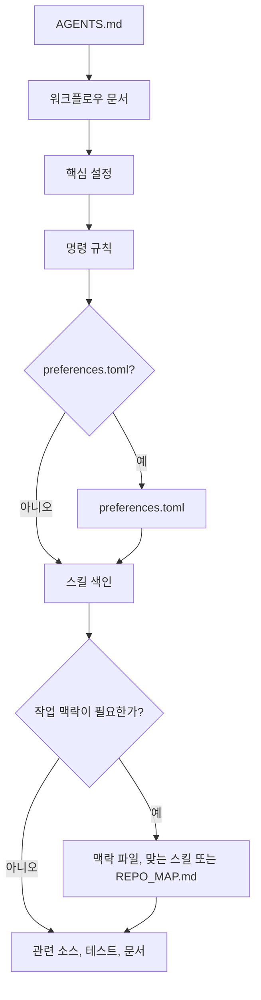

# mustflow

언어: [English](../../../README.md) · [한국어](README.md) · [中文](../zh/README.md) · [Español](../es/README.md) · [Français](../fr/README.md) · [हिन्दी](../hi/README.md)

mustflow는 LLM 코딩 에이전트를 위한 저장소 로컬 작업 계약이자 검증 CLI입니다. 호스트 에이전트의 샌드박스, 승인 절차, 체크포인트, 모델, 도구 정책을 대체하지 않고, 에이전트가 저장소 안에서 명시된 읽기, 명령, 검증 경계를 따르도록 돕습니다.

핵심 개념은 단순합니다. 사용자 프로젝트 루트에 `AGENTS.md`를 두고, 세부 작업 흐름은 `.mustflow/` 폴더 아래에 모읍니다. 에이전트는 `AGENTS.md`에서 시작해 저장소 명령 계약, 작업 스킬, 프로젝트 맥락, 검증 절차를 순차적으로 확인합니다.

## 에이전트 읽기 흐름



`read_order`는 필수 읽기 순서를 지정하며, `optional_read_order`와 `[context]`는 작업별 맥락 로딩을 관리합니다. `[refresh]`는 동일 지침을 언제 다시 읽을지 결정합니다.

스킬 색인은 능동적인 작업 분기 단계입니다. 에이전트는 현재 작업을 `.mustflow/skills/INDEX.md`와 비교하고, 해당 범위를 수정하기 전에 적합한 `SKILL.md`를 읽습니다. 스킬은 절차만 안내하며, 명령 실행은 계속 `.mustflow/config/commands.toml`을 따릅니다.

- 문서 사이트: <https://0disoft.github.io/mustflow/>
- 저장소: <https://github.com/0disoft/mustflow>
- 이슈: <https://github.com/0disoft/mustflow/issues>

## 기능 개요

mustflow는 사용자 프로젝트에 에이전트용 워크플로우를 설치하고 검증합니다.

- `AGENTS.md`와 `.mustflow/**` 워크플로우를 설치합니다.
- `.mustflow/config/commands.toml`에서 실행 가능한 명령 규칙을 선언합니다.
- `mf check`와 `mf doctor`로 설치 상태와 설정 형식을 점검합니다.
- `mf run <intent>`로 허용된 일회성 명령을 제한 시간 내에 실행합니다.
- `mf map`으로 현재 mustflow 루트의 간략 탐색 맵인 `REPO_MAP.md`를 생성합니다.
- `mf index`와 `mf search`로 mustflow 문서, 스킬, 명령 규칙을 SQLite 색인에서 검색합니다.
- `mf update`로 mustflow 템플릿 변경 사항을 안전하게 미리 확인하고 적용합니다.
- 자동화용 보고서와 명령 계약을 위한 JSON 스키마를 `schemas/`에 공개합니다.

## 제한 사항

mustflow는 프로젝트 자동 수정 도구나 특정 에이전트 제품 전용 규약이 아닙니다.

- 사용자 애플리케이션 소스 코드를 자동 생성하거나 수정하지 않습니다.
- 설치만으로 프로젝트 파일을 변경하지 않으며, 파일 생성은 `mf init` 실행 시에만 수행합니다.
- `CLAUDE.md`, `GEMINI.md`처럼 특정 도구 이름에 묶인 파일명을 표준으로 삼지 않습니다.
- 빌드 시스템, 테스트 실행기, 패키지 관리자, CI/CD 설정을 대체하지 않습니다.
- GitHub, GitLab 등 플랫폼별 설정 파일을 기본 템플릿에 포함하지 않습니다.
- `justfile`, `Makefile`, `Taskfile.yml`을 기본 생성하지 않습니다.
- `mf dashboard`는 `.mustflow/config/preferences.toml`의 안전한 설정을 확인하고 수정하는 로컬 브라우저 UI를 실행하며, 기본 브라우저에서 엽니다. 화면 언어는 영어, 한국어, 중국어, 스페인어, 프랑스어, 힌디어 중 선택할 수 있습니다. 검증 옵션과 테스트 작성 선호값도 포함하며, 설정 저장 시 잠금 파일이 있으면 해당 항목을 맞춤 기준선으로 갱신합니다.

## 검토 중인 기능

다음 항목은 아이디어 차원에서 남겨 둔 후보 기능으로, 아직 mustflow의 공개 기능이 아닙니다.

- 커뮤니티 스킬 저장소 및 스킬 팩 설치
- 선택형 `.mustflow/work-items/`
- `mf orient`, `mf refresh`
- 도구별 어댑터

## 빠른 시작

Node.js 20 이상이 필요하며, npm 패키지로 배포됩니다. CLI 실행 이름은 `mf`입니다.

```sh
npm install -D mustflow
npx mf init --dry-run
npx mf init
npx mf check --strict
```

대화형 터미널에서 `mf init`을 실행하면 문서 언어, 프로젝트 성격, 에이전트 보고 언어를 선택할 수 있습니다. 스크립트에서 질문 없이 영어 기본값으로 설치하려면 `mf init --yes`를 사용하세요.

pnpm과 Bun도 같은 npm 패키지를 사용할 수 있습니다. 여기서 Bun은 설치/실행 선택지일 뿐 mustflow의 별도 의존성으로 추가하지 않습니다.

```sh
pnpm add -D mustflow
pnpm exec mf init --yes

bun add -d mustflow
bunx mf init --yes
```

프로젝트 안에 설치한 경우에는 `npx mf`, `pnpm exec mf`, `bunx mf`처럼 실행하세요. 셸에서 `mf`를 바로 실행하려면 mustflow를 전역으로 설치해야 합니다.

```sh
npm install -g mustflow
mf version --check

bun install -g mustflow
mf version --check
```

그래도 셸이 `mf: command not found`를 출력하면, 그 셸에서 mustflow가 전역 설치되어 있지 않거나 패키지 관리자의 전역 실행 파일 폴더가 `PATH`에 없습니다. Bun을 사용할 때는 보통 `~/.bun/bin`인 Bun 전역 실행 파일 폴더가 `PATH`에 들어 있는지 확인하세요.

Deno의 `npm:` 실행은 별도 검증 전까지 실험적 기능으로 간주합니다.

## 설치되는 파일

`mf init`은 현재 폴더에 에이전트용 워크플로우만 설치합니다.

```text
your-project/
├─ AGENTS.md
├─ .gitignore
└─ .mustflow/
   ├─ config/
   │  ├─ commands.toml
   │  ├─ manifest.lock.toml
   │  ├─ mustflow.toml
   │  └─ preferences.toml
   ├─ context/
   │  ├─ INDEX.md
   │  └─ PROJECT.md
   ├─ docs/
   │  └─ agent-workflow.md
   └─ skills/
      ├─ INDEX.md
      ├─ code-review/
      │  └─ SKILL.md
      ├─ codebase-orientation/
      │  └─ SKILL.md
      ├─ docs-update/
      │  └─ SKILL.md
      ├─ failure-triage/
      │  └─ SKILL.md
      ├─ project-context-authoring/
      │  └─ SKILL.md
      ├─ skill-authoring/
      │  └─ SKILL.md
      ├─ test-design-guard/
      │  └─ SKILL.md
      ├─ test-maintenance/
      │  └─ SKILL.md
      ├─ visual-review-artifact/
      │  └─ SKILL.md
      └─ web-asset-optimization/
         └─ SKILL.md
```

`README.md`, `PROJECT.md`, `ROADMAP.md`, `DESIGN.md`, `GOVERNANCE.md`, `TESTING.md`, `API.md`, `project.contract.json`, `openapi.yaml` 같은 프로젝트 소유 루트 문서나 계약 파일은 기본 생성하지 않습니다. CI 설정, 일반 `docs/`, 일반 `skills/`도 생성하지 않습니다. 이는 사용자 프로젝트에 이미 같은 이름의 파일이나 폴더가 있을 수 있기 때문입니다.

`.gitignore`가 없으면 `mf init`이 새로 생성하며, 이미 있으면 사용자 규칙은 유지한 채 mustflow 관리 블록만 추가하거나 갱신합니다.

`REPO_MAP.md`는 템플릿에서 복사하지 않으며, 필요할 때 `mf map --write`로 생성합니다. `.mustflow/cache/mustflow.sqlite` 역시 `mf index`로 생성 가능한 재생성 가능한 로컬 색인입니다.

프로젝트에 이미 `README.md`, `PROJECT.md`, `ROADMAP.md`, `DESIGN.md`, `GOVERNANCE.md`, `TESTING.md`, `DEPLOYMENT.md`, `ARCHITECTURE.md`, `API.md` 같은 선택적 루트 Markdown 문서가 있다면, 저장소 맵은 이를 탐색 앵커로 활용할 수 있습니다. `project.contract.json`, `project.constants.json`, `design-tokens.json`, `openapi.yaml`, `asyncapi.yaml`, `schema.graphql`, `schema.prisma`처럼 용도가 명확한 기계 판독 계약 파일도 인식할 수 있습니다. `SSOT.json`처럼 모든 내용을 담는 이름은 기본 앵커로 보지 않습니다. 그럼에도 `mf init`은 프로젝트가 소유한 이러한 파일을 기본으로 생성하거나 덮어쓰지 않습니다.

## 기본 흐름

```sh
npx mf init --dry-run
npx mf init
npx mf doctor
npx mf check --strict
npx mf map --write
```

검색이 필요하면 선택적으로 색인을 생성합니다.

```sh
npx mf index --dry-run --json
npx mf index
npx mf search mustflow_check
```

템플릿 갱신은 먼저 계획을 확인한 뒤 적용합니다.

```sh
npx mf status
npx mf update --dry-run
npx mf update --apply
```

에이전트는 저장소에 실행 기록이 남도록 설정된 갱신 의도를 우선 사용합니다.

```sh
mf run mustflow_update_dry_run
mf run mustflow_update_apply
```

## 명령 목록

| 명령 | 역할 |
| --- | --- |
| `mf init` | `AGENTS.md`와 `.mustflow/**`를 설치합니다. |
| `mf init --dry-run` | 생성될 파일을 미리 보여주며 실제로는 쓰지 않습니다. |
| `mf init --merge` | 기존 `AGENTS.md`에 mustflow 관리 블록을 병합합니다. |
| `mf init --force` | 충돌하는 파일을 백업 후 덮어씁니다. |
| `mf check` | mustflow 파일, TOML 설정, 스킬 문서 형식을 검사합니다. |
| `mf check --strict` | 문서 정체성, 스킬 메타데이터, 명령 경계, 보존 정책, 실행 출력 제한, 원본 로그, 비밀정보 흔적 등 추가 안전 조건까지 검사합니다. |
| `mf doctor` | 현재 mustflow 루트를 읽기 전용으로 진단합니다. |
| `mf context --json` | 읽기 순서, 명령 규칙, 제공 기능, 최근 실행 요약을 JSON으로 출력합니다. |
| `mf map --stdout` | 현재 mustflow 루트의 탐색 지도를 터미널에 출력합니다. |
| `mf map --write` | `REPO_MAP.md`를 생성하거나 갱신합니다. |
| `mf run <intent>` | 허용된 일회성 명령을 실행합니다. |
| `mf index` | mustflow 문서와 명령 규칙을 SQLite 색인으로 만듭니다. |
| `mf search <query>` | SQLite 색인에서 문서, 스킬, 명령 규칙을 검색합니다. |
| `mf status` | 설치 상태와 변경/누락 파일을 확인합니다. |
| `mf update --dry-run` | 템플릿 갱신 계획을 계산하며 파일은 쓰지 않습니다. |
| `mf update --apply` | 차단 항목이 없을 때 템플릿 갱신을 적용합니다. |
| `mf help <topic>` | 설치된 mustflow 도움말을 보여줍니다. |
| `mf dashboard` | 안전한 mustflow 설정을 위한 로컬 대시보드를 실행하고 기본 브라우저에서 엽니다. 설정 저장 시 잠금 파일이 있으면 맞춤 기준선으로 갱신합니다. |
| `mf version` | 설치된 mustflow 패키지 버전을 출력합니다. |
| `mf version --check` | 설치된 버전을 npm 최신 게시 버전과 비교하고, 업데이트 명령을 출력합니다. |
| `mf version-sources` | 감지된 패키지, 템플릿, 선언된 버전 기준 원본을 파일 수정 없이 확인합니다. |
| `mf explain authority [path]` | 관리되는 마크다운 문서의 권한 결정을 파일 수정 없이 설명합니다. |

자동화나 에이전트가 결과를 읽어야 할 경우, 사람이 읽기 위한 텍스트를 파싱하지 말고 `--json` 출력을 사용하세요. 안정적인 출력 형식을 설명하는 JSON 스키마는 `schemas/`에 있습니다.

## 명령 실행 정책

에이전트가 명령어를 추측하지 않도록 실행 가능한 작업은 `.mustflow/config/commands.toml`에 명령 규칙으로 선언해야 합니다.

`mf run`은 다음 조건을 만족하는 명령만 실행합니다.

- `status = "configured"`
- `lifecycle = "oneshot"`
- `run_policy = "agent_allowed"`
- `stdin = "closed"`

개발 서버, 감시 모드, 브라우저 UI, 대화형 명령, 백그라운드 프로세스는 직접 실행하지 않습니다.

명령 실행 시 `.mustflow/state/runs/latest.json`에 마지막 실행 결과를 기록합니다. 실행 결과에는 명령 이름, 작업 디렉터리, 제한 시간, 종료 코드, 타임아웃 여부, 표준 출력과 표준 에러의 마지막 부분이 포함됩니다.

## 언어와 프로필

설치 문서 언어, 에이전트 보고 언어, 제품 대상 언어는 서로 다른 설정입니다.

```sh
npx mf init --profile product --locale ko --agent-lang ko
npx mf init --product-source-locale en --product-locale ko-KR
npx mf init --set git.auto_commit=true
```

- `--profile`: 프로젝트 성격을 지정합니다. 기본값은 `minimal`입니다.
- `--locale`: 설치되는 mustflow 문서의 언어입니다. 현재 기본 템플릿에서 지원하는 언어는 `en`, `ko`, `zh`, `es`, `fr`, `hi`이며, 각 언어별 문서가 포함되어 있습니다.
- `--agent-lang`: 에이전트 최종 보고 언어의 기본값입니다.
- `--interactive`: 질문에 답하며 초기 설정을 선택합니다.
- `--yes`: 질문 없이 영어 기본 초기 설정을 사용합니다.
- `--set`: 설치 중 허용된 설정을 변경합니다. 지원하는 키는 `git.auto_stage`, `git.auto_commit`, `git.auto_push=false`, `git.commit_message.*`, `reporting.commit_suggestion.enabled`, `language.memory.summary`, `release.versioning.*`, `verification.selection.*`, `testing.authoring.*`입니다.  
  `git.commit_message.style`에는 `conventional`, `descriptive`, `gitmoji`를 지정할 수 있으며, `gitmoji`는 제안 메시지 형식만 변경합니다.  
  `git.commit_message.language`에는 `preserve_existing`, `agent_response`, `docs`를 쓰거나 `ja`, `de`, `pt-BR` 같은 로케일 태그를 직접 지정할 수 있습니다.  
  `testing.authoring.new_test_policy`에는 `evidence_required`, `manual_approval`, `broad`를 지정할 수 있습니다.
- `--product-source-locale`, `--product-locale`: 제품 문자열의 기준 언어와 대상 로케일입니다.
- `--lang`: CLI 출력 언어입니다. 현재 `en`, `ko`, `zh`, `es`, `fr`, `hi`를 지원합니다.

## 저장소 구조

mustflow 저장소에는 CLI, 템플릿, 계약 명세, 문서 사이트, 저장소 수준 번역 문서가 함께 포함되어 있습니다.

```text
mustflow/
├─ README.md
├─ ROADMAP.md
├─ LICENSE
├─ package.json
├─ schemas/
├─ tsconfig.json
├─ docs/
│  ├─ spec/
│  └─ i18n/
├─ docs-site/
├─ src/
│  └─ cli/
├─ templates/
│  └─ default/
└─ tests/
```

사용자 프로젝트에 복사되는 원본은 `templates/default/common/`과 `templates/default/locales/<locale>/` 아래에 있습니다.

버전이 붙은 계약 명세는 `docs/spec/`에 위치하며, 문서 사이트에서는 Design -> Contract specifications 경로에서 확인할 수 있습니다.

## 개발

이 저장소의 개발 명령은 Bun을 사용합니다. 사용자 프로젝트에서 `mf`를 실행하기 위해 Bun이 반드시 필요한 것은 아닙니다.

```sh
bun install
bun run check
bun run docs:check
bun run check:install
```

이 저장소에서 작업하는 에이전트는 일반적인 검증에 설정된 mustflow 의도를 우선 사용해야 합니다.

```sh
mf run build
mf run test
mf run docs_validate
mf run mustflow_check
```

Bun 스크립트는 사람 유지보수자와 릴리스 포장 절차에 그대로 사용할 수 있습니다. `test_related`, `lint`, coverage, test-audit 의도는 해당 흐름을 위한 더 좁은 검증 관문이 마련될 때까지 의도적으로 선언하지 않았습니다.

`dist/`는 저장소에 커밋하지 않는 빌드 결과물입니다. `npm pack`과 `npm publish`를 실행하면 `prepack`이 먼저 `npm run build`를 실행하므로, npm 패키지 안에는 빌드된 CLI가 포함됩니다.

공개 전 전체 확인은 다음 명령으로 수행합니다.

```sh
bun run release:check
```

`release:check`는 CLI 검사, 문서 사이트 빌드, npm tarball 포장, 임시 프로젝트 설치, 공개 `mf` 명령 실행까지 모두 확인합니다.

## 문서 사이트

문서 사이트는 `docs-site/`에 위치합니다.

```sh
bun run docs:dev
bun run docs:build
bun run docs:preview
```

GitHub Pages는 `main` 브랜치의 `docs-site/` 소스를 GitHub Actions로 빌드하며, `docs-site/dist`를 Pages 배포 파일로 배포합니다. `docs-site/dist`는 커밋하지 않습니다.

## 패키지 포함 범위

npm 패키지에는 다음 항목만 포함됩니다.

```text
dist/
templates/
schemas/
README.md
LICENSE
```

`docs/`, `docs-site/`, `tests/`, `src/`, 작업 메모는 npm 패키지에 포함하지 않습니다.

## 라이선스

MIT-0
