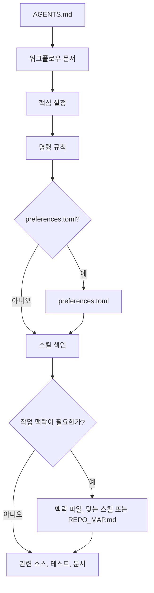

# mustflow

언어: [English](../../../README.md) · [한국어](README.md) · [中文](../zh/README.md) · [Español](../es/README.md) · [Français](../fr/README.md) · [हिन्दी](../hi/README.md)

mustflow는 LLM 코딩 에이전트가 저장소에 들어왔을 때 추측 없이 읽고, 실행하고,
검증할 수 있도록 돕는 에이전트용 워크플로우 CLI입니다.

핵심은 단순합니다. 사용자 프로젝트 루트에는 `AGENTS.md`를 두고, 세부 워크플로우는
`.mustflow/` 아래에 모읍니다. 에이전트는 `AGENTS.md`에서 시작해 명령 규약, 작업
스킬, 프로젝트 맥락, 검증 절차를 순서대로 확인합니다.

## 에이전트 읽기 흐름



`read_order`는 필수 읽기 순서를 정하고, `optional_read_order`와 `[context]`는
작업별 맥락 로딩을 관리하며, `[refresh]`는 같은 지침을 언제 다시 읽을지 결정합니다.

- 문서 사이트: <https://mustflow.github.io>
- 저장소: <https://github.com/0disoft/mustflow>
- 이슈: <https://github.com/0disoft/mustflow/issues>

## 하는 일

mustflow는 사용자 프로젝트에 에이전트용 워크플로우를 설치하고 검증합니다.

- `AGENTS.md`와 `.mustflow/**` 워크플로우를 설치합니다.
- `.mustflow/config/commands.toml`로 실행 가능한 명령 규칙을 선언합니다.
- `mf check`와 `mf doctor`로 설치 상태와 설정 형식을 확인합니다.
- `mf run <intent>`로 허용된 일회성 명령만 제한 시간 안에서 실행합니다.
- `mf map`으로 현재 mustflow 루트의 간략 탐색 맵인 `REPO_MAP.md`를 생성합니다.
- `mf index`와 `mf search`로 mustflow 문서, 스킬, 명령 규칙을 SQLite 색인으로 검색합니다.
- `mf update`로 mustflow 템플릿 변경 사항을 안전하게 미리 보여주고 적용합니다.

## 하지 않는 일

mustflow는 프로젝트 자동 수정 도구나 특정 에이전트 제품 전용 규약이 아닙니다.

- 사용자 애플리케이션 소스 코드를 자동 생성하거나 수정하지 않습니다.
- 설치만으로 프로젝트 파일을 바꾸지 않습니다. 파일 생성은 `mf init`을 실행했을 때만 합니다.
- `CLAUDE.md`, `GEMINI.md`처럼 특정 도구 이름에 묶인 파일명을 표준으로 삼지 않습니다.
- 빌드 시스템, 테스트 실행기, 패키지 관리자, CI/CD 설정을 대체하지 않습니다.
- GitHub, GitLab 같은 플랫폼별 설정 파일을 기본 템플릿에 넣지 않습니다.
- `justfile`, `Makefile`, `Taskfile.yml`을 기본 생성하지 않습니다.
- 대시보드는 아직 구현하지 않았습니다. `mf dashboard`는 예약된 명령입니다.

## 검토 중인 기능

다음 항목은 아이디어를 잊지 않기 위해 남겨 둔 후보이며, 아직 mustflow의 공개 기능이 아닙니다.

- `mf dashboard`
- 커뮤니티 스킬 저장소와 스킬 팩 설치
- 선택형 `.mustflow/work-items/`
- `mf orient`, `mf refresh`
- 도구별 어댑터

## 빠른 시작

Node.js 20 이상이 필요합니다. npm 패키지로 배포되며, CLI 실행 이름은 `mf`입니다.

```sh
npm install -D mustflow
npx mf init --dry-run
npx mf init
npx mf check --strict
```

대화형 터미널에서 `mf init`을 실행하면 문서 언어, 프로젝트 성격, 에이전트 보고
언어를 선택할 수 있습니다. 스크립트에서 질문 없이 영어 기본값으로 설치하려면
`mf init --yes`를 사용하세요.

pnpm과 Bun도 npm 패키지를 설치하는 방식으로 사용할 수 있습니다.

```sh
pnpm add -D mustflow
pnpm exec mf init --yes

bun add -d mustflow
bunx mf init --yes
```

Deno의 `npm:` 실행은 별도 검증까지는 실험적 기능으로 간주합니다.

## 설치되는 파일

`mf init`은 현재 폴더에 에이전트용 워크플로우만 설치합니다.

```text
your-project/
├─ AGENTS.md
├─ .gitignore
└─ .mustflow/
   ├─ config/
   │  ├─ commands.toml
   │  ├─ manifest.lock.toml
   │  ├─ mustflow.toml
   │  └─ preferences.toml
   ├─ context/
   │  ├─ INDEX.md
   │  └─ PROJECT.md
   ├─ docs/
   │  └─ agent-workflow.md
   └─ skills/
      ├─ INDEX.md
      ├─ code-review/
      │  └─ SKILL.md
      ├─ docs-update/
      │  └─ SKILL.md
      ├─ failure-triage/
      │  └─ SKILL.md
      └─ test-maintenance/
         └─ SKILL.md
```

`README.md`, 기여 안내, 보안 정책, CI 설정, 일반 `docs/`, 일반 `skills/`는 기본 생성하지
않습니다. 사용자 프로젝트에 이미 같은 이름의 폴더가 있을 수 있기 때문입니다.

`.gitignore`가 없으면 `mf init`이 새로 만들고, 이미 있으면 사용자 규칙은 보존한 채
mustflow 관리 블록만 추가하거나 갱신합니다.

`REPO_MAP.md`는 템플릿에서 복사하지 않습니다. 필요할 때 `mf map --write`로 생성합니다.
`.mustflow/cache/mustflow.sqlite`도 `mf index`로 만드는 재생성 가능한 로컬 색인입니다.

## 기본 흐름

```sh
npx mf init --dry-run
npx mf init
npx mf doctor
npx mf check --strict
npx mf map --write
```

검색이 필요하면 선택적으로 색인을 만듭니다.

```sh
npx mf index --dry-run --json
npx mf index
npx mf search mustflow_check
```

템플릿 갱신은 먼저 계획을 확인한 뒤 적용합니다.

```sh
npx mf status
npx mf update --dry-run
npx mf update --apply
```

## 명령 목록

| 명령 | 역할 |
| --- | --- |
| `mf init` | `AGENTS.md`와 `.mustflow/**`를 설치합니다. |
| `mf init --dry-run` | 어떤 파일을 만들지 보여주고 파일은 쓰지 않습니다. |
| `mf init --merge` | 기존 `AGENTS.md`에 mustflow 관리 블록을 병합합니다. |
| `mf init --force` | 충돌 파일을 백업한 뒤 덮어씁니다. |
| `mf check` | mustflow 파일, TOML 설정, 스킬 문서 형식을 검사합니다. |
| `mf check --strict` | 보존 정책, 실행 출력 제한, 원본 로그, 비밀정보 흔적 같은 추가 안전 조건까지 검사합니다. |
| `mf doctor` | 현재 mustflow 루트를 읽기 전용으로 진단합니다. |
| `mf context --json` | 읽기 순서, 명령 규칙, 제공 기능, 최근 실행 요약을 JSON으로 출력합니다. |
| `mf map --stdout` | 현재 mustflow 루트의 탐색 지도를 터미널에 출력합니다. |
| `mf map --write` | `REPO_MAP.md`를 생성하거나 갱신합니다. |
| `mf run <intent>` | 허용된 일회성 명령을 실행합니다. |
| `mf index` | mustflow 문서와 명령 규칙을 SQLite 색인으로 만듭니다. |
| `mf search <query>` | SQLite 색인에서 문서, 스킬, 명령 규칙을 검색합니다. |
| `mf status` | 설치 상태와 변경/누락 파일을 확인합니다. |
| `mf update --dry-run` | 템플릿 갱신 계획을 계산하고 파일은 쓰지 않습니다. |
| `mf update --apply` | 차단 항목이 없을 때 템플릿 갱신을 적용합니다. |
| `mf help <topic>` | 설치된 mustflow 도움말을 보여줍니다. |
| `mf dashboard` | 예약된 명령입니다. 아직 구현하지 않았습니다. |

자동화나 에이전트가 결과를 읽어야 하면 사람이 읽기 위한 형식의 텍스트를 파싱하지 말고 `--json` 출력을
사용하세요.

## 명령 실행 정책

에이전트가 명령어를 추측하지 않도록 실행 가능한 작업은
`.mustflow/config/commands.toml`에 명령 규칙으로 선언합니다.

`mf run`은 다음 조건을 만족하는 명령만 실행합니다.

- `status = "configured"`
- `lifecycle = "oneshot"`
- `run_policy = "agent_allowed"`
- `stdin = "closed"`

개발 서버, 감시 모드, 브라우저 UI, 대화형 명령, 백그라운드 프로세스는 직접 실행하지
않습니다.

명령을 실행하면 `.mustflow/state/runs/latest.json`에 마지막 실행 결과를 기록합니다.
실행 결과에는 명령 이름, 작업 디렉터리, 제한 시간, 종료 코드, 타임아웃 여부,
표준 출력과 에러의 마지막 부분이 들어갑니다.

## 언어와 프로필

설치 문서 언어, 에이전트 보고 언어, 제품 대상 언어는 서로 다른 설정입니다.

```sh
npx mf init --profile product --locale ko --agent-lang ko
npx mf init --product-source-locale en --product-locale ko-KR
npx mf init --set git.auto_commit=true
```

- `--profile`: 프로젝트 성격입니다. 기본값은 `minimal`입니다.
- `--locale`: 설치되는 mustflow 문서 언어입니다. 현재 기본 템플릿에서 설치할 수
  있는 언어는 `en`, `ko`, `zh`, `es`, `fr`, `hi`이며, 기본 템플릿에는 각 언어별
  문서가 포함되어 있습니다.
- `--agent-lang`: 에이전트 최종 보고 언어 기본값입니다.
- `--interactive`: 질문에 답하며 초기 설정을 선택합니다.
- `--yes`: 질문 없이 영어 기본 초기 설정을 사용합니다.
- `--set`: 설치 중 허용된 설정을 바꿉니다. 지원하는 키는
  `git.auto_stage`, `git.auto_commit`, `git.commit_message.language`,
  `reporting.commit_suggestion.enabled`, `language.memory.summary`입니다.
- `--product-source-locale`, `--product-locale`: 제품 문자열의 기준 언어와 대상 로케일입니다.
- `--lang`: CLI 출력 언어입니다. 현재 `en`, `ko`, `zh`, `es`, `fr`, `hi`를
  지원합니다.

## 저장소 구조

mustflow 저장소에는 CLI, 템플릿, 문서 사이트가 함께 있습니다.

```text
mustflow/
├─ README.md
├─ LICENSE
├─ package.json
├─ tsconfig.json
├─ docs-site/
├─ src/
│  └─ cli/
├─ templates/
│  └─ default/
└─ tests/
```

사용자 프로젝트에 복사되는 원본은 `templates/default/common/`과
`templates/default/locales/<locale>/` 아래에 있습니다.

## 개발

이 저장소의 개발 명령은 Bun을 사용합니다. 사용자 프로젝트에서 `mf`를 실행하기 위해
Bun이 필요한 것은 아닙니다.

```sh
bun install
bun run check
bun run docs:check
bun run check:install
```

`dist/`는 저장소에 커밋하지 않는 빌드 결과물입니다. `npm pack`과 `npm publish`를 실행하면
`prepack`이 먼저 `npm run build`를 실행하므로, npm 패키지 안에는 빌드된 CLI가 들어갑니다.

공개 전 전체 확인은 다음 명령을 사용합니다.

```sh
bun run release:check
```

`release:check`는 CLI 검사, 문서 사이트 빌드, npm tarball 포장, 임시 프로젝트 설치,
공개 `mf` 명령 실행까지 확인합니다.

## 문서 사이트

문서 사이트는 `docs-site/`에 있습니다.

```sh
bun run docs:dev
bun run docs:build
bun run docs:preview
```

GitHub Pages는 `main` 브랜치의 `docs-site/` 소스를 GitHub Actions로 빌드하고,
`docs-site/dist`를 Pages 배포 파일로 배포합니다. `docs-site/dist`는 커밋하지 않습니다.

## 패키지 포함 범위

npm 패키지에는 다음만 포함합니다.

```text
dist/
templates/
README.md
LICENSE
```

`docs-site/`, `tests/`, `src/`, 작업 메모는 npm 패키지에 포함하지 않습니다.

## 라이선스

MIT-0
