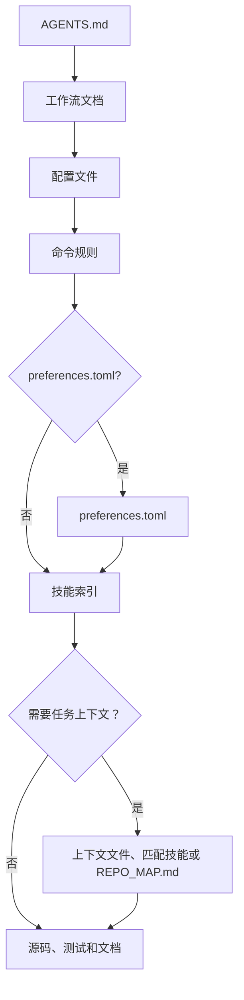

```markdown
# mustflow

语言：[英文](../../../README.md) · [韩文](../ko/README.md) · [中文](README.md) · [西班牙文](../es/README.md) · [法文](../fr/README.md) · [印地文](../hi/README.md)

mustflow 是面向大型语言模型（LLM）编码代理的仓库本地工作契约与验证命令行工具。它不会取代宿主代理的沙盒、审批、检查点、模型或工具策略，而是帮助代理遵守仓库中明确的阅读、命令和验证边界。

核心模型非常简洁：在项目根目录放置 `AGENTS.md`，详细工作流则存放于 `.mustflow/` 目录。代理从 `AGENTS.md` 开始，依次读取仓库命令合同、技能、项目上下文和验证规则。

## 代理读取流程



`read_order` 定义了必须的读取顺序，`optional_read_order` 和 `[context]` 控制任务特定上下文的加载方式，`[refresh]` 策略决定代理何时重新读取相同指令。

技能索引是主动分流的关键步骤：代理会将任务与 `.mustflow/skills/INDEX.md` 进行匹配，并在编辑对应范围前加载匹配的 `SKILL.md`。技能仅指导流程，命令执行仍由 `.mustflow/config/commands.toml` 决定。

- 文档站点：<https://0disoft.github.io/mustflow/>
- 仓库地址：<https://github.com/0disoft/mustflow>
- 问题反馈：<https://github.com/0disoft/mustflow/issues>

## 它能做什么

mustflow 为用户项目安装并验证代理工作流。

- 安装 `AGENTS.md` 和 `.mustflow/**` 工作流文件。
- 在 `.mustflow/config/commands.toml` 中声明可执行的命令规则。
- 使用 `mf check` 和 `mf doctor` 检查安装状态及配置结构。
- 通过 `mf run <intent>` 在超时限制内仅执行允许的一次性命令。
- 使用 `mf map` 生成简洁的仓库导航地图 `REPO_MAP.md`。
- 通过 `mf index` 和 `mf search` 利用 SQLite 索引搜索 mustflow 文档、技能和命令规则。
- 使用 `mf update` 安全预览并应用内置模板更新。
- 在 `schemas/` 目录发布面向自动化报告和命令合同的 JSON Schema。

## 它不做什么

mustflow 不是自动项目编辑器，也不绑定任何特定代理产品。

- 不会生成或修改应用源码。
- 不会因安装包存在而更改项目文件，仅在执行 `mf init` 时创建文件。
- 不强制使用 `CLAUDE.md`、`GEMINI.md` 等特定工具文件名。
- 不替代构建系统、测试运行器、包管理器或 CI/CD 配置。
- 不会将 GitHub、GitLab 等平台特定文件纳入默认模板。
- 默认不创建 `justfile`、`Makefile` 或 `Taskfile.yml`。
- `mf dashboard` 会启动本地浏览器界面，用于查看和编辑 `.mustflow/config/preferences.toml` 中的安全偏好设置，随后在默认浏览器打开。页面支持英语、韩语、中文、西班牙语、法语和印地语切换。界面还包含验证选项和测试编写偏好。保存时，如果存在锁文件，相关条目会刷新为自定义基线。

## 候选功能

以下为暂存的想法，尚未正式支持：

- 社区技能注册表和技能包安装
- 可选的 `.mustflow/work-items/`
- `mf orient`、`mf refresh`
- 特定工具适配器

## 快速开始

需 Node.js 20 及以上版本。mustflow 以 npm 包形式发布，CLI 命令为 `mf`。

```sh
npm install -D mustflow
npx mf init --dry-run
npx mf init
npx mf check --strict
```

在交互式终端中，`mf init` 会引导你选择文档语言、项目配置档案和代理报告语言。若需无提示安装英文默认配置，请使用 `mf init --yes`。

pnpm 和 Bun 同样支持该 npm 包。这里的 Bun 只是安装/运行选项，不是 mustflow 的额外依赖。

```sh
pnpm add -D mustflow
pnpm exec mf init --yes

bun add -d mustflow
bunx mf init --yes
```

项目本地安装时应使用 `npx mf`、`pnpm exec mf` 或 `bunx mf`。如果希望在 shell 中直接运行 `mf`，请全局安装 mustflow。

```sh
npm install -g mustflow
mf version --check

bun install -g mustflow
mf version --check
```

如果 shell 仍然输出 `mf: command not found`，说明 mustflow 没有在该 shell 中全局安装，或包管理器的全局可执行文件目录不在 `PATH` 中。使用 Bun 时，请确认 Bun 的全局可执行文件目录，通常是 `~/.bun/bin`，已经加入 `PATH`。

Deno 的 `npm:` 执行功能仍属实验性质，建议先单独验证。

## 安装的文件

`mf init` 仅会将代理工作流安装到当前目录。

```text
your-project/
├─ AGENTS.md
├─ .gitignore
└─ .mustflow/
   ├─ config/
   │  ├─ commands.toml
   │  ├─ manifest.lock.toml
   │  ├─ mustflow.toml
   │  └─ preferences.toml
   ├─ context/
   │  ├─ INDEX.md
   │  └─ PROJECT.md
   ├─ docs/
   │  └─ agent-workflow.md
   └─ skills/
      ├─ INDEX.md
      ├─ code-review/
      │  └─ SKILL.md
      ├─ codebase-orientation/
      │  └─ SKILL.md
      ├─ docs-update/
      │  └─ SKILL.md
      ├─ failure-triage/
      │  └─ SKILL.md
      ├─ project-context-authoring/
      │  └─ SKILL.md
      ├─ skill-authoring/
      │  └─ SKILL.md
      ├─ test-design-guard/
      │  └─ SKILL.md
      ├─ test-maintenance/
      │  └─ SKILL.md
      ├─ visual-review-artifact/
      │  └─ SKILL.md
      └─ web-asset-optimization/
         └─ SKILL.md
```

默认模板不会创建 `README.md`、`PROJECT.md`、`ROADMAP.md`、`DESIGN.md`、`GOVERNANCE.md`、`TESTING.md`、`API.md`、`project.contract.json`、`openapi.yaml` 等项目自有根文档或合同文件，也不会创建 CI 配置、通用 `docs/` 或通用 `skills/`。用户项目可能已使用这些名称存放自己的文件。

如果 `.gitignore` 不存在，`mf init` 会创建它；若已存在，mustflow 仅更新自己管理的部分，保留用户自定义规则。

`REPO_MAP.md` 不会从模板复制，需时请使用 `mf map --write` 生成。`.mustflow/cache/mustflow.sqlite` 由 `mf index` 创建，是可重新生成的本地索引。

若项目已有 `README.md`、`PROJECT.md`、`ROADMAP.md`、`DESIGN.md`、`GOVERNANCE.md`、`TESTING.md`、`DEPLOYMENT.md`、`ARCHITECTURE.md`、`API.md` 等可选根目录 Markdown 文档，仓库地图可将它们作为导航锚点。它也能识别 `project.contract.json`、`project.constants.json`、`design-tokens.json`、`openapi.yaml`、`asyncapi.yaml`、`schema.graphql`、`schema.prisma` 等用途明确的机器可读合同文件。`SSOT.json` 等泛用名称不作为默认锚点。`mf init` 仍不会默认创建或覆盖这些项目自有文件。

## 基本工作流

```sh
npx mf init --dry-run
npx mf init
npx mf doctor
npx mf check --strict
npx mf map --write
```

如需搜索功能，可创建可选的本地搜索索引：

```sh
npx mf index --dry-run --json
npx mf index
npx mf search mustflow_check
```

应用模板更新前先预览：

```sh
npx mf status
npx mf update --dry-run
npx mf update --apply
```

代理应优先使用已配置的更新意图，以便仓库保留运行记录：

```sh
mf run mustflow_update_dry_run
mf run mustflow_update_apply
```
```

## 命令

| 命令 | 说明 |
| --- | --- |
| `mf init` | 安装 `AGENTS.md` 和 `.mustflow/**`。 |
| `mf init --dry-run` | 显示将创建的文件，但不写入。 |
| `mf init --merge` | 将 mustflow 管理块合并到现有 `AGENTS.md`。 |
| `mf init --force` | 备份冲突文件后覆盖。 |
| `mf check` | 验证 mustflow 文件、TOML 配置和技能文档结构。 |
| `mf check --strict` | 额外执行文档身份、技能元数据、命令边界、保留策略、输出限制、原始日志及类似秘密上下文的安全检查。 |
| `mf doctor` | 以只读方式检查当前 mustflow 根目录。 |
| `mf api workspace-summary --json` | 为编码代理和外部执行框架输出稳定的只读 JSON 摘要。 |
| `mf api command-catalog --json` | 输出命令 intent 可用性和安全的 `mf run` 入口，不暴露原始命令字符串。 |
| `mf api verification-plan --changed --json` | 为已变更文件输出稳定的只读 verification plan，不执行命令。 |
| `mf api latest-evidence --json` | 输出 bounded 最新 run 或 verify evidence，不包含原始命令输出。 |
| `mf api diff-risk --changed --json` | 输出已变更文件的紧凑 risk 和 verification 摘要。 |
| `mf api health --json` | 为快速 agent gate 输出紧凑 workspace health 报告。 |
| `mf context --json` | 以 JSON 格式输出读取顺序、命令规则、可用能力及最近运行摘要。 |
| `mf map --stdout` | 将当前 mustflow 根目录地图输出到标准输出。 |
| `mf map --write` | 创建或更新 `REPO_MAP.md`。 |
| `mf run <intent>` | 运行允许的一次性命令。 |
| `mf index` | 为 mustflow 文档和命令规则构建 SQLite 索引。 |
| `mf search <query>` | 在 SQLite 索引中搜索文档、技能和命令规则。 |
| `mf status` | 检查安装状态及已更改或缺失的文件。 |
| `mf update --dry-run` | 计算模板更新计划，但不写入文件。 |
| `mf update --apply` | 在无阻塞项时应用模板更新。 |
| `mf help <topic>` | 显示已安装的 mustflow 帮助。 |
| `mf dashboard` | 启动本地 dashboard 管理安全偏好设置，并在默认浏览器打开。保存时若存在锁文件，会刷新自定义基线。 |
| `mf version` | 显示已安装的 mustflow 包版本。 |
| `mf version --check` | 将已安装版本与 npm 最新发布版本比较，并打印更新命令。 |
| `mf version-sources` | 不修改文件的情况下检查检测到的 package、模板及声明的版本来源。 |
| `mf explain authority [path]` | 不修改文件的情况下解释受管 Markdown 文档的权威决策。 |

自动化和代理应使用 `--json` 输出，避免解析面向人类的文本。稳定的 JSON Schema 位于 `schemas/`。

## 命令执行策略

可执行命令在 `.mustflow/config/commands.toml` 中声明，避免代理猜测命令。

`mf run` 仅执行同时满足以下条件的命令：

- `status = "configured"`
- `lifecycle = "oneshot"`
- `run_policy = "agent_allowed"`
- `stdin = "closed"`

开发服务器、监听模式、浏览器界面、交互式命令和后台进程不会被直接执行。

每次命令运行后，最新运行记录会写入 `.mustflow/state/runs/latest.json`，包含意图名称、工作目录、超时、退出码、是否超时，以及 stdout 和 stderr 的尾部内容。

## 语言和配置档案

已安装工作流语言、代理回复语言和面向产品的区域设置是相互独立的配置。

```sh
npx mf init --profile product --locale ko --agent-lang ko
npx mf init --product-source-locale en --product-locale ko-KR
npx mf init --set git.auto_commit=true
```

- `--profile`：项目配置档案，默认是 `minimal`。
- `--locale`：mustflow 文档语言。默认模板支持 `en`、`ko`、`zh`、`es`、`fr` 和 `hi`，且包含所有列出语言的本地化文档。
- `--agent-lang`：代理最终报告的默认语言。
- `--interactive`：通过交互提问选择初始化设置。
- `--yes`：无提示使用英文默认设置。
- `--set`：安装过程中设置允许的偏好项。支持键包括 `git.auto_stage`、`git.auto_commit`、`git.auto_push=false`、`git.commit_message.*`、`reporting.commit_suggestion.enabled`、`language.memory.summary`、`release.versioning.*`、`verification.selection.*` 和 `testing.authoring.*`。  
  `git.commit_message.style` 可选 `conventional`、`descriptive` 或 `gitmoji`，其中 `gitmoji` 仅改变建议消息格式。  
  `git.commit_message.language` 可选 `preserve_existing`、`agent_response`、`docs`，也可直接指定如 `ja`、`de`、`pt-BR` 等 locale 标签。  
  `testing.authoring.new_test_policy` 可选 `evidence_required`、`manual_approval` 或 `broad`。
- `--product-source-locale`、`--product-locale`：面向用户的产品字符串的源区域设置和目标区域设置。
- `--lang`：CLI 输出语言，当前支持 `en`、`ko`、`zh`、`es`、`fr` 和 `hi`。

## 仓库结构

mustflow 仓库包含 CLI、模板、契约规范、文档站点和仓库级翻译文档。

```text
mustflow/
├─ README.md
├─ ROADMAP.md
├─ LICENSE
├─ package.json
├─ schemas/
├─ tsconfig.json
├─ docs/
│  ├─ spec/
│  └─ i18n/
├─ docs-site/
├─ src/
│  └─ cli/
├─ templates/
│  └─ default/
└─ tests/
```

复制到用户项目的文件来自 `templates/default/common/` 和 `templates/default/locales/<locale>/`。

带版本的契约规范位于 `docs/spec/`，文档站点通过 Design -> Contract specifications 链接到这些规范。

## 开发

本仓库的开发命令使用 Bun。用户在自己的项目中运行 `mf` 不需要 Bun。

```sh
bun install
bun run check
bun run docs:check
bun run check:install
```

在本仓库中工作的代理应优先使用已配置的 mustflow intent 进行日常验证。

```sh
mf run build
mf run test
mf run docs_validate
mf run mustflow_check
```

Bun 脚本仍供维护者和发布打包流程使用。`test_related`、`lint`、coverage 和 test-audit intent 会在仓库拥有更细粒度检查入口后再声明。

`dist/` 是构建输出目录，不提交到仓库。`npm pack` 和 `npm publish` 会通过 `prepack` 运行 `npm run build`，确保 npm 包包含构建后的 CLI。

发布前执行完整发布检查：

```sh
bun run release:check
```

`release:check` 会验证 CLI、构建文档站点、打包 npm 压缩包、将其安装到临时项目，并运行公开的 `mf` 工作流。

## 文档站点

文档站点位于 `docs-site/`。

```sh
bun run docs:dev
bun run docs:build
bun run docs:preview
```

GitHub Pages 通过 GitHub Actions 从 `main` 分支构建 `docs-site/` 源码，并将 `docs-site/dist` 部署为 Pages 工件。请勿提交 `docs-site/dist`。

## 包内容

npm 包仅包含：

```text
dist/
templates/
schemas/
README.md
LICENSE
```

`docs/`、`docs-site/`、`tests/`、`src/` 和工作笔记不包含在 npm 包中。

## 许可证

MIT-0
