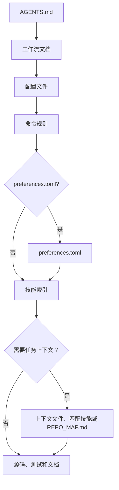

# mustflow

语言：[英文](../../../README.md) · [韩文](../ko/README.md) · [中文](README.md) · [西班牙文](../es/README.md) · [法文](../fr/README.md) · [印地文](../hi/README.md)

mustflow 是面向 LLM 编码代理的工作流 CLI。它帮助代理进入仓库，读取正确
的运行上下文，只执行已声明的命令，并在不猜测的情况下验证自己的工作。

核心模型很简单：在项目根目录放置 `AGENTS.md`，再把详细工作流放在
`.mustflow/` 下。代理从 `AGENTS.md` 开始，然后按顺序读取命令合同、技能、
项目上下文和验证规则。

## 代理读取流程



`read_order` 定义必读顺序，而 `optional_read_order` 和 `[context]` 控制
如何加载任务特定上下文。`[refresh]` 策略决定代理何时重新读取相同指令。

- 文档站点：<https://mustflow.github.io>
- 仓库：<https://github.com/0disoft/mustflow>
- 问题：<https://github.com/0disoft/mustflow/issues>

## 它做什么

mustflow 为用户项目安装并验证代理工作流。

- 安装 `AGENTS.md` 和 `.mustflow/**` 工作流文件。
- 在 `.mustflow/config/commands.toml` 中声明可运行的命令规则。
- 使用 `mf check` 和 `mf doctor` 检查安装健康状况和配置结构。
- 通过 `mf run <intent>` 在超时限制内只运行允许的一次性命令。
- 使用 `mf map` 生成简洁的仓库导航地图 `REPO_MAP.md`。
- 通过 `mf index` 和 `mf search` 使用 SQLite 索引并搜索 mustflow 文档、
  技能和命令规则。
- 使用 `mf update` 安全地预览并应用内置模板更新。

## 它不做什么

mustflow 不是自动项目编辑器，也不绑定到某个代理产品。

- 它不会生成或修改应用源码。
- 它不会因为安装包存在就更改项目文件。只有运行 `mf init` 时才会创建文件。
- 它不会强制使用 `CLAUDE.md` 或 `GEMINI.md` 这类特定工具文件名。
- 它不会替代构建系统、测试运行器、包管理器或 CI/CD 设置。
- 它不会把 GitHub、GitLab 或类似平台的特定文件加入默认模板。
- 它默认不会创建 `justfile`、`Makefile` 或 `Taskfile.yml`。
- 仪表板尚未实现。`mf dashboard` 是保留命令。

## 候选功能

这些是暂存想法，尚未正式支持。

- `mf dashboard`
- 社区技能注册表和技能包安装
- 可选的 `.mustflow/work-items/`
- `mf orient`、`mf refresh`
- 特定工具适配器

## 快速开始

需要 Node.js 20 或更高版本。mustflow 以 npm 包形式发布，CLI 名称为
`mf`。

```sh
npm install -D mustflow
npx mf init --dry-run
npx mf init --yes
npx mf check --strict
```

pnpm 和 Bun 可以使用同一个 npm 包。

```sh
pnpm add -D mustflow
pnpm exec mf init --yes

bun add -d mustflow
bunx mf init --yes
```

Deno 的 `npm:` 执行在单独验证前应视为实验性功能。

## 安装的文件

`mf init` 只会把代理工作流安装到当前目录。

```text
your-project/
├─ AGENTS.md
└─ .mustflow/
   ├─ config/
   │  ├─ commands.toml
   │  ├─ manifest.lock.toml
   │  ├─ mustflow.toml
   │  └─ preferences.toml
   ├─ context/
   │  ├─ INDEX.md
   │  └─ PROJECT.md
   ├─ docs/
   │  └─ agent-workflow.md
   └─ skills/
      ├─ INDEX.md
      ├─ code-review/
      │  └─ SKILL.md
      ├─ docs-update/
      │  └─ SKILL.md
      ├─ failure-triage/
      │  └─ SKILL.md
      └─ test-maintenance/
         └─ SKILL.md
```

默认模板不会创建 `README.md`、贡献指南、安全策略、CI 配置、通用
`docs/` 或通用 `skills/`。用户项目可能已经把这些名称用于自己的文件。

`REPO_MAP.md` 不会从模板复制。需要时请使用 `mf map --write` 生成。
`.mustflow/cache/mustflow.sqlite` 也是由 `mf index` 创建、可重新生成的本地
索引。

## 基本工作流

```sh
npx mf init --dry-run
npx mf init --yes
npx mf doctor
npx mf check --strict
npx mf map --write
```

如果需要搜索能力，可以创建可选的本地搜索索引。

```sh
npx mf index --dry-run --json
npx mf index
npx mf search mustflow_check
```

应用模板更新前先预览。

```sh
npx mf status
npx mf update --dry-run
npx mf update --apply
```

## 命令

| 命令 | 作用 |
| --- | --- |
| `mf init` | 安装 `AGENTS.md` 和 `.mustflow/**`。 |
| `mf init --dry-run` | 显示将创建哪些文件，但不写入文件。 |
| `mf init --merge` | 将 mustflow 管理块合并到现有 `AGENTS.md`。 |
| `mf init --force` | 备份冲突文件，然后覆盖它们。 |
| `mf check` | 验证 mustflow 文件、TOML 配置和技能文档结构。 |
| `mf check --strict` | 针对保留策略、输出限制、原始日志和类似秘密的上下文运行额外安全检查。 |
| `mf doctor` | 以只读方式检查当前 mustflow 根目录。 |
| `mf context --json` | 以 JSON 输出读取顺序、命令规则、可用能力和最近运行摘要。 |
| `mf map --stdout` | 将当前 mustflow 根目录地图输出到标准输出。 |
| `mf map --write` | 创建或更新 `REPO_MAP.md`。 |
| `mf run <intent>` | 运行允许的一次性命令。 |
| `mf index` | 为 mustflow 文档和命令规则构建 SQLite 索引。 |
| `mf search <query>` | 在 SQLite 索引中搜索文档、技能和命令规则。 |
| `mf status` | 检查已安装状态以及已更改或缺失的文件。 |
| `mf update --dry-run` | 计算模板更新计划，但不写入文件。 |
| `mf update --apply` | 在没有阻塞项时应用模板更新。 |
| `mf help <topic>` | 显示已安装的 mustflow 帮助。 |
| `mf dashboard` | 保留命令。尚未实现。 |

自动化和代理应使用 `--json` 输出，而不是解析面向人类的文本。

## 命令执行策略

可执行工作在 `.mustflow/config/commands.toml` 中声明，这样代理就不会猜测
命令。

`mf run` 只执行满足以下所有条件的命令：

- `status = "configured"`
- `lifecycle = "oneshot"`
- `run_policy = "agent_allowed"`
- `stdin = "closed"`

开发服务器、监听模式、浏览器界面、交互式命令和后台进程不会被直接运行。

每次命令运行都会把最新运行记录写入
`.mustflow/state/runs/latest.json`。该记录包含意图名称、工作目录、超时、
退出码、是否超时，以及 stdout 和 stderr 的末尾内容。

## 语言和配置档案

已安装工作流语言、代理回复语言和面向产品的区域设置是相互独立的设置。

```sh
npx mf init --profile product --locale ko --agent-lang ko
npx mf init --product-source-locale en --product-locale ko-KR
```

- `--profile`：项目配置档案。默认值是 `minimal`。
- `--locale`：已安装 mustflow 文档语言。默认模板当前提供 `en`、`ko`、
  `zh`、`es`、`fr` 和 `hi`。默认模板为所有列出的语言包含本地化文档。
- `--agent-lang`：代理最终报告的默认语言。
- `--product-source-locale`、`--product-locale`：面向用户的产品字符串的
  源区域设置和目标区域设置。
- `--lang`：CLI 输出语言。当前值为 `en`、`ko`、`zh`、`es`、`fr` 和
  `hi`。

## 仓库结构

mustflow 仓库包含 CLI、模板、文档站点和仓库级翻译文档。

```text
mustflow/
├─ README.md
├─ LICENSE
├─ package.json
├─ tsconfig.json
├─ docs/
│  └─ i18n/
├─ docs-site/
├─ src/
│  └─ cli/
├─ templates/
│  └─ default/
└─ tests/
```

复制到用户项目的文件来自 `templates/default/common/` 和
`templates/default/locales/<locale>/`。

## 开发

本仓库的开发命令使用 Bun。用户在自己的项目中运行 `mf` 不需要 Bun。

```sh
bun install
bun run check
bun run docs:check
bun run check:install
```

`dist/` 是生成的构建输出，不提交到仓库。`npm pack` 和 `npm publish` 会通过
`prepack` 运行 `npm run build`，因此 npm 包包含构建后的 CLI。

发布前运行完整发布检查。

```sh
bun run release:check
```

`release:check` 会验证 CLI、构建文档站点、打包 npm tarball、将其安装到临时
项目，并运行公开的 `mf` 工作流。

## 文档站点

文档站点位于 `docs-site/`。

```sh
bun run docs:dev
bun run docs:build
bun run docs:preview
```

GitHub Pages 使用 GitHub Actions 从 `main` 分支构建 `docs-site/` 源码，并将
`docs-site/dist` 部署为 Pages 工件。不要提交 `docs-site/dist`。

## 包内容

npm 包只包含：

```text
dist/
templates/
README.md
LICENSE
```

`docs/`、`docs-site/`、`tests/`、`src/` 和工作笔记不包含在 npm 包中。

## 许可证

MIT-0
